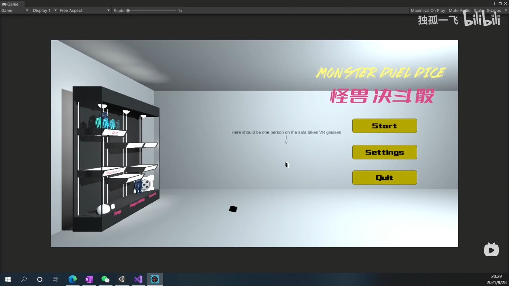
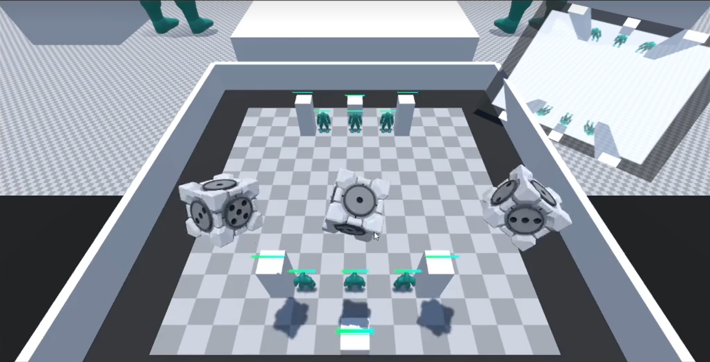
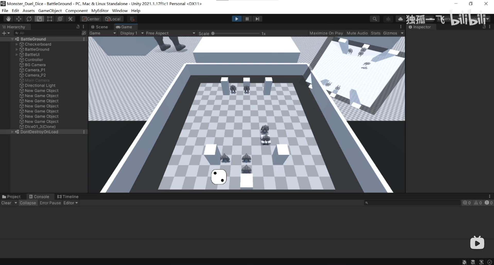
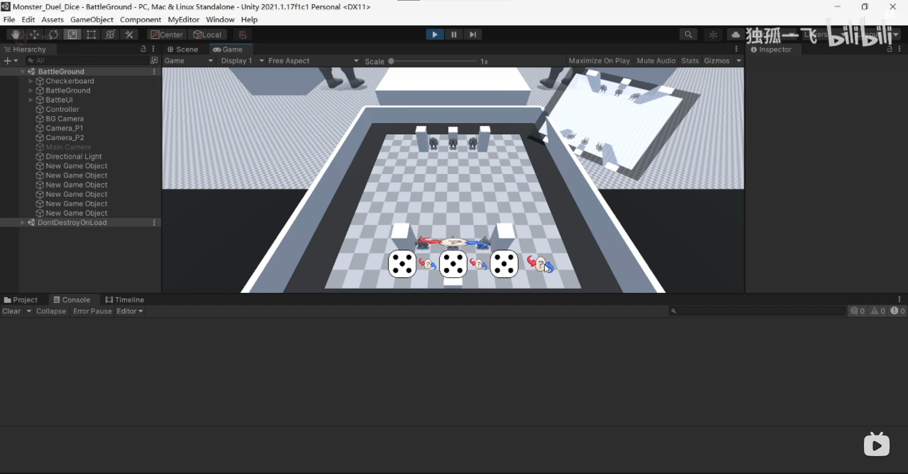
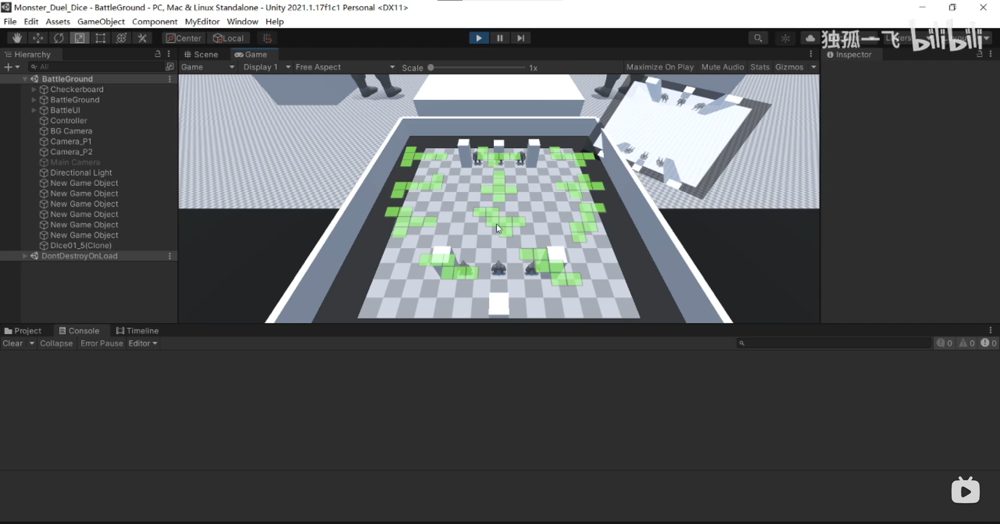
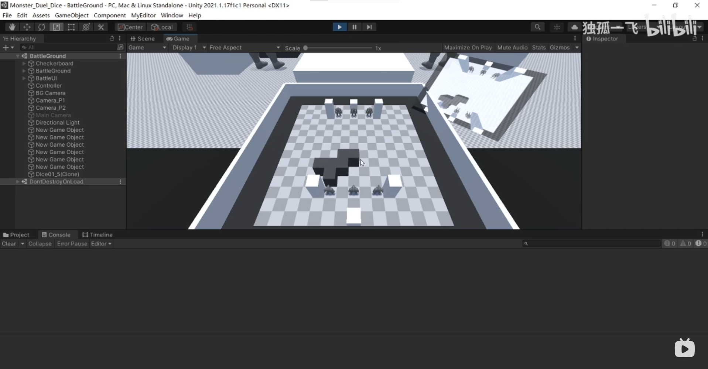

# Monster Duel Dice

A game I designed in primary school inspired by Dungeon Dice Monsters which can be played by 2 players.

Player use three dice to obtain different commands and use these commands to control monsters on the panel. The panel will be projected onto the large battlefield between two players.

Same dice can be merged to a stronger command. Different dice have different effects. For example, 1 can summon a monster, 1-1 can merge two same level monsters to upgrade it. Some dice can let players alter or change terrain and place traps.

代码：https://github.com/DuGuYifei/MonsterDuelDice

视频：https://www.bilibili.com/video/BV1mq4y1o7ww

# TODO:
This game was completed during my second semester. I am planning to remake it using Unreal Engine in the future and make it playable online with multiplayer support, after I learn Computer Network and Socket Programming. Currently, it can only be played locally by two players taking turns to control.