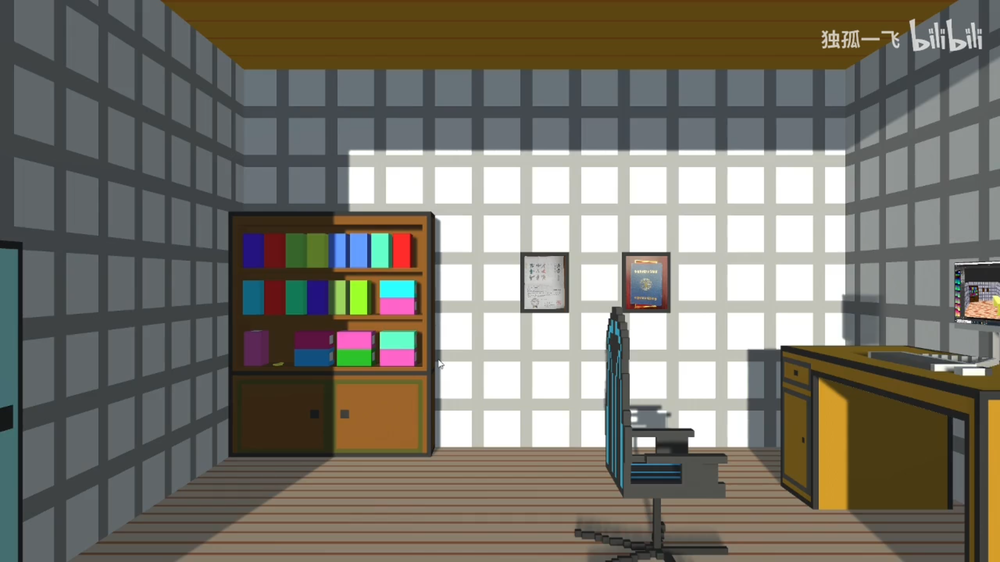

# presentation by making a pixel game

Make a unity escaping room game to make class presentation.

First time try to build pixel model by myself.

代码：https://github.com/DuGuYifei/HobbyPresentation_Unity

视频：https://www.bilibili.com/video/BV1Dq4y1r7av/
