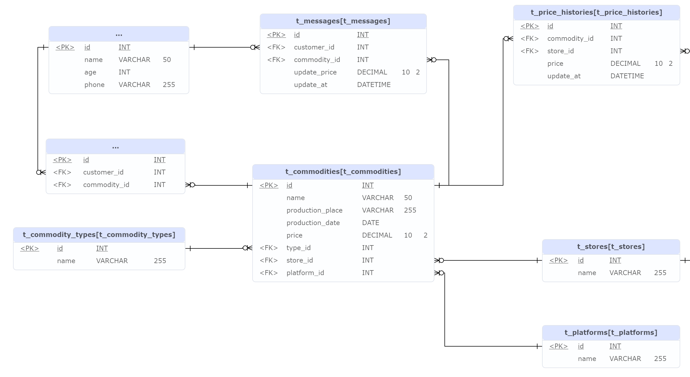

# 商单4-后端-复旦学生项目商城

## 1. ERD


## 2. 数据库表结构
```sql
CREATE TABLE IF NOT EXISTS `t_customers`
(
    `id`    int          NOT NULL AUTO_INCREMENT,
    `name`  varchar(50)  NOT NULL,
    `age`   int          NOT NULL,
    `phone` varchar(255) NOT NULL,
    PRIMARY KEY (`id`)
) ENGINE = InnoDB
  DEFAULT CHARSET = utf8mb4
  COLLATE = utf8mb4_0900_ai_ci;

CREATE TABLE IF NOT EXISTS `t_commodity_types`
(
    `id`   int          NOT NULL AUTO_INCREMENT,
    `name` varchar(255) NOT NULL,
    PRIMARY KEY (`id`)
) ENGINE = InnoDB
  DEFAULT CHARSET = utf8mb4
  COLLATE = utf8mb4_0900_ai_ci;

CREATE TABLE IF NOT EXISTS `t_stores`
(
    `id`   int          NOT NULL AUTO_INCREMENT,
    `name` varchar(255) NOT NULL,
    PRIMARY KEY (`id`),
    UNIQUE KEY `name` (`name`)
) ENGINE = InnoDB
  DEFAULT CHARSET = utf8mb4
  COLLATE = utf8mb4_0900_ai_ci;

CREATE TABLE IF NOT EXISTS `t_platforms`
(
    `id`   int          NOT NULL AUTO_INCREMENT,
    `name` varchar(255) NOT NULL,
    PRIMARY KEY (`id`),
    UNIQUE KEY `name` (`name`)
) ENGINE = InnoDB
  DEFAULT CHARSET = utf8mb4
  COLLATE = utf8mb4_0900_ai_ci;

CREATE TABLE IF NOT EXISTS `t_commodities`
(
    `id`               int            NOT NULL AUTO_INCREMENT,
    `name`             varchar(50)    NOT NULL,
    `production_place` varchar(255)   NOT NULL,
    `production_date`  date           NOT NULL,
    `price`            decimal(10, 2) NOT NULL,
    `type_id`          int            NOT NULL,
    `store_id`         int            NOT NULL,
    `platform_id`      int            NOT NULL,
    PRIMARY KEY (`id`)
) ENGINE = InnoDB
  DEFAULT CHARSET = utf8mb4
  COLLATE = utf8mb4_0900_ai_ci;

CREATE TABLE IF NOT EXISTS `t_favorites`
(
    `id`           int NOT NULL AUTO_INCREMENT,
    `customer_id`  int NOT NULL,
    `commodity_id` int NOT NULL,
    PRIMARY KEY (`id`)
) ENGINE = InnoDB
  DEFAULT CHARSET = utf8mb4
  COLLATE = utf8mb4_0900_ai_ci;

CREATE TABLE IF NOT EXISTS `t_messages`
(
    `id`           int            NOT NULL AUTO_INCREMENT,
    `customer_id`  int            NOT NULL,
    `commodity_id` int            NOT NULL,
    `update_price` decimal(10, 2) NOT NULL,
    `update_at`    datetime       NOT NULL,
    PRIMARY KEY (`id`)
) ENGINE = InnoDB
  DEFAULT CHARSET = utf8mb4
  COLLATE = utf8mb4_0900_ai_ci;

CREATE TABLE IF NOT EXISTS `t_price_histories`
(
    `id`           int            NOT NULL AUTO_INCREMENT,
    `commodity_id` int            NOT NULL,
    `store_id`     int            NOT NULL,
    `price`        decimal(10, 2) NOT NULL,
    `update_at`    datetime       NOT NULL,
    PRIMARY KEY (`id`)
) ENGINE = InnoDB
  DEFAULT CHARSET = utf8mb4
  COLLATE = utf8mb4_0900_ai_ci;
```

## 3. 核心说明

### 3.1 历史价格trigger

在存储历史价格上，采用了trigger的方式。当commodities表中的price字段更新时，会触发after_commodity_update这个trigger，将更新前的价格、更新后的价格、更新时间、商品id、店铺id存储到price_histories表中。

```SQL
DELIMITER //

CREATE TRIGGER after_commodity_update
    AFTER UPDATE ON t_commodities
    FOR EACH ROW
BEGIN
    IF OLD.price <> NEW.price THEN
        INSERT INTO t_price_histories (commodity_id, store_id, price, update_at)
        VALUES (NEW.id, NEW.store_id, NEW.price, NOW());
    END IF;
END;

//
DELIMITER ;
```

### 3.2 价格变动消息trigger

在价格变动消息上，采用了trigger的方式。当commodities表中的price字段更新时，如果更新后的价格小于更新前的价格，即降价，会触发after_price_drop这个trigger，将降价的商品id、降价后的价格、降价时间、降价的用户id存储到messages表中。

关键点在于这里的降价用户id的获取。我从favorites表中获取了所有收藏了该商品的用户id，然后将这些用户id和降价后的价格、降价时间、商品id一起存储到messages表中，这样就做到了给收藏该商品的用户发送降价消息。

这里还有一个关键点是，有两种选择，一个是让数据库每日记录价格，这样当我们想获取近一周价格时可以直接获取，但是这样会导致数据库压力过大。另一个是只记录价格变动，这样当我们想获取近一周价格时，需要分两步，第一步是近一周内的价格变动情况，第二步是一周前最后一次价格变动，因为我们的表只记录价格变动。最终采用了第二种方式。
    
```SQL
DELIMITER //

CREATE TRIGGER after_price_drop
    AFTER UPDATE ON t_commodities
    FOR EACH ROW
BEGIN
    IF NEW.price < OLD.price THEN
        INSERT INTO t_messages (customer_id, commodity_id, update_price, update_at)
        SELECT f.customer_id, NEW.id, NEW.price, NOW()
        FROM t_favorites f
        WHERE f.commodity_id = NEW.id;
    END IF;
END;

//
DELIMITER ;
```

### 3.3 其他关键点说明

1. 将type单独生成一个表，这样当用户搜索某种类型的商品时，可以直接从数据库中获取，而不是从commodities表中获取，这样可以减少数据库的压力。其实相当于可以在commodities表中添加一个type字段，然后将其索引。但是这样的话，当type字段更新时，需要更新索引，这样会影响性能。所以最终采用了单独生成一个表的方式。
2. 对于历史价格，最开始是想要直接存储json格式的历史价格到commodities表中，这样当数据量大时，依旧可以快速查询。但是考虑到mysql对json不支持，只能自己手动解析，并且本次项目更希望考察的是对数据库的设计和使用，所以最终采用了trigger的方式。

### 3.4 核心SQL查询语句
#### 3.4.1 收藏商品最多的商品类型
```sql
SELECT
    ct.name AS commodity_type,
    COUNT(*) AS favorite_count
FROM
    t_favorites f
JOIN
    t_commodities c ON f.commodity_id = c.id
JOIN
    t_commodity_types ct ON c.type_id = ct.id
WHERE
    f.customer_id = #{customerID}
GROUP BY
    ct.name;
```

#### 3.4.2 获取某个用户的按时间倒序的消息列表
```sql
SELECT * FROM t_messages WHERE customer_id = #{customerID} ORDER BY update_at DESC
```

#### 3.4.3 获取某个商品一周内的历史价格或最低价格

需要分两步，第一步是近一周内的价格变动情况，第二步是一周前最后一次价格变动，因为我们的表只记录价格变动。（月，年同理）

1. 近一周内的价格变动情况
```sql
SELECT * FROM t_price_histories WHERE commodity_id = #{commodityID} AND update_at >= DATE_SUB(CURDATE(), INTERVAL 1 WEEK) ORDER BY update_at DESC
```
2. 一周前最后一次价格变动
```sql
SELECT * FROM t_price_histories WHERE commodity_id = #{commodityID} AND update_at < DATE_SUB(CURDATE(), INTERVAL 1 WEEK) ORDER BY update_at DESC LIMIT 1
```
3. 一周内价格变动的最低价格
```sql
SELECT MIN(price) FROM t_price_histories WHERE commodity_id = #{commodityID} AND update_at >= DATE_SUB(CURDATE(), INTERVAL 1 WEEK)
```

#### 3.4.5 每种商品在不同商家一周（月，年）内的价格差

先获取每种商品在不同商家的最高价格和最低价格，然后计算价格差。

其中先用join将commodities表和price_histories表连接起来，然后用group by将每种商品在不同商家的最高价格和最低价格分组，最后用max和min函数获取最高价格和最低价格。

```sql
WITH LastWeekPrices AS (
    SELECT
        commodity_id,
        store_id,
        price AS last_week_price
    FROM
        t_price_histories
    WHERE
        (commodity_id, update_at) IN (
            SELECT
                commodity_id,
                MAX(update_at)
            FROM
                t_price_histories
            WHERE
                update_at < DATE_SUB(NOW(), INTERVAL 1 WEEK)
            GROUP BY
                commodity_id
        )
), ThisWeekPrices AS (
    SELECT
        ph.commodity_id,
        c.store_id,
        MAX(ph.price) AS max_price,
        MIN(ph.price) AS min_price
    FROM
        t_price_histories ph
    JOIN
        t_commodities c ON ph.commodity_id = c.id
    WHERE
        ph.update_at BETWEEN DATE_SUB(NOW(), INTERVAL 1 WEEK) AND NOW()
    GROUP BY
        ph.commodity_id, c.store_id
)
SELECT
    ct.name AS commodity_type,
    s.name AS store_name,
    LWP.last_week_price AS last_week_price,
    TWP.max_price,
    TWP.min_price,
    GREATEST(TWP.max_price, COALESCE(LWP.last_week_price, TWP.min_price)) - LEAST(TWP.min_price, COALESCE(LWP.last_week_price, TWP.min_price)) AS price_difference
FROM
    t_commodity_types ct
JOIN
    t_commodities c ON ct.id = c.type_id
JOIN
    t_stores s ON c.store_id = s.id
LEFT JOIN
    LastWeekPrices LWP ON c.id = LWP.commodity_id AND c.store_id = LWP.store_id
LEFT JOIN
    ThisWeekPrices TWP ON c.id = TWP.commodity_id AND c.store_id = TWP.store_id;
```

#### 3.4.6 比较某个商品在不同商家的价格差

使用join将commodities表和stores表连接起来，然后用where将不同商家的商品筛选出来，最后用order by将商品按照价格差从大到小排序。价格差的计算使用abs函数。

```sql
SELECT
    ct.name AS commodity_type,
    s1.name AS store_name_1,
    s2.name AS store_name_2,
    ABS(c1.price - c2.price) AS price_difference
FROM
    t_commodities c1
JOIN
    t_commodities c2 ON c1.type_id = c2.type_id AND c1.id != c2.id
JOIN
    t_stores s1 ON c1.store_id = s1.id
JOIN
    t_stores s2 ON c2.store_id = s2.id
JOIN
    t_commodity_types ct ON c1.type_id = ct.id
WHERE
    s1.id != s2.id
ORDER BY
    commodity_type, price_difference DESC;
```

#### 3.4.7 简单推荐方法：用户搜索商品种类A，推荐种类A的商品价格在该用户收藏最低价格和最高价格之间的，且按被收藏量降序排序

从commodities表中获取商品种类为A的商品，然后用inner join将commodities表和favorites表连接起来，然后用where将价格在该用户收藏最低价格和最高价格之间的商品筛选出来，最后用order by将商品按照被收藏量降序排序。

```sql
SELECT
    c.id,
    c.name,
    c.price
FROM
    t_commodities c
INNER JOIN (
    SELECT
        commodity_id,
        COUNT(*) AS favorite_count
    FROM
        t_favorites
    GROUP BY
        commodity_id
) AS fc ON c.id = fc.commodity_id
WHERE
    c.type_id = #{typeId}
AND c.price >= (
    SELECT
        MIN(ph.price)
    FROM
        t_favorites f
    INNER JOIN t_price_histories ph ON f.commodity_id = ph.commodity_id
    WHERE
        f.customer_id = #{customerId}
)
AND c.price <= (
    SELECT
        MAX(ph.price)
    FROM
        t_favorites f
    INNER JOIN t_price_histories ph ON f.commodity_id = ph.commodity_id
    WHERE
        f.customer_id = #{customerId}
)
ORDER BY
    fc.favorite_count DESC;
```
