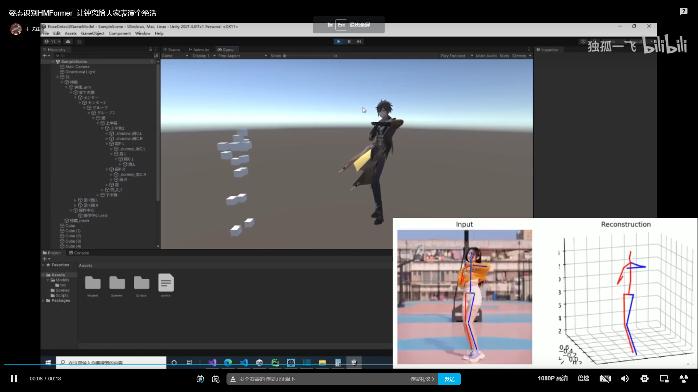

# 项目介绍

使用HMFormer进行非实时姿态估计，并使用unity读取结果以控制模型骨骼

项目地址: https://github.com/DuGuYifei/PoseDetect2UnityModel
视频地址：https://www.bilibili.com/video/BV1M14y1v73w/

# HMFormer
[GitHub - Vegetebird/MHFormer: [CVPR 2022] MHFormer: Multi-Hypothesis Transformer for 3D Human Pose Estimation](https://github.com/Vegetebird/MHFormer)

研究完源码发现结果在：
在函数`get_pose3D(video_path, output_dir):` 中：
```py
## 3D
        fig = plt.figure(figsize=(9.6, 5.4))
        gs = gridspec.GridSpec(1, 1)
        gs.update(wspace=-0.00, hspace=0.05)
        ax = plt.subplot(gs[0], projection='3d')
        ax.set_xlabel('X Label')
        ax.set_ylabel('Y Label')
        ax.set_zlabel('Z Label')
        with open('points.txt', 'ab') as f:
            np.savetxt(f, post_out, delimiter="\n") # 在这里
            # print(post_out)
        show3Dpose(post_out, ax)

        output_dir_3D = output_dir + 'pose3D/'
        os.makedirs(output_dir_3D, exist_ok=True)
        plt.savefig(output_dir_3D + str(('%04d' % i)) + '_3D.png', dpi=200, format='png', bbox_inches='tight')
```

在unity中尝试获取姿态估计结果顺序：

```
右                 左
         10
         9
16 15 14 8 11 12 13
         7
      1  0  4
      2     5
      3     6
```


# 原神官方模型问题

1. 由于是MMD常用的pmx模型，所以先经过Blender将其转换为fbx后发现丢失材质
2. 使用blender转换为obj发现材质为反
3. 使用PmxEditor只能输出没有骨骼的obj
4. 如果使用blender的obj需要将贴图旋转180度再镜像翻转
5. 为了使用骨骼，将blender的材质为反的obj放入fbx材质自动为正

不同部位的材质怎么区分
obj的文件可以直接按文本打开：
```
mtllib 钟离.mtl
```
其中这一行为**贴图配置文件名**

打开贴图配置文件：
```
newmtl m0
map_Kd tex/面.png
Ka 0.5 0.5 0.5
Kd 1 1 1
Ks 0 0 0
Ns 5
d 1

newmtl m1
map_Kd tex/面.png
Ka 0.5 0.5 0.5
Kd 1 1 1
Ks 0 0 0
Ns 5
d 1
```

1. m0，m1 是在unity中obj可见的材质名
2. 面/png 是材质所需贴图的文件名
3. m0 m1 其实是一样的，但是又有细微差别，不过暂时没有发现导致差别的规律，所以即使都放一样的问题也不大，最终也只有一个吊坠的一个小珠子颜色错了

# 获取骨骼
## 模型部分
模型 Rig -> animation type -> 选择 Humanoid -> 点击configure

将各部分给到位，注意存在父子关系。

## 代码部分

```c#
public Animator animator; // 也可以GetComponent获取

hip = animator.GetBoneTransform(HumanBodyBones.Hips);
leftUpperLeg = animator.GetBoneTransform(HumanBodyBones.LeftUpperLeg);
rightUpperLeg = animator.GetBoneTransform(HumanBodyBones.RightUpperLeg);
leftLowerLeg = animator.GetBoneTransform(HumanBodyBones.LeftLowerLeg);
rightLowerLeg = animator.GetBoneTransform(HumanBodyBones.RightLowerLeg);
//leftFoot        = animator.GetBoneTransform(HumanBodyBones.LeftFoot);
//rightFoot       = animator.GetBoneTransform(HumanBodyBones.RightFoot);
spine = animator.GetBoneTransform(HumanBodyBones.Spine);
chest = animator.GetBoneTransform(HumanBodyBones.Chest);
neck = animator.GetBoneTransform(HumanBodyBones.Neck);
head = animator.GetBoneTransform(HumanBodyBones.Head);
leftShoulder = animator.GetBoneTransform(HumanBodyBones.LeftShoulder);
rightShoulder = animator.GetBoneTransform(HumanBodyBones.RightShoulder);
leftUpperArm = animator.GetBoneTransform(HumanBodyBones.LeftUpperArm);
rightUpperArm = animator.GetBoneTransform(HumanBodyBones.RightUpperArm);
leftLowerArm = animator.GetBoneTransform(HumanBodyBones.LeftLowerArm);
rightLowerArm = animator.GetBoneTransform(HumanBodyBones.RightLowerArm);
//leftHand        = animator.GetBoneTransform(HumanBodyBones.LeftHand);
//rightHand       = animator.GetBoneTransform(HumanBodyBones.RightHand);
```

```C#
public Transform botBody; // 直接拖拽
```

# 对骨骼进行旋转

```c#
        frame = points[frameIndex];
        for(int i = 0; i < 17; i++)
        {
            cubes[i].position = frame[i];
        }

        // hip - point 1,0,4
        // rotate 90 degree
        Vector3 temp = frame[1] - frame[0];
        temp = Vector3.ProjectOnPlane(temp, hip.up);
        temp = Quaternion.AngleAxis(270, hip.up) * temp;
        hip.rotation = Quaternion.LookRotation(temp, hip.up);

        // right upper leg connect hip - point 1 2
        rightUpperLeg.rotation = Quaternion.LookRotation(rightUpperLeg.forward, frame[1] - frame[2]);

        // left upper leg connect hip - point 4 5
        leftUpperLeg.rotation = Quaternion.LookRotation(leftUpperLeg.forward, frame[4] - frame[5]);

        // right lower leg connet upper - point 2 3
        rightLowerLeg.rotation = Quaternion.LookRotation(rightLowerLeg.forward, frame[2] - frame[3]);

        // left lower leg connect upper - point 5 6
        leftLowerLeg.rotation = Quaternion.LookRotation(leftLowerLeg.forward, frame[5] - frame[6]);

        // spine and hip(lower body) - point 0 7
        spine.rotation = Quaternion.LookRotation(spine.forward, frame[7] - frame[0]);

        // chest and spine - point 7 8
        chest.rotation = Quaternion.LookRotation(chest.forward, frame[8] - frame[7]);

        // right shoulder - point 8 14
        rightShoulder.rotation = Quaternion.LookRotation(rightShoulder.forward, frame[14] - frame[8]);

        // left shoulder - point 8 11
        leftShoulder.rotation = Quaternion.LookRotation(leftShoulder.forward, frame[11] - frame[8]);

        // right upper arm - point 14 15
        temp = frame[15] - frame[14];
        rightUpperArm.rotation = Quaternion.LookRotation(Vector3.Cross(rightUpperArm.right, temp), temp);

        // left upper arm - point 12 11
        temp = frame[12] - frame[11];
        leftUpperArm.rotation = Quaternion.LookRotation(Vector3.Cross(leftUpperArm.right, temp), temp);

        // right lower arm - point 15 16
        temp = frame[16] - frame[15];
        rightLowerArm.rotation = Quaternion.LookRotation(Vector3.Cross(rightLowerArm.right, temp), temp);

        // left lower arm - point 13 12
        temp = frame[13] - frame[12];
        leftLowerArm.rotation = Quaternion.LookRotation(Vector3.Cross(leftLowerArm.right, temp), temp);

        // neck - point 9 8
        neck.rotation = Quaternion.LookRotation(neck.forward, frame[9] - frame[8]);

        // head - point 10 9
        head.rotation = Quaternion.LookRotation(head.forward);

        frameIndex++;
        if (frameIndex == frameNum)
        {
            frameIndex = 0;
        }
```

其中
1. 使用**叉积**是因为根据具体点的位置只能获取其中一个方向，另一个方向在假定最后一个方向不变的情况下，通过叉积求出来
2. 对于hip使用的计算：
   1. 由于模型的hip并不是正朝上而是一个奇怪的角度，所以不能直接使用左右腿的差值向量
   2. 差值向量需要按hip的local坐标系旋转90度以找到该差值向量对应的forward，因为该差值属于right
   3. 不能直接旋转90度，需要将其投影到hip坐标系的forward和right组成的平面上再旋转
   4. `temp = Vector3.ProjectOnPlane(temp, hip.up);`中使用hip.up是因为这是所需平面的法向量

# 帧数
使用 `Time.fixedDeltaTime`调节`FixedUpdate`的帧数


