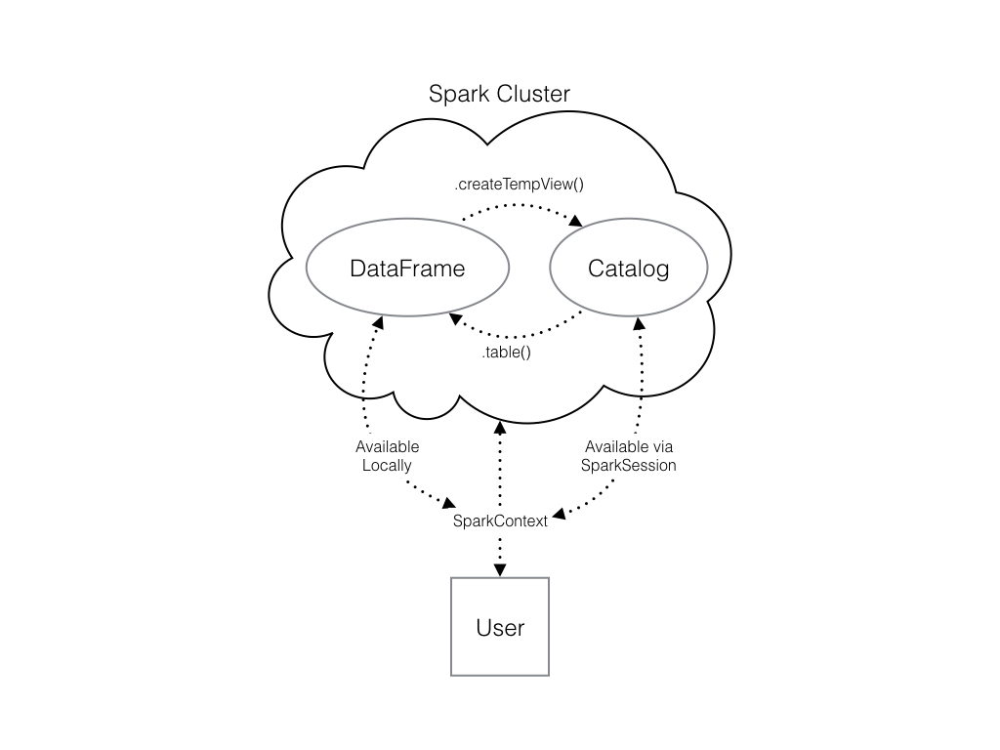

# DataFrame
1. [简介](#简介)
2. [常用](#常用)
	1. [df.columns](#dfcolumns)
	2. [df.filter](#dffilter)
		1. [`~`的作用](#的作用)
	3. [df.select](#dfselect)
	4. [df.withColumn](#dfwithcolumn)
	5. [df.drop](#dfdrop)
3. [创建SparkSession](#创建sparksession)
4. [打印表格](#打印表格)
5. [执行查询](#执行查询)
6. [转换为pandas dataframe](#转换为pandas-dataframe)
7. [从pandas dataframe创建表](#从pandas-dataframe创建表)
8. [将pandas数据放入集群，并使用sparksession访问](#将pandas数据放入集群并使用sparksession访问)
	1. [创建临时表注册到catalog](#创建临时表注册到catalog)
9. [和pandas取列对比](#和pandas取列对比)


## 简介
The Spark DataFrame was designed to behave a lot like a SQL table (a table with variables in the columns and observations in the rows). 

1. Not only are they easier to understand, 
2. DataFrames are also more **optimized for complicated operations than RDDs**  Resilient Distributed Dataset 弹性分布式数据集.

注意下面的`spark`可能是SparkSession的实例。

## 常用
### df.columns
```python
# Count the number of columns and their names
print("There are {} columns in the people_df DataFrame and their names are {}".format(len(people_df.columns), people_df.columns))
```

### df.filter
根据条件筛选满足要求的**行**，类似于 SQL 中的 WHERE 子句
```python
# Filter flights by passing a string
long_flights1 = flights.filter("distance > 1000")
```

#### `~`的作用
表示取反，即取不包含的行

```python
voter_df = voter_df.filter(~col('VOTER_NAME').contains('_'))
```

### df.select
返回指定的**列**
```python
# Select the first set of columns
selected1 = flights.select("tailnum", "origin", "dest")
```

### df.withColumn
添加新列
```python
from pyspark.sql import SparkSession
from pyspark.sql.functions import col
df_with_new_column = df.withColumn("Age Plus One", col("Age") + 1)
df_with_new_column.show()
```

### df.drop
删除列
```python
# Drop the columns
flights = flights.drop("distance", "air_time")
```


## 创建SparkSession
要开始使用 Spark DataFrames，您首先必须从 SparkContext 创建一个 SparkSession 对象。 您可以将 SparkContext 视为您与集群的连接，将 SparkSession 视为您与该连接的接口。

```python
# Import SparkSession from pyspark.sql
from pyspark.sql import SparkSession

# Create my_spark
my_spark = SparkSession.builder.getOrCreate()

# Print my_spark
print(my_spark)
```
## 打印表格
```python
# Print the tables in the catalog
print(spark.catalog.listTables())
```

## 执行查询
```python
# Don't change this query
query = "FROM flights SELECT * LIMIT 10"

# Get the first 10 rows of flights
flights10 = spark.sql(query)

# Show the results
flights10.show()
```

## 转换为pandas dataframe
```python
# Don't change this query
query = "SELECT origin, dest, COUNT(*) as N FROM flights GROUP BY origin, dest"

# Run the query
flight_counts = spark.sql(query)

# Convert the results to a pandas DataFrame
pd_counts = flight_counts.toPandas()

# Print the head of pd_counts
print(pd_counts.head())
```

## 从pandas dataframe创建表


```python
flights = spark.createDataFrame("flights")
```

## 将pandas数据放入集群，并使用sparksession访问

### 创建临时表注册到catalog
创建df的输出存储在本地，而不是在 SparkSession 目录中。 这意味着您可以在其上使用所有 Spark DataFrame 方法，但无法在其他上下文中访问数据。

所以要创建临时表:`.createTempView()`或`.createOrReplaceTempView()`

```python
# Create pd_temp
pd_temp = pd.DataFrame(np.random.random(10))

# Create spark_temp from pd_temp
spark_temp = spark.createDataFrame(pd_temp)

# Examine the tables in the catalog
print(spark_temp)

# Add spark_temp to the catalog
spark_temp.createOrReplaceTempView("temp")

# Examine the tables in the catalog again
print(spark.catalog.listTables())
```

## 和pandas取列对比

pandas取列：`df['col_name']`
spark取列：`df.col_name`
