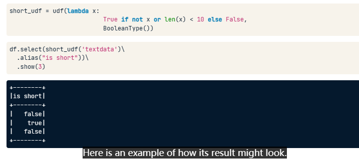
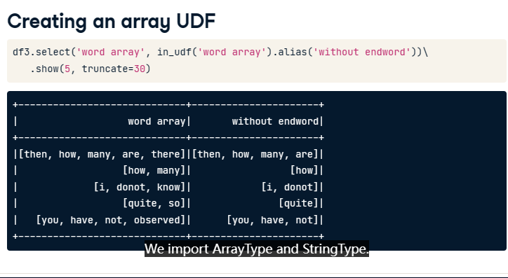

# ExtractTransformSelect

## ETS
* Extraction - extract features from raw data
* Transformation - scaling, converting, or modifying features
* Selection - obtain a subset of features

## Built-in functions

[pyspark基础](pyspark基础.md)
```PYTHON
from pyspark.sql.functions import split, explode, length
df.where(length('sentence') == 0)
```

## Creating a custom function
define a new column-based function (UDF User Defined Function)

```PYTHON
from pyspark.sql.functions import udf
```

### boolean UDF
```PYTHON
from pyspark.sql.types import BooleanType
short_udf = udf(lambda x: True if not x or len(x) < 10 else False, BooleanType())
df.select(short_udf('textdata')\
		  .alias('short'))\
		  .show(3)
```


### array UDF
```PYTHON
# remove last item in array
from pyspark.sql.types import ArrayType, StringType
in_udf = udf(lambda x: 
				x[0:len(x)-1] if x and len(x) > 1
				else [], ArrayType(StringType()))

df3.select('word array', in_udf('word array').alias('without endword')).show(5, truncate=30)
```


### important UDF return types
```PYTHON
from pyspark.sql.types import BooleanType, IntegerType, FloatType, StringType, ArrayType
```

## Sparse vector format
### 由两个array组成
1. indices
2. values
3. size + indices + values

### 注意数据类型
它是py4j生成的，所以数据类型都很奇怪，要记得常手动转换一下，比如`int(x.indices[0])`

它是dense vector

### 仅保存非0数
* Array: `[1.0, 0.0, 0.0, 3.0]`
* Sparse vector: `(4, [0, 3], [1.0, 3.0])`

### built-in functions
```PYTHON
# 检测是否为sparse vector，sparse vector是稀疏向量数据类型，有toArray()方法
hasattr(df, 'toArray')
# 检测vector是否为空，因为sparse vector不计算0
x.numNonzeros()
```

### 稀疏向量和稠密向量
稠密向量是指所有元素都不为0的向量。例如，向量[1, 2, 3, 4]就是一个稠密向量。

稀疏向量是指只有一小部分元素不为0的向量。例如，向量[0, 1, 0, 2, 0, 0, 0, 3]就是一个稀疏向量。由于稀疏向量中大多数元素都是0，因此可以使用更少的存储空间来表示它们。