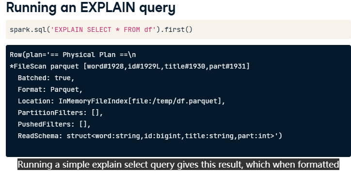
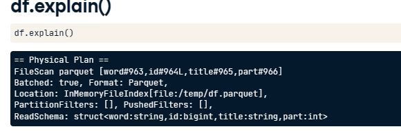
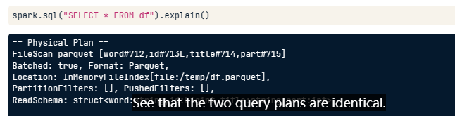
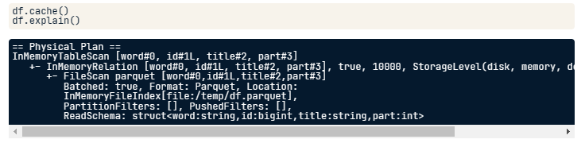

# QueryPlans

## Explain
provides detailed plan information about the query without running

instead of the usual table of data, it returns a query execution plan, also called a query plan
```sql
EXPLAIN SELECT * FROM table;
```

```PYTHON
df = spark.read.load('/temp/df.parquet')
df.registerTempTable('df')
spark.sql('EXPLAIN SELECT * FROM df').first()
``` 



```PYTHON
df.explain()
```


```PYTHON
spark.sql("SELECT * from df").explain()
```



```PYTHON
df.cache()
df.explain()
```

