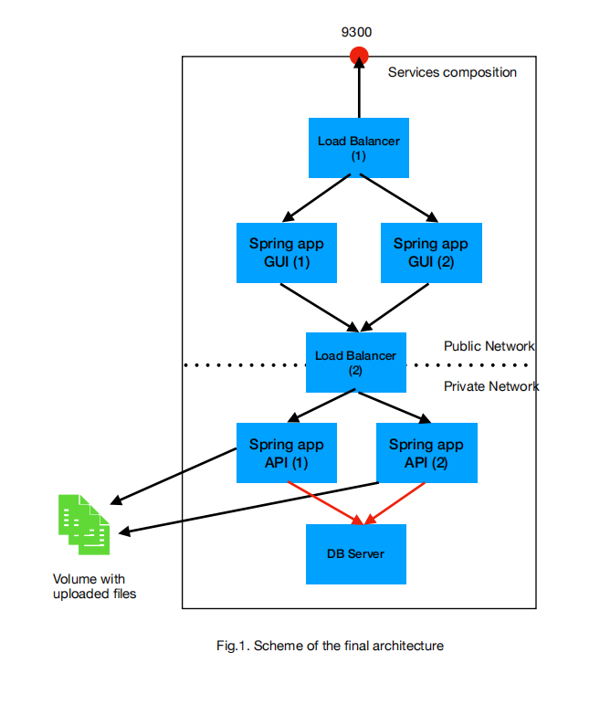

# docker compose

## 启动命令

```shell
docker-compose up -d

docker-compose -f "/my_project/docker-compose/docker-compose.yml" up -d

# 停止容器 
# 还顺带删除了container
docker-compose down


# 全版本
docker-compose build
docker-compose up
```

## example

```yml
version: "3"
services:
  proxy1:
    restart: always
    build: 
      context: ./proxy1
      dockerfile: Dockerfile
    ports:
      - "4000:80"
    volumes:
      - "/E/Gdansk University of Technology/fifth_semester/InternetiServicesArchitectures/Lab/Lab7/docker/proxy1/nginx/nginx.conf:/etc/nginx/nginx.conf"
      - "/E/Gdansk University of Technology/fifth_semester/InternetiServicesArchitectures/Lab/Lab7/docker/proxy1/nginx/conf.d/default.conf:/etc/nginx/conf.d/default.conf"
      - "/E/Gdansk University of Technology/fifth_semester/InternetiServicesArchitectures/Lab/Lab7/docker/proxy1/nginx/lognginx:/var/log/nginx"
    extra_hosts:
      - "host.docker.internal:host-gateway"
  
  gui1:
    restart: always
    build: 
      context: ./gui1
      dockerfile: Dockerfile
    ports:
      - "4001:80"
    volumes:
      - "/E/Gdansk University of Technology/fifth_semester/InternetiServicesArchitectures/Lab/Lab7/docker/gui1/nginx/html:/usr/share/nginx/html"
      - "/E/Gdansk University of Technology/fifth_semester/InternetiServicesArchitectures/Lab/Lab7/docker/gui1/nginx/nginx.conf:/etc/nginx/nginx.conf"
      - "/E/Gdansk University of Technology/fifth_semester/InternetiServicesArchitectures/Lab/Lab7/docker/gui1/nginx/conf.d/default.conf:/etc/nginx/conf.d/default.conf"
      - "/E/Gdansk University of Technology/fifth_semester/InternetiServicesArchitectures/Lab/Lab7/docker/gui1/nginx/lognginx:/var/log/nginx"

  gui2:
    restart: always
    build: 
      context: ./gui2
      dockerfile: Dockerfile
    ports:
      - "4002:80"
    volumes:
      - "/E/Gdansk University of Technology/fifth_semester/InternetiServicesArchitectures/Lab/Lab7/docker/gui2/nginx/html:/usr/share/nginx/html"
      - "/E/Gdansk University of Technology/fifth_semester/InternetiServicesArchitectures/Lab/Lab7/docker/gui2/nginx/nginx.conf:/etc/nginx/nginx.conf"
      - "/E/Gdansk University of Technology/fifth_semester/InternetiServicesArchitectures/Lab/Lab7/docker/gui2/nginx/conf.d/default.conf:/etc/nginx/conf.d/default.conf"
      - "/E/Gdansk University of Technology/fifth_semester/InternetiServicesArchitectures/Lab/Lab7/docker/gui2/nginx/lognginx:/var/log/nginx"

  proxy2:
    restart: always
    build: 
      context: ./proxy2
      dockerfile: Dockerfile
    ports:
      - "4030:80"
    volumes:
      - "/E/Gdansk University of Technology/fifth_semester/InternetiServicesArchitectures/Lab/Lab7/docker/proxy2/nginx/nginx.conf:/etc/nginx/nginx.conf"
      - "/E/Gdansk University of Technology/fifth_semester/InternetiServicesArchitectures/Lab/Lab7/docker/proxy2/nginx/conf.d/default.conf:/etc/nginx/conf.d/default.conf"
      - "/E/Gdansk University of Technology/fifth_semester/InternetiServicesArchitectures/Lab/Lab7/docker/proxy2/nginx/lognginx:/var/log/nginx"
    links:
      - gateway1
      - gateway2
    networks:
      - mynetwork

  gateway1:
    restart: always
    build: 
      context: ./gateway1
      dockerfile: Dockerfile
    volumes:
      - "/E/Gdansk University of Technology/fifth_semester/InternetiServicesArchitectures/Lab/Lab7/docker/api1/gateway1/nginx/nginx.conf:/etc/nginx/nginx.conf"
      - "/E/Gdansk University of Technology/fifth_semester/InternetiServicesArchitectures/Lab/Lab7/docker/api1/gateway1/nginx/conf.d/default.conf:/etc/nginx/conf.d/default.conf"
      - "/E/Gdansk University of Technology/fifth_semester/InternetiServicesArchitectures/Lab/Lab7/docker/api1/gateway1/nginx/lognginx:/var/log/nginx"
      - "/E/Gdansk University of Technology/fifth_semester/InternetiServicesArchitectures/Lab/Lab7/docker/api1/gateway1/java:/java"
    command: /bin/bash -c /java/wrapper.sh
    links:
      - pet1
      - animal1
    networks:
      - mynetwork

  pet1:
    restart: always
    build: 
      context: ./pet1
      dockerfile: Dockerfile
    volumes:
      - "/E/Gdansk University of Technology/fifth_semester/InternetiServicesArchitectures/Lab/Lab7/docker/api1/pet1/nginx/nginx.conf:/etc/nginx/nginx.conf"
      - "/E/Gdansk University of Technology/fifth_semester/InternetiServicesArchitectures/Lab/Lab7/docker/api1/pet1/nginx/conf.d/default.conf:/etc/nginx/conf.d/default.conf"
      - "/E/Gdansk University of Technology/fifth_semester/InternetiServicesArchitectures/Lab/Lab7/docker/api1/pet1/nginx/lognginx:/var/log/nginx"
      - "/E/Gdansk University of Technology/fifth_semester/InternetiServicesArchitectures/Lab/Lab7/docker/api1/pet1/java:/java"
    command: /bin/bash -c /java/wrapper.sh
    links:
      - mysql57
    networks:
      - mynetwork

  animal1:
    restart: always
    build: 
      context: ./animal1
      dockerfile: Dockerfile
    volumes:
      - "/E/Gdansk University of Technology/fifth_semester/InternetiServicesArchitectures/Lab/Lab7/docker/api1/animal1/nginx/nginx.conf:/etc/nginx/nginx.conf"
      - "/E/Gdansk University of Technology/fifth_semester/InternetiServicesArchitectures/Lab/Lab7/docker/api1/animal1/nginx/conf.d/default.conf:/etc/nginx/conf.d/default.conf"
      - "/E/Gdansk University of Technology/fifth_semester/InternetiServicesArchitectures/Lab/Lab7/docker/api1/animal1/nginx/lognginx:/var/log/nginx"
      - "/E/Gdansk University of Technology/fifth_semester/InternetiServicesArchitectures/Lab/Lab7/docker/api1/animal1/java:/java"
      - "/E/Gdansk University of Technology/fifth_semester/InternetiServicesArchitectures/Lab/Lab7/docker/cloud_drive:/cloud_drive"
    command: /bin/bash -c /java/wrapper.sh
    links:
      - mysql57
    networks:
      - mynetwork

  gateway2:
    restart: always
    build: 
      context: ./gateway2
      dockerfile: Dockerfile
    volumes:
      - "/E/Gdansk University of Technology/fifth_semester/InternetiServicesArchitectures/Lab/Lab7/docker/api2/gateway2/nginx/nginx.conf:/etc/nginx/nginx.conf"
      - "/E/Gdansk University of Technology/fifth_semester/InternetiServicesArchitectures/Lab/Lab7/docker/api2/gateway2/nginx/conf.d/default.conf:/etc/nginx/conf.d/default.conf"
      - "/E/Gdansk University of Technology/fifth_semester/InternetiServicesArchitectures/Lab/Lab7/docker/api2/gateway2/nginx/lognginx:/var/log/nginx"
      - "/E/Gdansk University of Technology/fifth_semester/InternetiServicesArchitectures/Lab/Lab7/docker/api2/gateway2/java:/java"
    command: /bin/bash -c /java/wrapper.sh
    links:
      - pet2
      - animal2
    networks:
      - mynetwork

  pet2:
    restart: always
    build: 
      context: ./pet2
      dockerfile: Dockerfile
    volumes:
      - "/E/Gdansk University of Technology/fifth_semester/InternetiServicesArchitectures/Lab/Lab7/docker/api2/pet2/nginx/nginx.conf:/etc/nginx/nginx.conf"
      - "/E/Gdansk University of Technology/fifth_semester/InternetiServicesArchitectures/Lab/Lab7/docker/api2/pet2/nginx/conf.d/default.conf:/etc/nginx/conf.d/default.conf"
      - "/E/Gdansk University of Technology/fifth_semester/InternetiServicesArchitectures/Lab/Lab7/docker/api2/pet2/nginx/lognginx:/var/log/nginx"
      - "/E/Gdansk University of Technology/fifth_semester/InternetiServicesArchitectures/Lab/Lab7/docker/api2/pet2/java:/java"
    command: /bin/bash -c /java/wrapper.sh
    links:
      - mysql57
    networks:
      - mynetwork

  animal2:
    restart: always
    build: 
      context: ./animal1
      dockerfile: Dockerfile
    volumes:
      - "/E/Gdansk University of Technology/fifth_semester/InternetiServicesArchitectures/Lab/Lab7/docker/api2/animal2/nginx/nginx.conf:/etc/nginx/nginx.conf"
      - "/E/Gdansk University of Technology/fifth_semester/InternetiServicesArchitectures/Lab/Lab7/docker/api2/animal2/nginx/conf.d/default.conf:/etc/nginx/conf.d/default.conf"
      - "/E/Gdansk University of Technology/fifth_semester/InternetiServicesArchitectures/Lab/Lab7/docker/api2/animal2/nginx/lognginx:/var/log/nginx"
      - "/E/Gdansk University of Technology/fifth_semester/InternetiServicesArchitectures/Lab/Lab7/docker/api2/animal2/java:/java"
      - "/E/Gdansk University of Technology/fifth_semester/InternetiServicesArchitectures/Lab/Lab7/docker/cloud_drive:/cloud_drive"
    command: /bin/bash -c /java/wrapper.sh
    links:
      - mysql57
    networks:
      - mynetwork

  mysql57:
    restart: always
    build: 
      context: ./mysql
      dockerfile: Dockerfile
    volumes:
      - "/E/Gdansk University of Technology/fifth_semester/InternetiServicesArchitectures/Lab/Lab7/docker/mysql/mysql:/var/lib/mysql"
      - "/E/Gdansk University of Technology/fifth_semester/InternetiServicesArchitectures/Lab/Lab7/docker/mysql/init:/docker-entrypoint-initdb.d"
    environment:
      MYSQL_ROOT_PASSWORD: root
      MYSQL_PASSWORD: root
    networks:
      - mynetwork

networks:
  mynetwork:
    driver: bridge
```