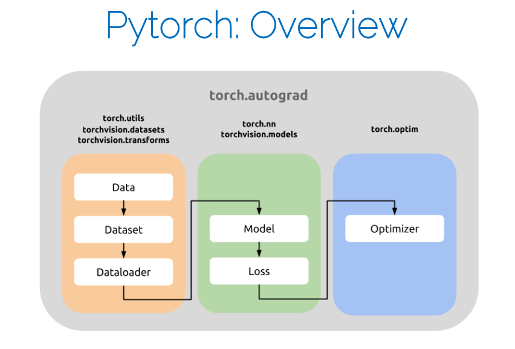

# Pytorch Ovewrview

- [1. 基本结构](#1-基本结构)
- [2. Some key features](#2-some-key-features)
- [3. References on Pytorch](#3-references-on-pytorch)
- [4. Tensorboard (also in Pytorch)](#4-tensorboard-also-in-pytorch)
- [5. 更高级的框架 - Pytorch Lightning](#5-更高级的框架---pytorch-lightning)
  - [5.1. LightningModule](#51-lightningmodule)
  - [5.2. Trainer](#52-trainer)


## 1. 基本结构



## 2. Some key features
1. Device management:
    ```python
    device = torch.device('cuda:0' if torch.cuda.is_available() else 'cpu')
    print(device)

    print(f"original device: {x.device}") # "cpu", integer

    tensor = x.to(device)
    print(f"current device: {x.device}") # "cpu" or "cuda", double
    ```
2. Implementations of:
   1. Optimizers, etc.
   2. Datasets
   3. Automatic gradients
3. Easy network creation
    ```python
    import torch.nn as nn
    # define the model
    class Net(nn.Module):
        def __init__(self, input_size=1*28*28, output_size=100):
            super(Net, self).__init__()
            self.fc1 = nn.Linear(input_size, output_size)

        def forward(self, x):
            x = self.fc1(x)
            return x
    
    net = Net()
    net = net.to(device)

    # 训练
    criterion = nn.CrossEntropyLoss()
    optimizer = torch.optim.Adam(net.parameters(), lr=0.001)

    for epoch in range(2):  # loop over the dataset multiple times
        running_loss = 0.0
        for i, data in enumerate(trainloader, 0):
            # get the inputs; data is a list of [inputs, labels]
            inputs, labels = data
            inputs, labels = inputs.to(device), labels.to(device)

            # zero the parameter gradients
            optimizer.zero_grad()

            # forward + backward + optimize
            outputs = net(inputs)
            loss = criterion(outputs, labels)
            loss.backward()
            optimizer.step()

            # print statistics
            running_loss += loss.item()
            if i % 2000 == 1999:    # print every 2000 mini-batches
                print('[%d, %5d] loss: %.3f' %
                      (epoch + 1, i + 1, running_loss / 2000))
                running_loss = 0.0
    ```

## 3. References on Pytorch
* Repository: https://github.com/pytorch/pytorch
* Examples (recommendation):https://github.com/pytorch/examples
* PyTorch for NumPy users:https://github.com/wkentaro/pytorch-for-numpyusers

## 4. Tensorboard (also in Pytorch)

* Visualize Networks
* In short: document everything!
  * Weight Initialization

## 5. 更高级的框架 - Pytorch Lightning

1. Research code: 这是编写模型时最有趣的部分，包括针对新任务或模型的具体算法和技术。在 PyTorch Lightning 中，这部分通常封装在 LightningModule 类中。
2. Engineering code: 这部分对于所有项目和模型来说都是相同的，主要处理如模型训练、评估等通用流程。这部分代码在 Trainer 类中实现。
3. Non-essential code: 包括日志记录、运行组织等辅助功能，通常通过 Callbacks 实现。

### 5.1. LightningModule

如何使用 LightningModule 来封装一个模型:

```python
import pytorch_lightning as pl

class LitModel(pl.LightningModule):
    def __init__(self):
        super().__init__()
        self.l1 = torch.nn.Linear(28 * 28, 10)

    def forward(self, x):
        return torch.relu(self.l1(x.view(x.size(0), -1)))

    def training_step(self, batch, batch_idx):
        x, y = batch
        y_hat = self(x)
        loss = F.cross_entropy(y_hat, y)
        return loss

    def configure_optimizers(self):
        return torch.optim.Adam(self.parameters(), lr=0.02)
```


### 5.2. Trainer

如何使用 Trainer 类来训练模型:

```python
model = LitModel()
trainer = pl.Trainer(gpus=1, max_epochs=10)
trainer.fit(model, train_loader)
```