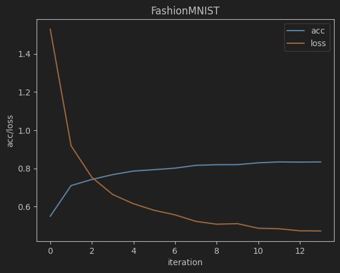
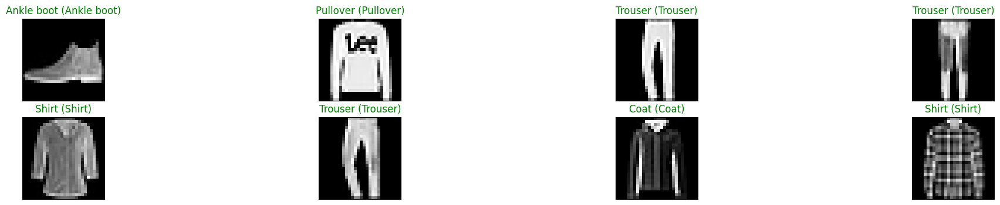

# pytorch基础

- [1. 安装](#1-安装)
- [2. Tensor](#2-tensor)
  - [2.1. Initializing Tensor - numpy](#21-initializing-tensor---numpy)
  - [2.2. Conversion between NumPy and Tensor](#22-conversion-between-numpy-and-tensor)
  - [2.3. Operations on Tensor](#23-operations-on-tensor)
    - [2.3.1. Indexing](#231-indexing)
    - [2.3.2. Mathematical operations](#232-mathematical-operations)
  - [2.4. Device](#24-device)
- [3. Training a classifier with PyTorch](#3-training-a-classifier-with-pytorch)
  - [3.1. DataLoader](#31-dataloader)
    - [3.1.1. 普通数据](#311-普通数据)
    - [3.1.2. Torchvision](#312-torchvision)
  - [3.2. Define a network](#32-define-a-network)
  - [3.3. Define the Loss function and Optimizer](#33-define-the-loss-function-and-optimizer)
  - [3.4. Train the network](#34-train-the-network)
  - [3.5. Test the performance of the model](#35-test-the-performance-of-the-model)


## 1. 安装

```python
# Install a pip package in the current Jupyter kernel
import sys

# For google colab
# !python -m pip install torch==2.2.2 torchvision==0.17.2 torchaudio==2.2.2 --index-url https://download.pytorch.org/whl/cu121

# For Linux and probably Windows (CPU)
# !{sys.executable} -m pip install torch==2.2.2 torchvision==0.17.2 torchaudio==2.2.2 --index-url https://download.pytorch.org/whl/cpu

# For Linux and probably Windows (Prerequisites: Nvidia GPU + CUDA toolkit 11.8)
!{sys.executable} -m pip install torch==2.2.2+cu118 torchvision==0.17.2+cu118 torchaudio==2.2.2+cu118 --index-url https://download.pytorch.org/whl/cu118


# For OS X/Mac
# !{sys.executable} -m pip install torch==2.2.2 torchvision==0.17.2 torchaudio==2.2.2
```

检查：
```python
import torch
import torchvision
print(f"PyTorch version Installed: {torch.__version__}\nTorchvision version Installed: {torchvision.__version__}\n")
if not torch.__version__.startswith("2.2"):
    print("you are using an another version of PyTorch. We expect PyTorch 2.2. You may continue using your version but it"
          " might cause dependency and compatibility issues.")
if not torchvision.__version__.startswith("0.17"):
    print("you are using an another version of torchvision. We expect torchvision 0.17. You can continue with your version but it"
          " might cause dependency and compatibility issues.")

################
# PyTorch version Installed: 2.2.2+cu118
# Torchvision version Installed: 0.17.2+cu118
```

开始：
```python
import numpy as np
import matplotlib.pyplot as plt
import torchvision.transforms as transforms
from torch.utils.data.sampler import SubsetRandomSampler

import os
import pandas as pd
pd.options.mode.chained_assignment = None  # default='warn'

%load_ext autoreload
%autoreload 2
%matplotlib inline

os.environ['KMP_DUPLICATE_LIB_OK']='True' # To prevent the kernel from dying.
```

## 2. Tensor
### 2.1. Initializing Tensor - numpy

```python
array_np = np.array([[1,2,3],[5,6,7]]) # A NumPy array

# Initializing the Tensor
array_ts = torch.tensor([[1,2,3],[4,5,6]]) # A Tensor

print("Variable array_np:\nDatatype: {}\nShape: {}".format(type(array_np), array_np.shape))
print("Values:\n", array_np)
print("\n\nVariable array_ts:\nDatatype {}\nShape: {}".format(type(array_ts), array_ts.shape))
print("Values:\n", array_ts)

################
# Variable array_np:
# Datatype: <class 'numpy.ndarray'>
# Shape: (2, 3)
# Values:
#  [[1 2 3]
#  [5 6 7]]


# Variable array_ts:
# Datatype <class 'torch.Tensor'>
# Shape: torch.Size([2, 3])
# Values:
#  tensor([[1, 2, 3],
#         [4, 5, 6]])
```

### 2.2. Conversion between NumPy and Tensor

During the conversion, both ndarray and Tensor share the same memory address. Changes in value of one will affect the other.

```python
# Conversion
array_np = np.array([1, 2, 3])

# Conversion from  a numpy array to a Tensor
array_ts_2 = torch.from_numpy(array_np)

# Conversion from  Tensor to numpy array
array_np_2 = array_ts_2.numpy()

# Change a value of the np_array
array_np_2[1] = -1

# Changes in the numpy array will also change the values in the tensor
assert(array_np[1] == array_np_2[1])
```

### 2.3. Operations on Tensor

#### 2.3.1. Indexing
```python
# Let us take the first two columns from the original tensor array and save it in a new one
b = array_ts[:2, :2]

# Let's assign the value of first column of the new variable to be zero
b[:, 0] = 0
print(b)

################
# tensor([[0, 2],
#         [0, 5]])
```

如果使用mask，会将符合条件的元素提取出来，形成一个新的tensor，并且新的tensor的是一个一维的tensor。
```python
# Index of the elements with value greater than one
mask = array_ts > 1
new_array = array_ts[mask]
print(new_array)

################
# tensor([2, 3, 4, 5, 6])

c = array_ts[array_ts>1]

# Is the result same as the array from the previous cell?
print(c == new_array)

################
# tensor([True, True, True, True, True])
```

#### 2.3.2. Mathematical operations
```python
x = torch.tensor([[1,2],[3,4]])
y = torch.tensor([[5,6],[7,8]])

# Elementwise Addition of the tensors
# [[ 6.0  8.0]
#  [10.0 12.0]]

# Addition - Syntax 1
print("x + y: \n{}".format(x + y))

# Addition - Syntax 2
print("x + y: \n{}".format(torch.add(x, y)))

# Addition - Syntax 3
result_add = torch.empty(2, 2)
torch.add(x, y, out=result_add)
print("x + y: \n{}".format(result_add))

################
# 均输出：
# x + y:
# tensor([[ 6,  8],
#         [10, 12]])
```

Similar syntax holds for other element-wise operations such as subtraction and multiplication.
When dividing two integers in NumPy as well PyTorch, the result is always a float. For example,

```python
x_np = np.array([[1,2],[3,4]])
y_np = np.array([[5,6],[7,8]])
print(x_np / y_np)

################
# [[0.2        0.33333333]
#  [0.42857143 0.5       ]]
```

### 2.4. Device

Let us check if a GPU is available. If it is available, we will assign it to device and move the tensor x to the GPU.

```python
device = torch.device("cuda:0" if torch.cuda.is_available() else "cpu")
print(device)

print(f"Original device: {x.device}") # "cpu"

tensor = x.to(device)
print(f"Current device: {tensor.device}") #"cpu" or "cuda"

# If you have a GPU, the output will be:
# cuda:0
# Original device: cpu
# Current device: cuda:0
```
其中`:0`表示GPU的编号，如果有多个GPU，可以使用`cuda:1`等。

## 3. Training a classifier with PyTorch

1. Load data
2. Define a two-layer network
3. Define a loss function and optimizer
4. Train the network
5. Test the network

### 3.1. DataLoader

The general procedure of loading data is :
- Extract data from source
- Transform the data into a suitable form (for example, to a Tensor)
- Put our data into an object to make it easy to access further on

#### 3.1.1. 普通数据

[`DataLoader`](https://pytorch.org/docs/stable/data.html#torch.utils.data.DataLoader)

有趣的参数：
* num_workers：用于数据加载的子进程数。默认为0，表示在主进程中加载数据。

```python
from torch.utils.data import DataLoader

pytorch_dataloader = DataLoader(our_csv_dataset, batch_size=batch_size)

# We can use the exact same way to iterate over samples
for i, item in enumerate(pytorch_dataloader):
    print('Batch {}'.format(i))
    for key in item:
        print("\nDictionary Key:",key)
        print("Value Type",type(item[key]))
        print("Shape of the Value",item[key].shape)

    if i+1 >= 1: # 这是为了只打印一个batch
        break
```

#### 3.1.2. Torchvision

翻译：
对于计算机视觉，torchvision包为许多常见数据集提供了数据加载器，例如`ImageNet`、`FashionMNIST`、`MNIST`，以及`torchvision.datasets`和`torch.utils.data.DataLoader`模块中的图像的附加数据转换器。

Let's try loading the [`Fashion-MNIST`](https://research.zalando.com/welcome/mission/research-projects/fashion-mnist/) dataset. It has  gray-scale images of size $28* 28$ belonging to 10 different classes of clothing accessories such as T-Shirt, Trousers, Sneakers.


`transforms.Compose`创建一系列转换以准备数据集。
- `transforms.ToTensor`将`PIL image`或numpy.ndarray $(H \times W\times C)$转换为范围为[0,255]的`torch.FloatTensor`，形状为$(C \times H \times W)$，范围为[0.0, 1.0]。
- `transforms.Normalize`使用提供的均值和标准差对张量图像进行归一化。
- CHW: Channel, Height, Width

```python
import torchvision.transforms as transforms

# Mean and standard deviations have to be sequences (e.g. tuples),hence we add a comma after the values
transform = transforms.Compose([transforms.ToTensor(),
                                transforms.Normalize((0.5,),(0.5,))])
```

`datasets.FashionMNIST` downloads the Fashion MNIST dataset and transforms it using our previous cell definition.  
By setting the value of `train`, we get the training and test set.

```python
import torchvision

fashion_mnist_dataset = torchvision.datasets.FashionMNIST(root='../datasets', train=True,
                                                          download=True, transform=transform)
fashion_mnist_test_dataset = torchvision.datasets.FashionMNIST(root='../datasets', train=False,
                                                          download=True, transform=transform)
```


`torch.utils.data.Dataloader`接受我们的训练数据或测试数据，参数为`batch_size`和`shuffle`。变量`batch_size`定义了每个批次加载多少个样本。变量`shuffle=True`使数据在每个epoch重新洗牌。

```python
fashion_mnist_dataloader = DataLoader(fashion_mnist_dataset, batch_size=8)
fashion_mnist_test_dataloader = DataLoader(fashion_mnist_test_dataset, batch_size=8)

classes = ('T-shirt/top', 'Trouser', 'Pullover', 'Dress', 'Coat',
           'Sandal', 'Shirt', 'Sneaker', 'Bag', 'Ankle boot')
```

```python
# We can use the exact same way to iterate over samples
for i, item in enumerate(fashion_mnist_dataloader):
    print('Batch {}'.format(i))
    image, label = item
    print(f"Datatype of Image: {type(image)}")
    print(f"Shape of the Image: {image.shape}")
    print(f"Label Values: {label}")

    if i+1 >= 1:
        break
```

```python
def imshow(img):
    img = img / 2 + 0.5 # unormalize
    npimg = img.numpy()
    plt.imshow(np.transpose(npimg, (1, 2, 0)))
    plt.show()

# get some random training images
dataiter = iter(fashion_mnist_dataloader)
for images, labels in fashion_mnist_dataloader:
    break
# show images
imshow(torchvision.utils.make_grid(images))
# print labels
print(' '.join('%5s' % classes[labels[j]] for j in range(8)))
```


```
Ankle boot T-shirt/top T-shirt/top Dress T-shirt/top Pullover Sneaker Pullover
```

### 3.2. Define a network
PyTorch provides a `nn.Module` that builds neural networks. Now, we will use it to define our network class.

```python
import torch.nn as nn


class Net(nn.Module):
    def __init__(self, activation=nn.Sigmoid(),
                 input_size=1*28*28, hidden_size=100, classes=10):

        super().__init__()
        self.input_size = input_size

        # Here we initialize our activation and set up our two linear layers
        self.activation = activation
        self.fc1 = nn.Linear(input_size, hidden_size)
        self.fc2 = nn.Linear(hidden_size, classes)

    def forward(self, x):
        x = x.view(-1, self.input_size) # flatten
        x = self.fc1(x)
        x = self.activation(x)
        x = self.fc2(x)

        return x
```

看一下`Net`的构造函数，我们有：
- `super().__init__`创建一个从另一个类继承属性和行为的类。
- `self.fc1`创建一个具有`input_size`输入和`hidden_size`输出的仿射层。
- `self.fc2`是第二个仿射层。

`Forward`函数定义了模式的前向传递。
  - 输入`x`被展平为`x = x.view(-1, self.input_size)`，以便作为仿射层的输入。
  - 顺序地应用`fc1`、`activation`、`fc2`来完成网络。


PyTorch中所有神经网络的核心是`autograd`包。它为张量上的所有操作提供自动微分。如果我们将`torch.Tensor`的属性`.requires_grad`设置为`True`，它将跟踪在该张量上应用的所有操作。一旦所有计算完成，函数`.backward()`将计算梯度到`Tensor.grad`变量。

感谢`autograd`包，我们只需要定义`forward()`函数。我们可以在`forward()`函数中使用任何张量操作。`backward()`函数（通过反向传播计算梯度）由PyTorch自动定义。

我们可以使用`print()`查看网络的所有定义层（但不会显示前向传递的信息）。

模型的学习参数由`[model_name].parameters()`返回。我们还可以通过`[model_name].[layer_name].parameters()`访问不同层的参数。

让我们创建`Net`模型的一个实例，并查看每个层的参数矩阵形状。

```python
net = Net()
# Always remember to move the network to the GPU/CPU depending on device
net = net.to(device)

print(net)

print("Shapes of the Parameter Matrix:")
for parameter in net.parameters():
    print(parameter.shape)

################
# Net(
#   (activation): Sigmoid()
#   (fc1): Linear(in_features=784, out_features=100, bias=True)
#   (fc2): Linear(in_features=100, out_features=10, bias=True)
# )
# Shapes of the Parameter Matrix:
# torch.Size([100, 784])
# torch.Size([100])
# torch.Size([10, 100])
# torch.Size([10])
```

### 3.3. Define the Loss function and Optimizer

`torch.nn`和`torch.optim`模块包括各种损失函数和优化器。我们将初始化它们的一个实例。

此处案例为多分类问题，所以用`CrossEntropyLoss`作为损失函数，`SGD`作为优化器。

```python
import torch.optim as optim

criterion = nn.CrossEntropyLoss()
optimizer = optim.SGD(net.parameters(), lr=0.001, momentum=0.9)
```

### 3.4. Train the network

```python
# Initializing the list for storing the loss and accuracy

train_loss_history = [] # loss
train_acc_history = [] # accuracy

for epoch in range(2):


    running_loss = 0.0
    correct = 0.0
    total = 0

    # Iterating through the minibatches of the data

    for i, data in enumerate(fashion_mnist_dataloader, 0):

        # data is a tuple of (inputs, labels)
        X, y = data

        X = X.to(device)
        y = y.to(device)

        # Reset the parameter gradients  for the current  minibatch iteration
        optimizer.zero_grad()


        y_pred = net(X)             # Perform a forward pass on the network with inputs
        loss = criterion(y_pred, y) # calculate the loss with the network predictions and ground Truth
        loss.backward()             # Perform a backward pass to calculate the gradients
        optimizer.step()            # Optimize the network parameters with calculated gradients


        # Accumulate the loss and calculate the accuracy of predictions
        running_loss += loss.item()
        _, preds = torch.max(y_pred, 1) #convert output probabilities of each class to a singular class prediction
        correct += preds.eq(y).sum().item()
        total += y.size(0)

        # Print statistics to console
        if i % 1000 == 999: # print every 1000 mini-batches
            running_loss /= 1000
            correct /= total
            print("[Epoch %d, Iteration %5d] loss: %.3f acc: %.2f %%" % (epoch+1, i+1, running_loss, 100*correct))
            train_loss_history.append(running_loss)
            train_acc_history.append(correct)
            running_loss = 0.0
            correct = 0.0
            total = 0

print('FINISH.')
```

翻译：
所以，一般的训练过程如下：
- `zero_grad()`: 将所有模型参数的梯度缓冲区清零，以开始当前的小批量迭代。
- `y_pred = net(X)`: 通过将图像传递给模型，通过网络进行前向传递，以获得预测，这些预测是图像属于每个类的对数概率。
- `loss = criterion(y_pred, y)`: 从生成的预测和训练数据`y`计算损失。
- `loss.backward()`: 通过网络进行反向传递，计算模型参数的梯度。
- `optimizer.step()`: 使用计算出的梯度更新模型参数。

我们随时跟踪随时间变化的训练损失和准确性。下图显示了训练损失和准确性的平均值。

```python
plt.plot(train_acc_history)
plt.plot(train_loss_history)
plt.title("FashionMNIST")
plt.xlabel('iteration')
plt.ylabel('acc/loss')
plt.legend(['acc', 'loss'])
plt.show()
```



### 3.5. Test the performance of the model

```python
# obtain one batch of test images
dataiter = iter(fashion_mnist_test_dataloader)
images, labels = dataiter.__next__()
images, labels = images.to(device), labels.to(device)

# get sample outputs
outputs = net(images)
# convert output probabilites to predicted class
_, predicted = torch.max(outputs, 1)
```

```python
# prep images for display
if not isinstance(images, np.ndarray):
    images = images.cpu().numpy()

# plot the images in the batch, along with predicted and true labels
fig = plt.figure(figsize=(25,4))
for idx in range(8):
    ax = fig.add_subplot(2, 8//2, idx+1, xticks=[], yticks=[]) # 这里是为了显示8张图片
    ax.imshow(np.squeeze(images[idx]), cmap='gray')
    ax.set_title(f"{classes[predicted[idx]]} ({classes[labels[idx]]})",
                color="green" if predicted[idx]==labels[idx] else "red")
```



让我们找出哪些类的图像表现良好，哪些类的图像表现不佳！`torch.no_grad()`确保在张量上不计算梯度，因为我们只执行前向传递。

```python
class_correct = list(0. for i in range(10))
class_total = list(0. for i in range(10))

with torch.no_grad():
    for data in fashion_mnist_test_dataloader:
        images, labels = data
        images, labels = images.to(device), labels.to(device)
        outputs = net(images)
        _, predicted = torch.max(outputs, 1) # 这里_和predicted分别是最大值和最大值的索引
        c = (predicted == labels).squeeze()
        for i in range(8):
            label = labels[i]
            class_correct[label] += c[i].item()
            class_total[label] += 1


for i in range(10):
    print('Accuracy of %11s: %2d %%' % (classes[i], 100 * class_correct[i] / class_total[i]))
```
