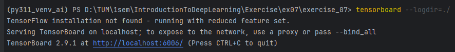
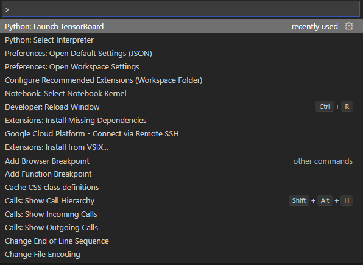
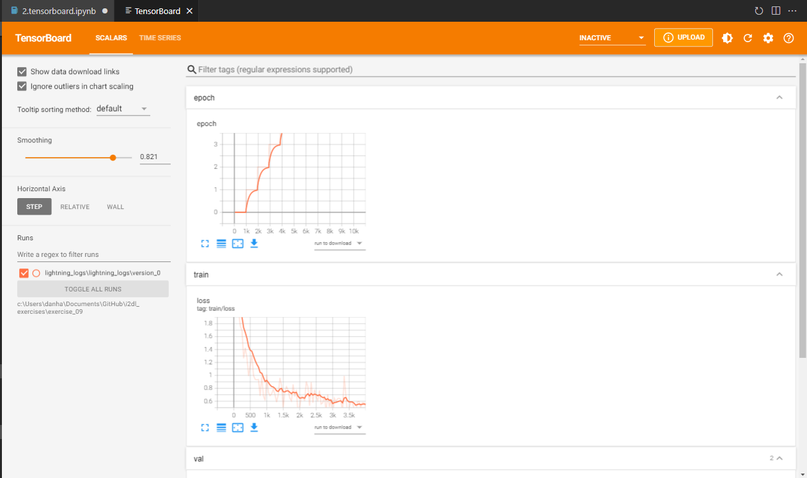
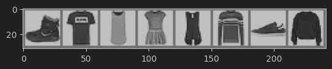
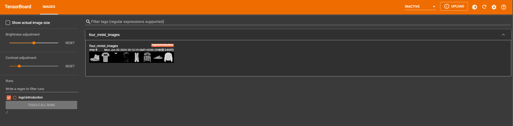
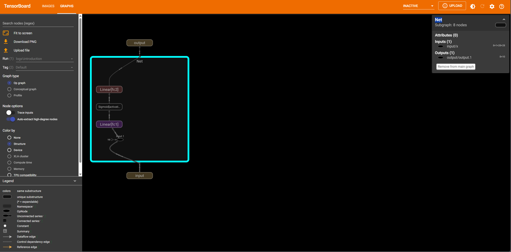
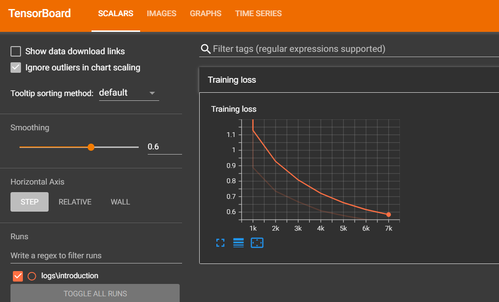
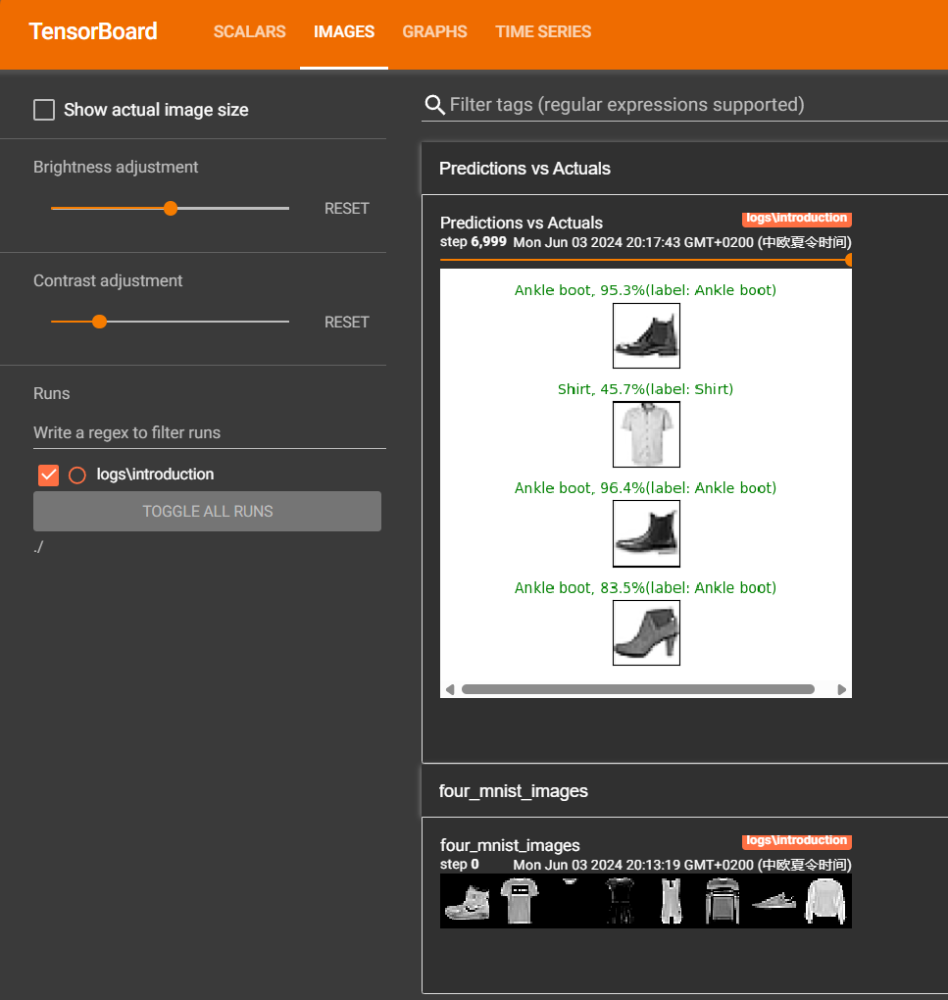

# tensorboard基础


## 安装

```python
# remove the "> /dev/null" if you want to see the installation output
import sys

# For google colab
# !python -m pip install tensorboard==2.9.1 > /dev/null

# For anaconda/regular environments
!{sys.executable} -m pip install tensorboard==2.9.1
```

## Setting up

```python
# import all the required packages
%load_ext autoreload
%autoreload 2
%matplotlib inline

import matplotlib.pyplot as plt
import numpy as np

import torch
import torchvision
import torchvision.transforms as transforms

import torch.nn as nn
import torch.nn.functional as F
import torch.optim as optim

import os
import shutil

transform = transforms.Compose([transforms.ToTensor(),
                                transforms.Normalize((0.5,),(0.5,))])  # mean and std have to be sequences (e.g. tuples),
                                                                      # therefore we should add a comma after the values

fashion_mnist_dataset = torchvision.datasets.FashionMNIST(root='../datasets', train=True,
                                                          download=True, transform=transform)

fashion_mnist_test_dataset = torchvision.datasets.FashionMNIST(root='../datasets', train=False,
                                                          download=True, transform=transform)

trainloader = torch.utils.data.DataLoader(fashion_mnist_dataset, batch_size=8)

testloader = torch.utils.data.DataLoader(fashion_mnist_test_dataset, batch_size=8)

classes = ('T-shirt/top', 'Trouser', 'Pullover', 'Dress', 'Coat',
           'Sandal', 'Shirt', 'Sneaker', 'Bag', 'Ankle boot')


def matplotlib_imshow(img, one_channel=False):
    if one_channel:
        img = img.cpu().mean(dim=0)
    img = img / 2 + 0.5     # unnormalize
    npimg = img.numpy()
    if one_channel:
        plt.imshow(npimg, cmap="Greys")
    else:
        plt.imshow(np.transpose(npimg, (1, 2, 0)))

os.environ['KMP_DUPLICATE_LIB_OK']='True' # To prevent the kernel from dying.

path = os.path.abspath("logs")
if os.path.exists(path):
    shutil.rmtree(path)
os.makedirs(path, exist_ok=True)
```

Initialize device
    
```python
device = torch.device("cuda:0" if torch.cuda.is_available() else "cpu")
print("Using the device",device)
```

准备网络
    
```python
class Net(nn.Module):
    def __init__(self, activation=nn.Sigmoid(),
                 input_size=1*28*28, hidden_size=100, classes=10):
        super().__init__()
        self.input_size = input_size

        # Here we initialize our activation and set up our two linear layers
        self.activation = activation
        self.fc1 = nn.Linear(input_size, hidden_size)
        self.fc2 = nn.Linear(hidden_size, classes)

    def forward(self, x):
        x = x.view(-1, self.input_size) # flatten
        x = self.fc1(x)
        x = self.activation(x)
        x = self.fc2(x)

        return x

net = Net()
net.to(device)

criterion = nn.CrossEntropyLoss()
optimizer = optim.SGD(net.parameters(), lr=0.001, momentum=0.9)
```

### SummaryWriter

PyTorch提供了使用`SummaryWriter`模块将数据记录到TensorBoard的支持。我们现在将初始化一个`SummaryWriter`对象，并指定目录[**logs/introduction**]以存储其相关数据。

```python
from torch.utils.tensorboard import SummaryWriter

writer = SummaryWriter('logs/introduction')
```

## Writing to TensorBoard

Let's write some stuff to TensorBoard, and log into it to see how things go. :)


1. You can open the TensorBoard GUI by running the command from this exercise folder in a Terminal:
```tensorboard --logdir=./```

For those using Linux or Mac, you can open a Terminal **in this exercise folder** and run the above command.

For those using Windows with Anaconda packages, open an Anaconda Prompt and then run the above command.
In case you don't  use Anaconda, use your default method of running python code in cmd.

让我们向TensorBoard写入一些内容，并登录到其中查看事情的进展。 :)

1. 您可以通过在终端中从此练习文件夹运行以下命令来打开TensorBoard GUI：
    ```
    tensorboard --logdir=./
    ```

    对于使用Linux或Mac的用户，您可以在此练习文件夹中打开终端并运行上述命令。

    对于使用带有Anaconda包的Windows用户，请打开Anaconda提示符，然后运行上述命令。

    如果您不使用Anaconda，请使用cmd中运行python代码的默认方法。

    

2. Also, if you're using VScode, press <code> Ctrl + Shift + p (Windows User), CMD + Shift + P (Mac User)</code> and look for <code> Tensorboard </code> (Make sure that version <code>2.8.0</code> is installed)

 

### 添加一个图


No dashboards are created yet! Let's log some data to our SummaryWriter object

```python
# get some random training images
for images, labels in trainloader:
    break

# create grid of images
img_grid = torchvision.utils.make_grid(images)

# show images using our helper function
matplotlib_imshow(img_grid)

# Write the generated image to tensorboard
writer.add_image('four_mnist_images', img_grid)
```


We can now see the image in our TensorBoard interface. You might need to hit the refresh button on the top right as TensorBoard will only update in discrete intervals of time.



## Visualization Model Architectures

```python
writer.add_graph(net.cpu(), images)
writer.close()
```



Click the `GRAPHS` section in the top ribbon to access it the architecture. The above image was generated by clicking on our network `Net`.
Feel free to explore with the various features of this model's visualization!

## Training network models

We shall define two helper functions here: `images_to_probs` and `plot_classes_preds`.

```python
def images_to_probs(net, images):
    '''
    Returns the predicted class and probabilites of the image belonging to each of the classes
    from the network output
    '''
    output = net(images)
    # convert output probabilities to predicted class
    _, preds_tensor = torch.max(output, 1)
    preds = np.squeeze(preds_tensor.cpu().numpy())
    return preds, [F.softmax(el, dim=0)[i].item() for i, el in zip(preds, output)]


def plot_classes_preds(net, images, labels):
    '''
    Returns a plot using the network, along with images
    and labels from a batch, that shows the network's class prediction along
    with its probability, alongside the actual label, coloring this
    information based on whether the prediction was correct or not.
    Uses the "images_to_probs" function defined above.
    '''
    preds, probs = images_to_probs(net, images)
    # plot the images in the batch, along with predicted and true labels
    fig = plt.figure(figsize=(4,4))

    for idx in np.arange(4):
        ax = fig.add_subplot(4, 1, idx+1, xticks=[], yticks=[])
        fig.tight_layout()
        matplotlib_imshow(images[idx], one_channel=True)
        ax.set_title("{0}, {1:.1f}%(label: {2})".format(
            classes[preds[idx]],
            probs[idx] * 100.0,
            classes[labels[idx]]),
                    color=("green" if preds[idx]==labels[idx].item() else "red"),loc="center",pad=5,fontsize="medium")
    return fig
```

我们已经准备好训练模型了！让我们使用与`PyTorch`教程笔记本中相同的框架。

让我们使用`add_scalar`和`add_figure`函数，每1000 batches将平均损失和`plot_classes_preds`生成的图绘制到TensorBoard中。

```python
epochs = 1
running_loss = 0.0
net.to(device)

for epoch in range(epochs):  # loop over the dataset multiple times
    for i, data in enumerate(trainloader, 0):#Iterating through the minibatches of the data

        # data is a tuple of (inputs, labels)
        inputs, labels = data

        # Makes sure that the model and the data are in the same device
        inputs = inputs.to(device)
        labels = labels.to(device)

        # Reset the parameter gradients for the current  minibatch iteration
        optimizer.zero_grad()


        outputs = net(inputs)              # Perform a forward pass on the network with inputs
        loss = criterion(outputs, labels)  # calculate the loss with the network predictions and ground Truth
        loss.backward()                    # Perform a backward pass to calculate the gradients
        optimizer.step()                   # Optimise the network parameters with calculated gradients

        # Accumulate the loss
        running_loss += loss.item()

        if i % 1000 == 999:    # every thousandth mini-batch
            print("[Epoch %d, Iteration %5d]" % (epoch+1, i+1))

            # log the running loss
            writer.add_scalar('Training loss',
                            running_loss / 1000,
                            epoch * len(trainloader) + i)

            # log the plot showing the model's predictions on a  sample of mini-batch using our helper function

            writer.add_figure('Predictions vs Actuals',
                            plot_classes_preds(net, inputs, labels),
                            i)
            running_loss = 0.0

print('Finished Training')
```

You will now be able to see the plot of loss under `SCALARS` tab. We can also see the  figure for predicted samples in `IMAGES` tab.





## Example - Experimenting weight initialization strategies

1. Initializes a new `SummaryWriter` instance to log experiment values in the directory `weight_init_experiments`. 

```python
from torch.utils.tensorboard import SummaryWriter
writer = SummaryWriter('logs/weight_init_experiments')
```

2. 准备网络

```python
import torch.nn as nn
import torch.nn.functional as F

class Net(nn.Module):
    def __init__(self, activation_method):
        super().__init__()

        self.x1 = torch.Tensor([])
        self.x2 = torch.Tensor([])
        self.x3 = torch.Tensor([])
        self.x4 = torch.Tensor([])
        self.x5 = torch.Tensor([])
        self.x6 = torch.Tensor([])

        self.fc1 = nn.Linear(28*28, 300)
        self.fc2 = nn.Linear(300, 300)
        self.fc3 = nn.Linear(300, 300)
        self.fc4 = nn.Linear(300, 300)
        self.fc5 = nn.Linear(300, 300)
        self.fc6 = nn.Linear(300, 300)
        self.fc7 = nn.Linear(300, 10)

        if activation_method == "relu" :
            self.activation = nn.ReLU()
        elif activation_method == "tanh":
            self.activation = nn.Tanh()

    def forward(self, x):
        x = x.reshape(-1,28*28)
        self.x1 = self.activation(self.fc1(x))
        self.x2 = self.activation(self.fc2(self.x1))
        self.x3 = self.activation(self.fc3(self.x2))
        self.x4 = self.activation(self.fc4(self.x3))
        self.x5 = self.activation(self.fc5(self.x4))
        self.x6 = self.activation(self.fc6(self.x5))
        logits = self.fc7 (self.x6)
        return logits

    def collect_layer_out (self):# Return the output values for each of the network layers
        return [self.x1, self.x2, self.x3, self.x4, self.x5, self.x6]

net = Net("tanh")
```

3. Sample a batch of images for input to the network.

```python
visloader = torch.utils.data.DataLoader(fashion_mnist_dataset, batch_size=40, shuffle=True)
for images, labels in visloader:
    break

print("Size of the Mini-batch input:",images.size())

##########
# Size of the Mini-batch input: torch.Size([40, 1, 28, 28])
```

翻译：
我们将使用`add_histogram`函数绘制通过网络模型的输入产生的每个网络层中的激活值的直方图。 这有助于我们查看激活值的分布。 选择TensorBoard中的`HISTOGRAMS`选项卡以可视化实验结果。

```python
net_const = Net("tanh")

def init_weights(m):
    if type(m) == nn.Linear:
        torch.nn.init.constant_(m.weight,2.0)
        m.bias.data.fill_(0.01)

net_const.apply(init_weights)
outputs = net_const(images)
layer_out = net_const.collect_layer_out()

for i, x in enumerate(layer_out):
    writer.add_histogram('constant_init', x, i+1)

net_xavier = Net("tanh")

def init_weights(m):
    if type(m) == nn.Linear:
        torch.nn.init.xavier_normal_(m.weight)
        m.bias.data.fill_(0.01)

net_xavier.apply(init_weights)
outputs = net_xavier(images)
layer_out = net_xavier.collect_layer_out()

for i, x in enumerate(layer_out):
    writer.add_histogram('xavier_tanh', x, i+1)

net_xavier_relu = Net("relu")

def init_weights(m):
    if type(m) == nn.Linear:
        torch.nn.init.xavier_uniform_(m.weight)
        m.bias.data.fill_(0.01)

net_xavier_relu.apply(init_weights)
outputs = net_xavier_relu(images)
layer_out = net_xavier_relu.collect_layer_out()

for i, x in enumerate(layer_out):
    writer.add_histogram('xavier_relu', x, i+1)

net_kaiming_relu = Net("relu")

def init_weights(m):
    if type(m) == nn.Linear:
        torch.nn.init.kaiming_uniform_(m.weight,nonlinearity='relu')
        m.bias.data.fill_(0.01)

net_kaiming_relu.apply(init_weights)
outputs = net_kaiming_relu(images)
layer_out = net_kaiming_relu.collect_layer_out()

for i, x in enumerate(layer_out):
    writer.add_histogram('kaiming_relu', x, i+1)
```
