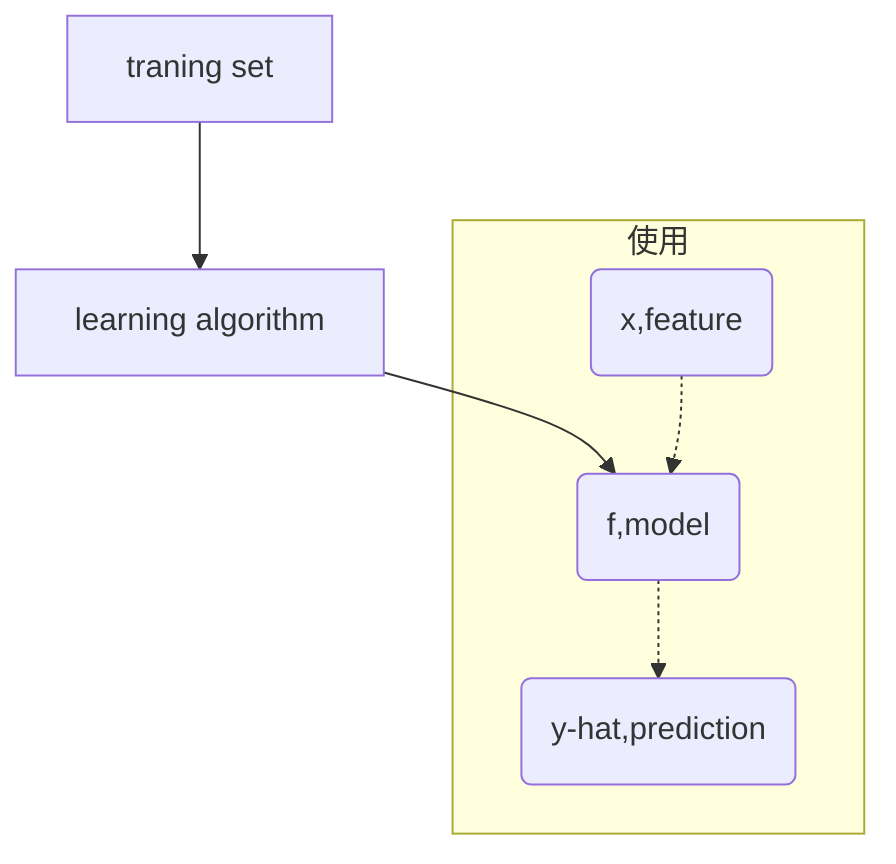

# 3.1-3.6 线性回归
## 3.1-3.2 线性回归模型
### 1. 标记
$(x^{(i)},y^{(i)})$ = ith training example, (input, output) or (feature, target)
### 2. 流程

$f_{wb}(x)=wx+b$
1. linear regression
	1. univariate linear regression 只有一个自变量的线性回归
## 3.3 代价函数 cost function
$$J_{w,b}=$$
squared error cost function
![[Pasted image 20240322161739.png]]
![[Pasted image 20240322161845.png]]
## 3.4 代价函数的直观理解
Choose w to minimize J(w)
## 3.5-3.6 可视化代价函数
当你没有b，只改变J会像个二次函数，同时改变就是三维的碗状态。
![[Pasted image 20240322234724.png]]
![[Pasted image 20240322234743.png]]