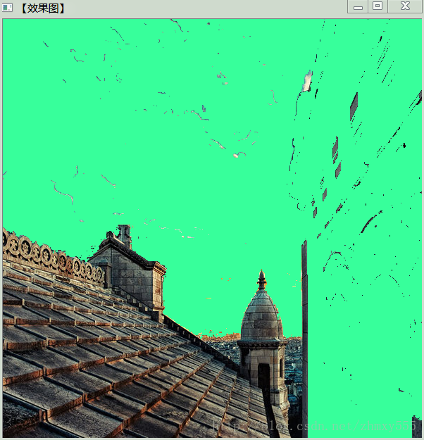

# floodfill洪水填充

第一种填充方式：以高低值判断填充区域
第二种填充方式：以被1包围的的闭合空间作为填充区域

[odfill](https://qianmo.blog.csdn.net/article/details/28261997?spm=1001.2101.3001.6661.1&utm_medium=distribute.pc_relevant_t0.none-task-blog-2%7Edefault%7ECTRLIST%7Edefault-1-28261997-blog-80966724.pc_relevant_aa&depth_1-utm_source=distribute.pc_relevant_t0.none-task-blog-2%7Edefault%7ECTRLIST%7Edefault-1-28261997-blog-80966724.pc_relevant_aa&utm_relevant_index=1)




# 例
```cpp
cap >> video1;
video2 = video1.clone();
split(video1, bgrChannels);//分离通道

//二值化（红色光用 2-0， 蓝色光用 0-2，为了保证正值）
//结果输出回video1
threshold(bgrChannels[2] - bgrChannels[0], video1, 100, 255, CV_THRESH_BINARY_INV);

//漫水法去除箭头图形，更简洁
//  会让速度变慢，已淘汰
//floodFill(video1, Point(0, 0), Scalar(0));
```