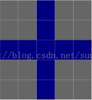

# getStructuringElement

[getStructuringElement函数(推荐)_3DYour的博客-CSDN博客_getstructuringelement](https://blog.csdn.net/abc1831939662/article/details/104305207)

```cpp
element = cv2.getStructuringElement(cv2.MORPH_CROSS,(5,5))
```


```cpp
cv::Mat element = getStructuringElement(cv::MORPH_RECT,cv::Size(3, 3), cv::Point(-1, -1));
//结构元素(内核矩阵)
    /*
    第一个参数:表示内核的形状
        矩形：MORPH_RECT
        交叉形：MORPH_CROSS
        椭圆形：MORPH_ELLIPSE
    第二参数:内核的尺寸
    第三个参数:锚点的位置.锚点的位置，有默认值Point（-1,-1），表示锚点位于中心点。element形状唯一依赖锚点位置，其他情况下，锚点只是影响了形态学运算结果的偏移
     */

    cv::Mat element1 = getStructuringElement(cv::MORPH_RECT, cv::Size(5, 5), cv::Point(-1, -1));
    std::cerr << element << std::endl<<std::endl;
    std::cerr << element1 << std::endl;
```

## 自定义
```python
>>> kernel = np.ones((5,5),np.uint8)
>>> kernel
array([[1, 1, 1, 1, 1],
       [1, 1, 1, 1, 1],
       [1, 1, 1, 1, 1],
       [1, 1, 1, 1, 1],
       [1, 1, 1, 1, 1]], dtype=uint8)
```