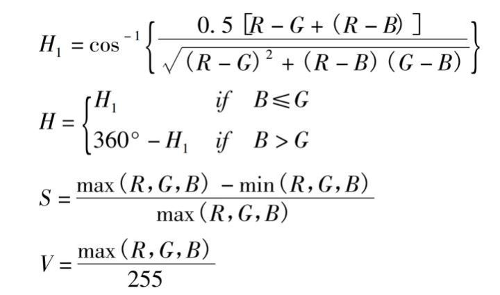
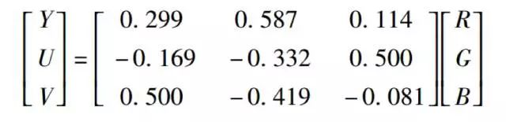

# Robomaster能量靶识别

[我的代码](main.cpp)

[RoboMaster能量机关识别的简易实现_海人007的博客-CSDN博客_robomaster 能量机关](https://blog.csdn.net/qq_45742471/article/details/105183884)
[RoboMaster视觉教程（9）风车能量机关识别2_Raring_Ringtail的博客-CSDN博客_能量机关](https://blog.csdn.net/u010750137/article/details/100825793)
[内附代码｜今年的大风车能量机关识别就是这么地so easy！](https://mp.weixin.qq.com/s/3B-iR32GX7jfVyxvNQVRXw)

1. [RGB 识别红光](#rgb-识别红光)
2. [二值化](#二值化)
3. [轮廓查找](#轮廓查找)
4. [透视变换](#透视变换)
5. [SVM or 模板匹配法](#svm-or-模板匹配法)
6. [圆形拟合 最小二乘法](#圆形拟合-最小二乘法)

## RGB 识别红光
风车上会有红光，如何变为容易识别的图像？

对于图像中红色的物体来说，其rgb分量中r的值最大，g和b在理想情况下应该是0，同理蓝色物体的b分量应该最大。

如果识别红色物体可以直接用r通道-b通道。由于在**低曝光**下只有灯条是有颜色的，两通道相减后，其他区域的部分会因为r和b的值差不多而被减去，而蓝色灯条部分由于r通道比b通道的值小，相减后就归0了，也就是剩下的灰度图只留下了红色灯条。

注意条件是**低曝光**，所以如果我用的录像不好用，则可以尝试：
[用色彩空间做图像处理，让颜色提取更高效](https://zhuanlan.zhihu.com/p/32269942)

HSV 或 YUV:
1. HSV:
   
   在 HSV 色彩空间中 H，S，V 这三个通道分别代表着**色相(Hue)**，**饱和度(Saturation)**和**明度(Value)**。
   实际上，HSV 格式是 RGB 的一种变形。`H` 代表**色彩**，`S` 代表**颜色的深浅**，`V` 代表着**颜色的明暗程度**。

   ```opencv
   cvtColor(src, dst, COLOR_BGR2HSV)
   ```

   ```opencv
   HSV = cv2.cvtColor(img, cv2.COLOR_BGR2HSV)  #RGB 转为 HSV
   H, S, V = cv2.split(HSV)    #分离 HSV 三通道
   Lowerred0 = np.array([155,43,35])
   Upperred0 = np.array([180,255,255])
   mask1 = cv2.inRange(HSV, Lowerred0, Upperred0) 
   Lowerred1 = np.array([0,43,35])
   Upperred1 = np.array([11,255,255])
   mask2 = cv2.inRange(HSV, Lowerred1, Upperred1)    #将红色区域部分归为全白，其他区域归为全黑
   Apple = mask1 +mask2
   cv2.imshow("apple", Apple)
   cv2.waitKey(0)
   ```

2. YUV:
   
   YUV 色彩空间实际上是把一幅彩色的图片分成了一个表示暗亮程度的**亮度信号(Luminance)**Y，和**两个表示颜色的色度信号(Chrominance)U 和 V**。**U，V**通道分别是**蓝色通道**和**红色通道**，Y 通道表示亮度信息。

   ```opencv
   fruit = cv2.imread("fruits.jpg")
   fruit = cv2.cvtColor(fruit,cv2.COLOR_BGR2YUV)
   Y,U,V = cv2.split(fruit)
   Blueberry = cv2.inRange(U,130,255)
   Strawberry = cv2.inRange(V,170,255)
   cv2.imshow("blueberry",Blueberry)
   cv2.imshow("strawberry",Strawberry)
   cv2.waitKey(0)
   ```

## 二值化


## 轮廓查找
[](../../AI算法/轮廓查找.md)

## 透视变换


## SVM or 模板匹配法
1. [SVM](../../AI算法/SVM.md)

2. 模版匹配法
   [模版匹配](https://baike.baidu.com/item/模板匹配/20823665)
   
   其实就是将两个图片进行比较，看看相关性啦，差距啦之类的。

## 圆形拟合 最小二乘法