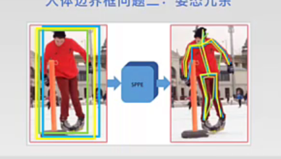
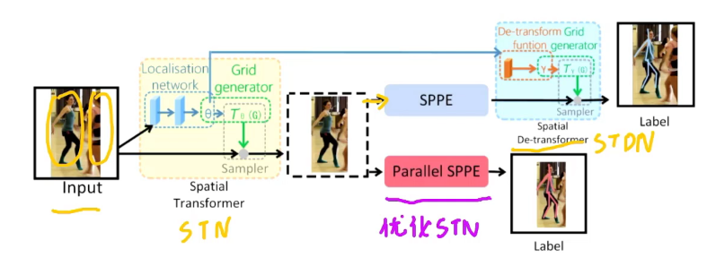
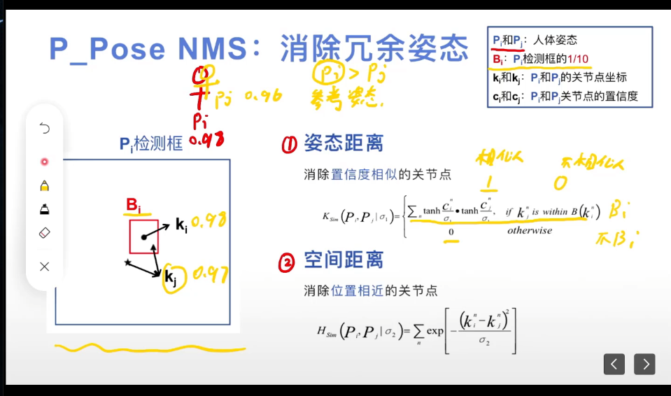
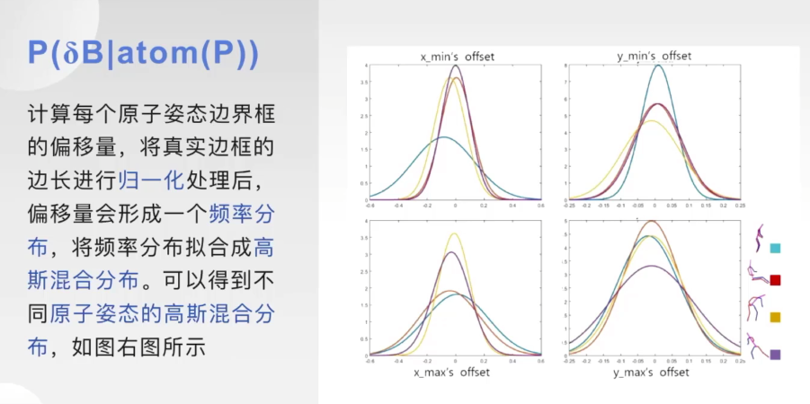

# alphapose

## 资源
[bilibili：人体姿态估计 Alphapose](https://www.bilibili.com/video/BV1hb4y117mu?p=2&spm_id_from=pageDriver&vd_source=6beebf17d5aa6fb3d9fb4b629d0b319a)

[GitHub - MVIG-SJTU/AlphaPose: Real-Time and Accurate Full-Body Multi-Person Pose Estimation&amp;Tracking System](https://github.com/MVIG-SJTU/AlphaPose)

[CS348 Computer Vision（官网）](https://www.mvig.org/research/alphapose.html)

## 提出两个问题
1. 边界框定位不准确
2. 姿态冗余（faster-RCNN 会有多个候选框，所以会有多个姿态产生）

## SPPE对称空间变换网络
**Regional Multi-Person Pose Estimation （RMPE）**是一种区域多人姿态估计框架。即使在人体边界框定位出错的情况下也能进行正确估计，该框架包含三部分：
* Symmertric Spatial Transformer Netword - SSTN (对称空间变换网络) **解决问题一**
* Parametric Pose Non-Maximum-Suppression - P_Pose NMS (参数化姿态非最大抑制) **解决问题二**
* Pose-Guided Proposals Generator - PGPG (姿态引导区域框生成器) **数据增强 - 对SSTN进行训练**

### SSTN
使检测人物在检测框居中

STN：用于从不准确的候选框中抽取高质量的单人区域。

SPPE：一个单人姿态估计器，从STN抽取的区域中估计此人的姿态动作。

SDTN：一个空间逆变换网络，将估计出的姿态重新映射到图像坐标系下。

Pose-NMS：一个参数化的姿态非极大抑制方法来处理冗余的估计结果。

Parallel SPPE：优化STN，提取更精确的人体检测框，仅用于训练，测试时没有它。

### P_Pose NMS 参数化非最大值抑制
消除冗余姿态

1. **姿态距离**：以Pi这个置信度较大的为基准，每个关节点的姿态距离计算完函数后加起来大于五说明是两个人高度相似是同一个人的，就删除，保留置信度较大的pi。

2. **空间距离**：也是一样的，直接计算两个姿态的距离。

满足一个标准就删除。

### PGPG数据增强
不同的姿态的偏移量分布是不同的

P(δB|atom(P)): 表示源自姿态P的偏移量分布，atom(P)是原子姿态（比如站着的数以一种姿态，称之为一种原子姿态）

如图，根据每种原子姿态的来自不同图测试出的预测框和实际标签框的归一化距离，拟合成高斯混合分布，以此会生成大量预测框训练sstn。
