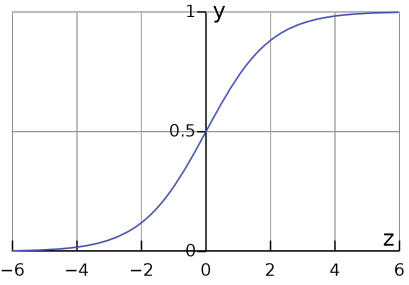
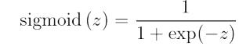
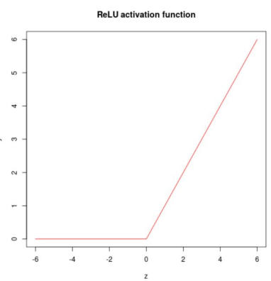
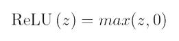
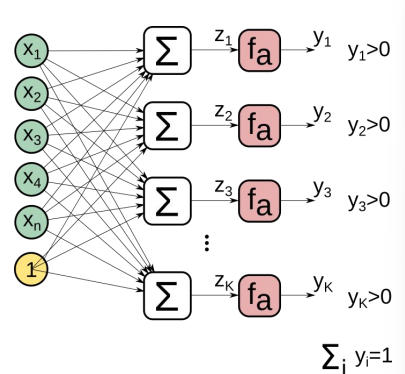
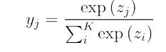
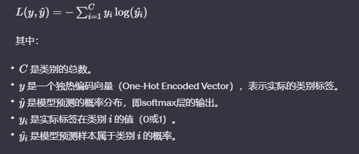

# 激活函数
sigmoid
-------

sigmoid(z) = 1/(1+exp(-z))

容易**导致**梯度消失vanishing gradient问题

常用于[LSTM](LSTM.md)的 gate neurons

常用于二元分类任务输出层的激活函数

ReLU
----

ReLU(z) = max(z,0)

可以相对减少梯度消失vanishing gradient问题

simpler, faster than sigmoid

danger of “dead” neurons

它有一个不可微点，但这在实践中并不影响

也可以用于分类任务，像回归任务一样

Softmax
-------

K类（非二元）分类任务中，提供y\_j所需条件的特殊激活函数

这一层通常与分类交叉熵损失函数Categorical Cross-Entropy Loss一起使用。

