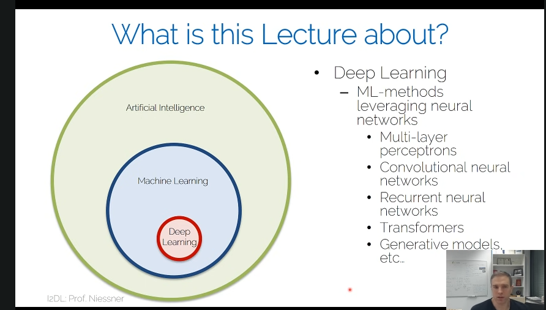
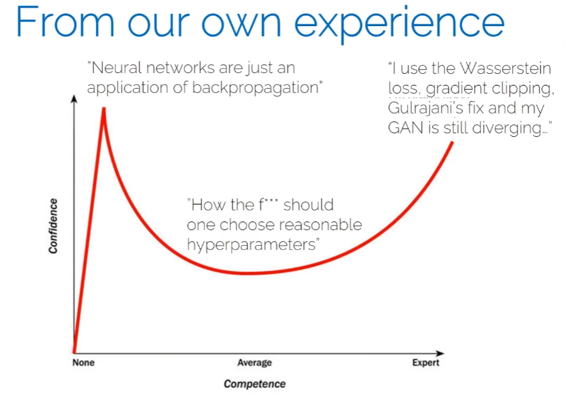

# Lecture 01 - Introduction

## 结构
AI -> ML -> DL

## Application Areas
- Computer Vision
- Medical Image
- Robotics
- Natural Language Processing(NLP)
- Computer Graphics
- many more

其中CV推动了DL的发展。

MLP：Multi-Layer Perceptron 多层感知器

## History
重点 2012年以后，2012年AlexNet。

一些名词：
1. GAN - Generative Adversarial Networks 生成对抗网络
2. LSTM - Long Short-Term Memory 长短期记忆(神经网络)

## experience

