# Lecture 06 - Training Neural Networks

- [1. Learning Rate: Implications](#1-learning-rate-implications)
- [2. Learning Rate Decay (学习率衰减)](#2-learning-rate-decay-学习率衰减)
  - [2.1. Common way](#21-common-way)
  - [2.2. Other ways](#22-other-ways)
  - [2.3. Training Schedule](#23-training-schedule)
  - [2.4. Basic Recipe for Training](#24-basic-recipe-for-training)
- [3. Validation](#3-validation)
  - [3.1. Training, Validation, Test集](#31-training-validation-test集)
  - [3.2. Cross-validation](#32-cross-validation)
- [4. Error](#4-error)
- [5. Learning Curves和观察问题](#5-learning-curves和观察问题)
  - [5.1. Under-Over fitting,Idea Training,Bad situation小结](#51-under-over-fittingidea-trainingbad-situation小结)
- [6. Hyperparameters](#6-hyperparameters)
  - [6.1. Hyperparameter Tuning](#61-hyperparameter-tuning)
- [7. 训练实践和经验](#7-训练实践和经验)
  - [7.1. 如何开始](#71-如何开始)
  - [7.2. 找到好的学习率](#72-找到好的学习率)
  - [7.3. Coarse Grid Search (粗网格搜索)](#73-coarse-grid-search-粗网格搜索)
  - [7.4. Refine Grid (细化网格)](#74-refine-grid-细化网格)
  - [7.5. Timings (时间)](#75-timings-时间)
  - [7.6. Network Architecture](#76-network-architecture)
  - [7.7. Debugging](#77-debugging)
  - [7.8. Common mistakes in practice](#78-common-mistakes-in-practice)
- [8. Tensorboard: Visualization in Practice](#8-tensorboard-visualization-in-practice)
- [9. 附：Confusion Matrix](#9-附confusion-matrix)


## 1. Learning Rate: Implications

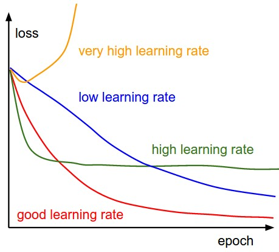

* Need high learning rate when far away.
* Need low learning rate when close.

不然会overshoot:

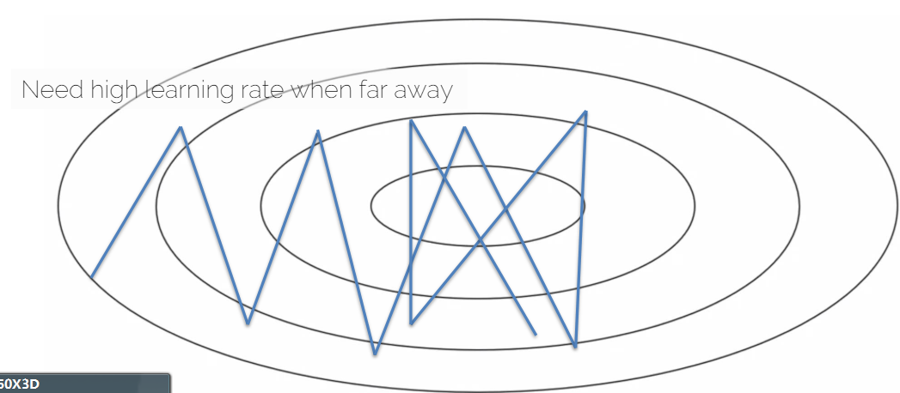

## 2. Learning Rate Decay (学习率衰减)

### 2.1. Common way
$$\alpha = \frac{\alpha_0}{1 + decay\_rate \times epoch}$$

- $\alpha_0$: 初始学习率
- 比如$\alpha_0 = 0.1, decay\_rate = 1.0$
  - epoch 0: $\alpha = 0.1$
  - epoch 1: $\alpha = 0.05$
  - epoch 2: $\alpha = 0.033$
  - ...

### 2.2. Other ways

1. Step decay
   1. $\alpha = \alpha - t \times \alpha$
   2. 每n步衰减一次
   3. t 是常常等于0.5的衰减率
2. Exponential decay
   1. $\alpha = t^{epoch} \times \alpha_0$
   2. t 是小于1的衰减率
3. $\alpha = \frac{t}{\sqrt{epoch}} \times \alpha_0$
   1. t 是衰减率
4. etc.

### 2.3. Training Schedule

手动给整个训练过程设置学习率

* Mannually set learning rate every n-epochs
* How?
  * Trial and error (the hard way)
  * Some experience (只有某些情况下适用)
* Consider: #epochs, training set size, network size, etc.

### 2.4. Basic Recipe for Training

* Given a data set with labels
  * ${x_i, y_i}$
    * $x_i$: 第i个训练图片，with label $y_i$
    * Often dim(x) >> dim(y) (e.g. for classification)
    * i is of ten in the 100-thousands or millions
  * Take network $f$ and its parameters $w$, $b$ (weights and biases)
  * Use SGD (or variation) to find optimal parameters $w$, $b$
    * Gradients from backpropagation

## 3. Validation
### 3.1. Training, Validation, Test集

Typical splits
- Train (60%), Val (20%), Test (20%)
- Train (80%), Val (10%), Test (10%)

During training:
- Train error comes from average minibatch error
- Typically take subset of validation every **n iterations**
  - 注意：这里说的是iterations，不是epochs。因为用epochs当然也可以，但是慢，不能实时调整。

### 3.2. Cross-validation

N fold cross-validation: 每次训练的时候，将数据集分成N份，每次Run取其中一份作为验证集，其他N-1份作为训练集。

**但是不一开始就用，一般最后再用，用来榨干最后一丝优化，因为使用这个可以有更多的训练集，相当于比直接的划分少了固定的validation集多了一些训练集。**

## 4. Error

```
Ground truth error - 1%
    ↕ Bias(underfitting)
Training set error - 5%  
    ↕ Variance(overfitting)
Val/Test set error - 8%
```

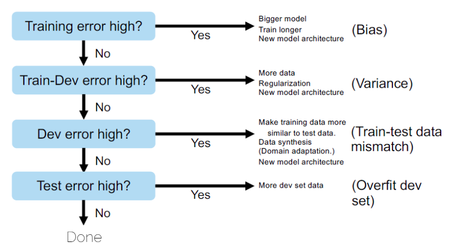

上图理解：
* Train error - ground truth 和 train 之间的误差 (Bias)
* Train-Dev error - train 和 validation 之间的误差 (Variance)
* Dev error - validation 和 test 之间的误差 (Train-test data mismatch)
* Test error - test结果的误差 （Overfit dev set）

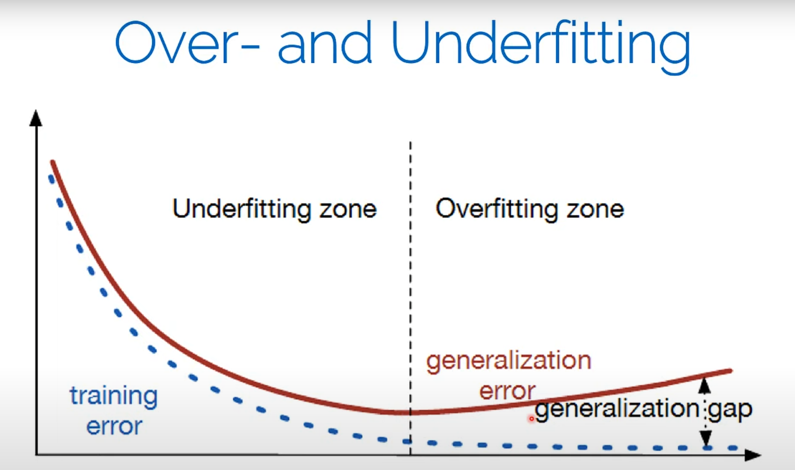

红线：validation error
蓝线：train error

## 5. Learning Curves和观察问题

一定要plot training 和 validation，不然不知道发生了什么，也可以早点知道存在一些错误。

1. Training graphs
   1. Accuracy
   2. Loss
   3. 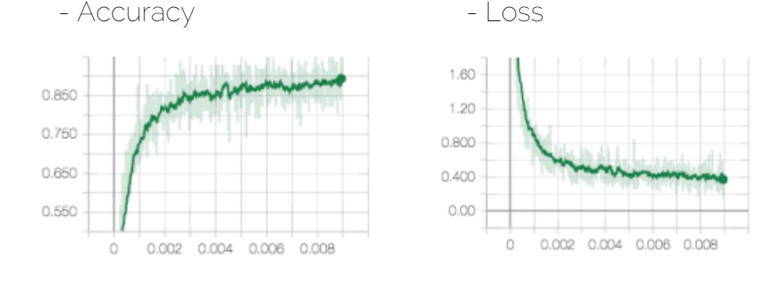
   4. **Tensorboard**可以用来画这个图，而且既可以和PyTorch，也可以和TensorFlow一起用。
   5. 在Loss图中深绿色是Average Loss, 浅绿色疯狂抖动是因为SGD（随机梯度下降）的原因，因为每次只用了一部分数据，所以会有很大的波动，浅绿色是Current Loss for each batch/iteration。batch size越小，波动越大，反之越stable。
   6. 理解：画到一张图的方法很简答，比如直接在浅绿色上跳过几个点，中间的求平均值就行了，这样就实现平滑了。
2. Validation Curve
   1. 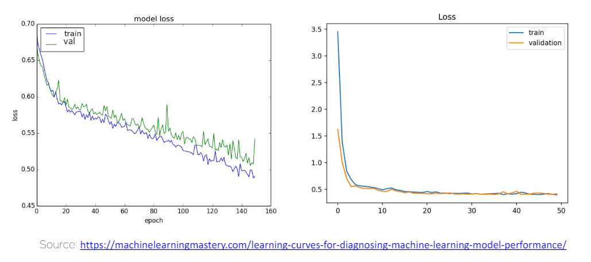
   2. Overfitting curves
      1. 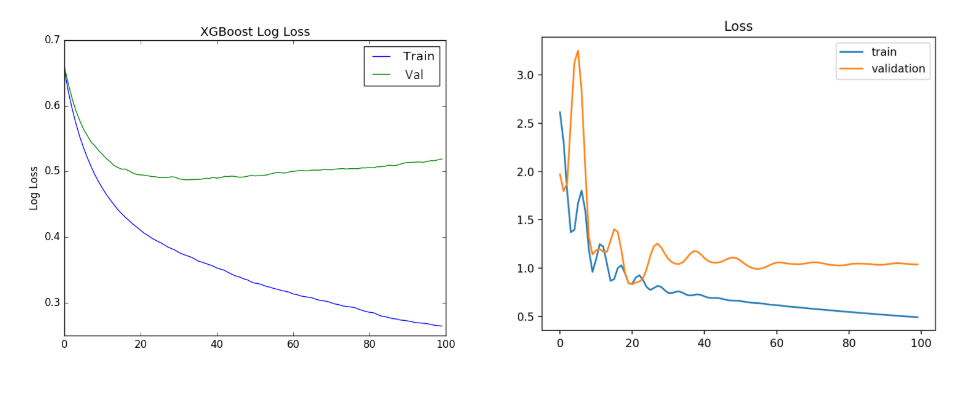
   3. Other curves
      1. 注意下左一不好，因为一开始下降的慢而且已知在下降，右一不好，是因为 validation loss 比 train loss 低。
      2. 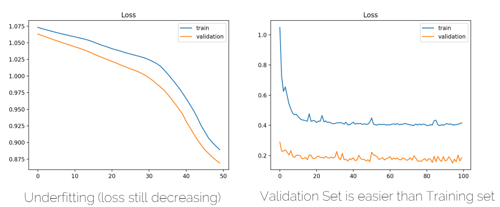

### 5.1. Under-Over fitting,Idea Training,Bad situation小结

- Underfitting
  - Training and validation losses decrease even at the end of training
- Overfitting
  - Training loss decreases and validation loss increases
- Ideal Training
  - Small gap between training and validation loss, and both go down at same rate (stable without fluctuations).

- Bad signs
  - Training error 不下降
  - Vaslidation error 不下降
  - Performance on validation better than on training set
  - 训练集上的测试结果和训练时不一样
    - 理解：在训练过程中监控的损失值或误差与训练结束后重新评估的结果存在显著差异。出现这种情况可能是由于训练过程中误差计算的不一致、数据泄露或代码实现错误等原因导致的。

- Bad practice
  - Training set contains test data
  - Debug algorithm on test data
  - **Never touch test edata during development or training**

## 6. Hyperparameters

* Network architecture (e.g. num layers, #weigts)
* Number of iterations
* Learning rate(s) (i.e. solver parameters, decay, etc.)
  * solver是指优化器，比如SGD，Adam等
* Regularization
* Batch size
  * 某种情况下特别不稳定（不稳定比如看上面有个浅绿色的图，当然不是说那个就不稳定）的时候，然后想稳定，可以用accumulated gradient，就是把几个batch的梯度加起来，然后再更新参数。
* ...
* Overall:
  * learning setup + optimization = hyperparameters

### 6.1. Hyperparameter Tuning

* Manual search:
  * most common
* Grid search
  * Define ranges for all parameters spaces and select points
  * Usually pseudo-uniformly distributed (伪均匀分布)
  * Iterate over all possible configurations
* Random search
  * 像网格搜索一样，但是在预定义的范围内随机选择点。

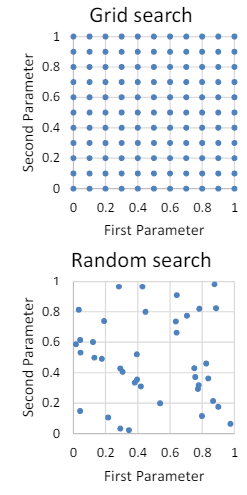

## 7. 训练实践和经验
### 7.1. 如何开始

1. 从single training sample开始
   1. 检查输出是否正确
   2. 过拟合 -> 训练精确度should be 100%，因为输入是记忆化的
2. 增加一些样本(e.g. 4)
   1. 检查是否被正确处理
3. Move from overfitting to more samples
   1. 5, 10, 100, 1000, ...
   2. At some point, 你会发现generalization。

### 7.2. 找到好的学习率

1. 使用所有数据with small weight decay
2. 执行 initial loss sanity check (初始损失检查)
   1.  e.g. log(C) for softmax with C classes
3.  Find a learning rate that makes the loss drop significantly (exponentially) within 100 iterations
4.  Good learning rates to try:
    1.  1e-1, 1e-2, 1e-3, 1e-4
    2.  数学写法$10^{-1}, 10^{-2}, 10^{-3}, 10^{-4}$

### 7.3. Coarse Grid Search (粗网格搜索)

先用粗网格搜索获得一部分high levbel结果，然后再fine tune and tweak。

* Tune: 更系统化、全面的优化，通常用于提高整体性能。
* Tweak: 较小幅度、局部的调整，通常用于解决具体的小问题或进行微调。

1. 选择一小部分的学习率和衰减权重的值 around what worked from(aroun)
2. 为了一小部分epochs训练一小部分模型
3. Good weight decay to try:
   1. 1e-4, 1e-5, 0

### 7.4. Refine Grid (细化网格)

1. Pick best models found with coarse grid search
2. Refine grid search around these models
3. Train them for longer (10-20 epochs) without learning rate decay
4. Study loss curves <- most important debugging tool!

### 7.5. Timings (时间)
* 每个iteration的时间
  * 获取精确的时间
  * 如果一个iteration超过500ms，things get dicey(冒险的)
* 找到瓶颈
  * Dataloading: samller resolution, compression, train from SSD
  * Backprop
* Estimate total time
  * 多久才能看到一些pattern?
  * 多久才能convergence?

### 7.6. Network Architecture

1. Frequent mistake at the beginning: 用超级大的network训练两周看看
2. Instead: 用最简单的network
   1. 经验法则: divde #layers you started with by 5
3. Get debug cycle down (缩短debug周期)
   1. 最好是分钟级别

### 7.7. Debugging

* Use train/validation/test curces
  * Evaluation 需要 consistent
  * Numbers 需要 comparable
* 每次只改变一样东西
* 可视化输入，预测，ground truth

### 7.8. Common mistakes in practice

* 没有先过拟合到单个batch
* 忘记切换网络的train/eval模式
  * 后面讲dropout的时候再说
* 忘记在调用`.backward()`之前调用`.zero_grad()` (pytorch)、
  * **梯度累积**: 每次调用backward()时，计算出的梯度会累加到已经存在的梯度上。这意味着每次参数更新时，使用的梯度不仅包括当前批次的梯度，还包括所有之前批次的梯度。
  * ```python
    optimizer = torch.optim.SGD(model.parameters(), lr=0.01)

    for data, target in train_loader:
        optimizer.zero_grad()  # 清除之前的梯度
        
        output = model(data)
        loss = criterion(output, target)

        
        
        loss.backward()
        optimizer.step()
    ```
* 将softmax输出传递给期望原始logits的损失函数

## 8. Tensorboard: Visualization in Practice

* Compare Train/Val Curves
  * 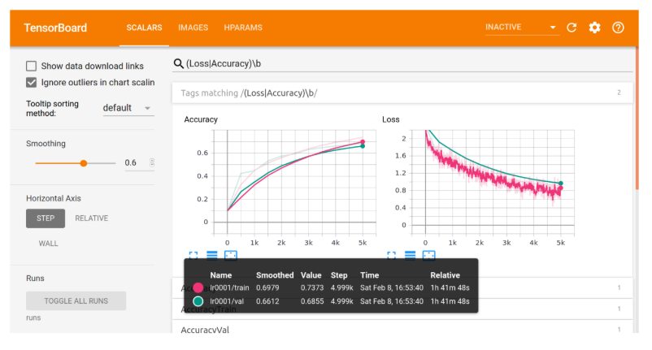
* Compare Different Runs
  * 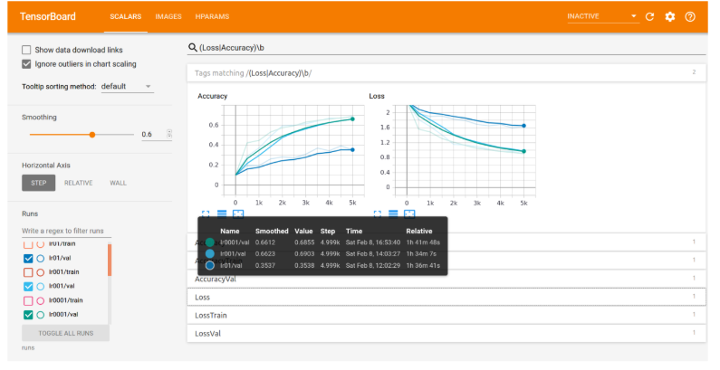
* Visualize Model Predictions
  * 
  * 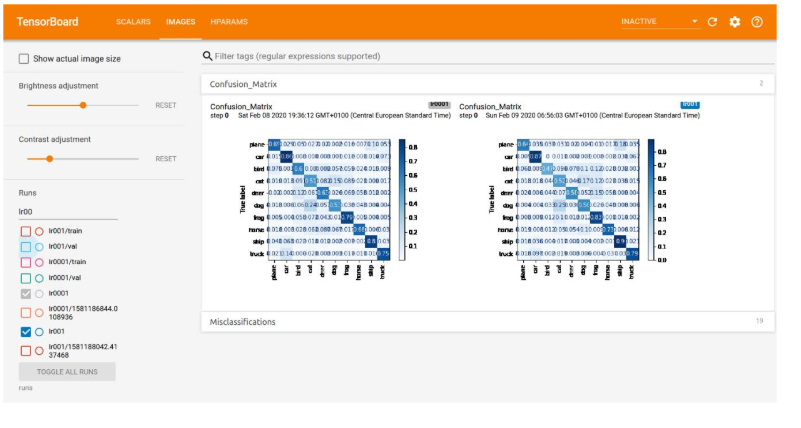
* Compare Hyperparameters
  * 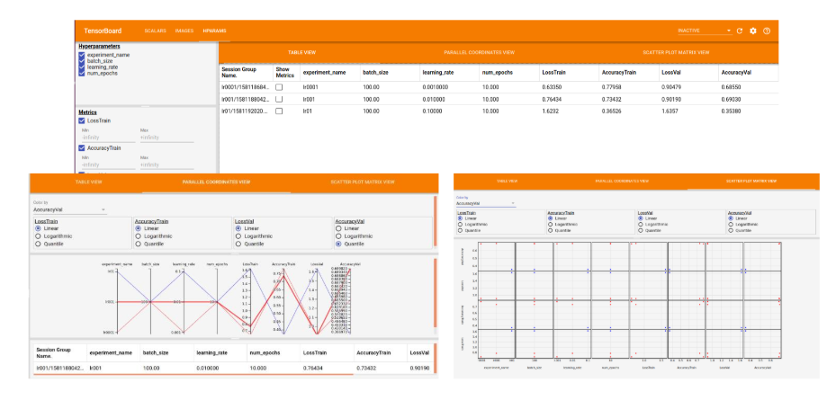


## 9. 附：Confusion Matrix

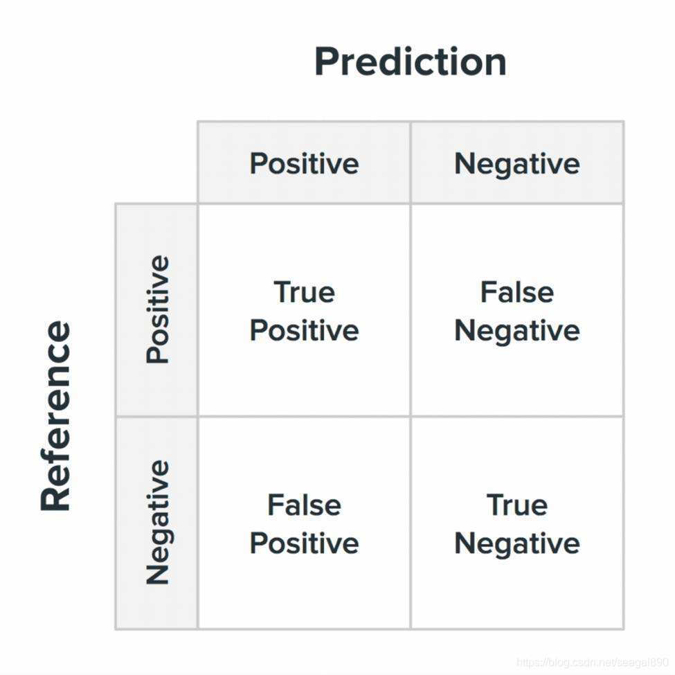