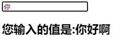
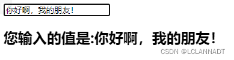

# v-bind和v-model的区别

[v-bind](v-bind.md) 是单向的

[v-model](v-model.md) 是双向的

## v-bind
```html
<!DOCTYPE html>
<html lang="en" xmlns:v-bind="http://www.w3.org/1999/xhtml">
<head>
    <meta charset="UTF-8">
    <title>Title</title>
 
</head>
<body>
 
<div id="app">
    <input type="text" v-bind:value="message" />
    <h2>您输入的值是:{{message}}</h2>
</div>
 
<script src="https://cdn.jsdelivr.net/npm/vue@2.5.21/dist/vue.min.js"></script>
<script>
    const app = new Vue({
        el:"#app",
        data:{
            message:'你好啊',
        },
        methods:{
 
        }
    })
</script>
</body>
</html>
```

删除input框中的“好啊”，下方的值并没有改变，所以是单向的。


## v-model
```html
<!DOCTYPE html>
<html lang="en" xmlns:v-bind="http://www.w3.org/1999/xhtml">
<head>
    <meta charset="UTF-8">
    <title>Title</title>
 
</head>
<body>
 
<div id="app">
    <!-- <input type="text" v-bind:value="message" /> -->
    <input type="text" v-model="message" />
    <h2>您输入的值是:{{message}}</h2>
</div>
 
<script src="https://cdn.jsdelivr.net/npm/vue@2.5.21/dist/vue.min.js"></script>
<script>
    const app = new Vue({
        el:"#app",
        data:{
            message:'你好啊',
        },
        methods:{
 
        }
    })
</script>
</body>
</html>
```

增加“，我的朋友！”，发现下方的值也跟着改变了，说明是双向的。
