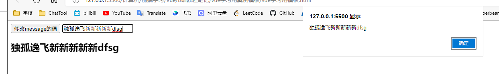

# v-mdel

* 便捷地获取和设置**表单元素**的值
* 绑定的数据会和表单元素值相关联，即**双向数据绑定**

```html
    <div id="app">
        <input type="text" v-model="message" @keyup.enter="getM">
        <h2 v-text="message"></h2>
    </div>
    <!-- 开发环境版本，包含了有帮助的命令行警告 -->
    <script src="https://cdn.jsdelivr.net/npm/vue/dist/vue.js"></script>
    <script>
        var app = new Vue({
            el:"#app",
            data:{
                message:"独孤逸飞"
            },
            methods:{
                getM(){
                    alert(this.message);
                }
            }
        })
    </script>
```



注意如果同时使用 input text 的value属性和v-model属性，会按照v-model的来

## v-model.numer
v-model 默认绑定的都是字符串，而使用 number 修饰符，就会将其自动转换为number类型
