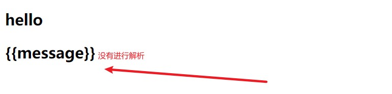

# v-pre

**当你想输出不被解析的纯文本时**

```javascript
<div id="app">
  <h2>{{message}}</h2>
  <h2 v-pre>{{message}}</h2>
</div>
<script src="../js/vue.js"></script>
<script>
  const app = new Vue({
    el: '#app',
    data: {
      message: 'hello'
    }
  })
</script>
```

