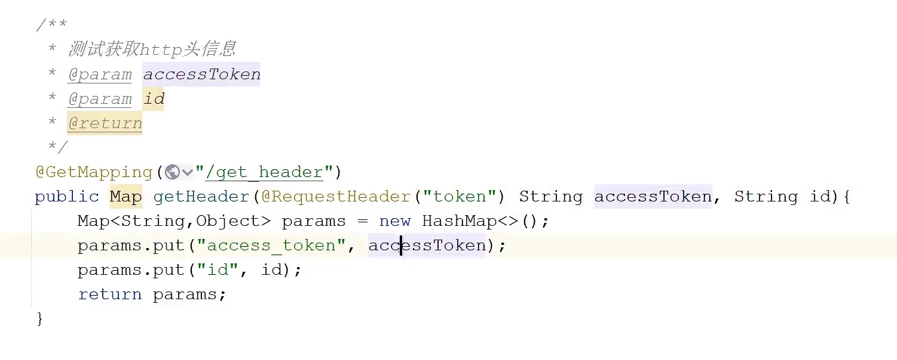

# MockMVC

## 什么是Mock
在面向对象的程序设计中，模拟对象（mock object）是以可控的方式模拟真实对象行为的假对象。在编程过程中，通常通过模拟一些输入数据来验证程序是否达到预期结果。

## 为什么使用Mock对象

使用模拟对象，可以模拟复杂的、真实的对象行为。如果在单元测试中无法使用真实对象，可采用模拟对象进行代替。

在以下情况可以采用模拟对象来替代真实对象：
* 真实对象的行为是不确定的（例如，当前的时间或温度）
* 真实对象很难搭建起来
* 真实对象的行为很难触发（例如，网络错误）
* 真实对象速度很慢（例如，一个完整的数据库，在测试之前可能需要初始化）
* 真实的对象是用户界面，或包括用户界面在内
* 真实的对象使用了回调机制
* 真实对象可能还不存在
* 真实对象可能包含不能用作测试（而不是为实际工作）的信息和方法

## Mockito
模拟对象的生成器

### 使用步骤
1. 模拟测试类所需的外部依赖
2. 执行测试代码
3. 判断执行结果是否符合预期

## MockMVC

MockMVC是Spring提供的一个用于测试Spring MVC的类，它可以模拟发送HTTP请求，然后对返回的结果进行验证。

是由spring-test包提供，实现了对Http请求的模拟，能够直接使用网络的形式，转换到Controller的调用，使得测试速度快、不依赖网络环境。同时提供了一套验证的工具，结果的验证十分方便。

配合JUnit使用，可以很方便的进行单元测试。

## 案例注释解释

```java
package lsea.controller;

import lsea.LaboratoryApplication;
import org.junit.Test;
import org.junit.runner.RunWith;
import org.springframework.boot.autoconfigure.SpringBootApplication;
import org.springframework.boot.test.autoconfigure.web.servlet.AutoConfigureMockMvc;
import org.springframework.boot.test.context.SpringBootTest;
import org.springframework.test.context.junit4.SpringRunner;
import org.springframework.test.context.web.WebAppConfiguration;
import org.springframework.test.web.servlet.MockMvc;
import org.springframework.test.web.servlet.MvcResult;
import org.springframework.test.web.servlet.request.MockMvcRequestBuilders;
import org.springframework.test.web.servlet.result.MockMvcResultHandlers;
import org.springframework.test.web.servlet.result.MockMvcResultMatchers;
import springfox.documentation.spring.web.json.Json;

import javax.annotation.Resource;

@RunWith(SpringRunner.class) // 是在JUnit4环境中用于启动Spring测试上下文的注解
@SpringBootTest(classes = {LaboratoryApplication.class}, webEnvironment = SpringBootTest.WebEnvironment.RANDOM_PORT) // 指定入口类，random_port防止端口冲突。不指定web环境的话，可以用@WebAppConfiguration，但是用这个就不能用其他配置了。
@AutoConfigureMockMvc // 自动配置MockMvc
public class IndexControllerTest {

    @Resource // 注入MockMvc
    private MockMvc mockMvc;

    @Test
    public void sanityCheck() throws Exception {
        Json json = new Json("{\"count\":0,\"data\":null,\"meta\":{\"message\":\"Hello World!\"}}");
        MvcResult result = mockMvc.perform(MockMvcRequestBuilders.get("/")
                .contentType("application/json;charset=UTF-8"))
                .andExpect(MockMvcResultMatchers.status().isOk())
                .andExpect(MockMvcResultMatchers.content().json(json.value())) // 判断返回的json是否符合预期，有很多其他匹配器的方法，比如String、xml、jsonPath等
                .andDo(MockMvcResultHandlers.print()) // 打印出请求和相应的内容
                .andReturn();
    }

    @Test
    @DisplayName("JSON响应测试用例") // controller见下图片
    public void testJsonResponse() throws Exception {
        mockMvc.perform(MockMvcRequestBuilders.get("/v1/get_header")
                .header("token", "123456")
                .param("id", "1")
        )  
                .andExpect(MockMvcResultMatchers.status().isOk())
                .andExpect(MockMvcResultMatchers.jsonPath("access_token").value("123456"))
                .andDo(MockMvcResultHandlers.print())
                .andReturn();
    }

}
```

