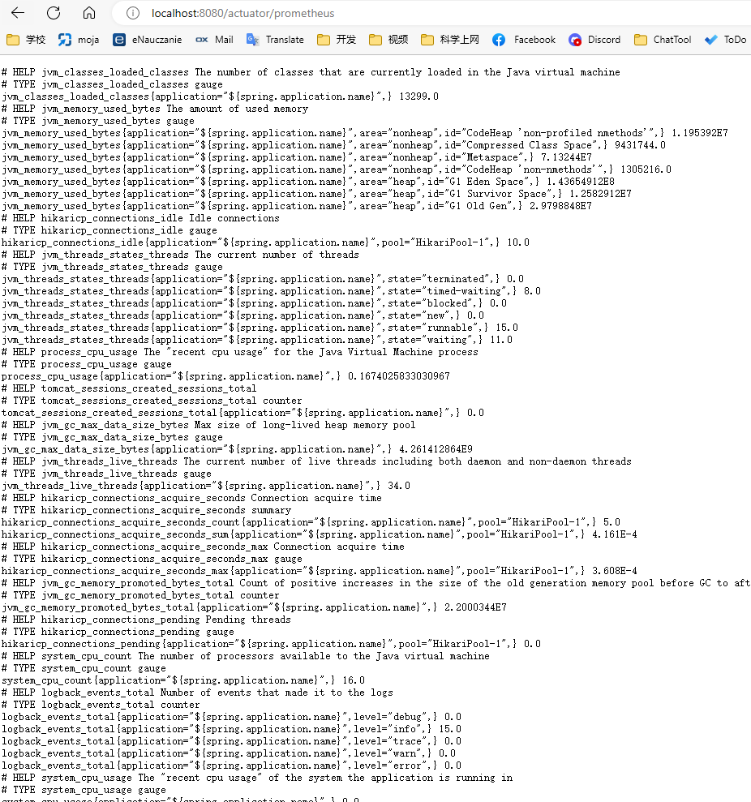

# Prometheus

[Prometheus](../%E6%80%A7%E8%83%BD%E6%B5%8B%E8%AF%95%E7%9B%91%E6%8E%A7/Prometheus.md)

## spring配置
```xml
		<dependency>
			<groupId>io.micrometer</groupId>
			<artifactId>micrometer-registry-prometheus</artifactId>
			<version>1.6.4</version>
		</dependency>
		<dependency>
			<groupId>org.springframework.boot</groupId>
			<artifactId>spring-boot-starter-actuator</artifactId>
		</dependency>
```

## 配置文件
这是spring-boot-starter-actuator的配置

[actuator](./actuator.md)

启动后可以通过 localhost:8080/actuator/prometheus 访问

