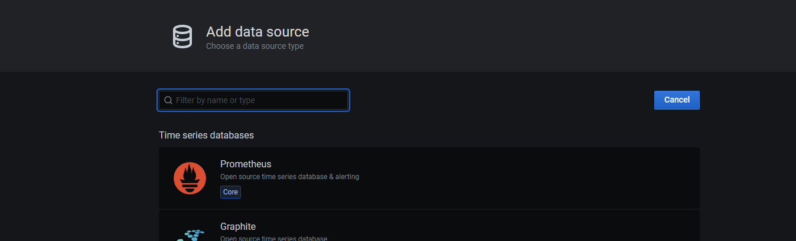
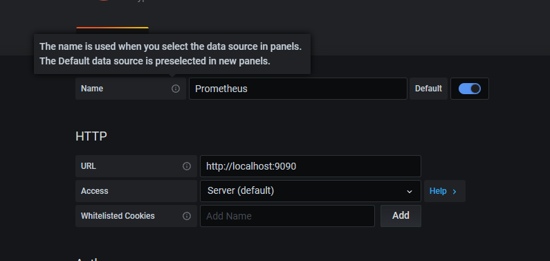

# Grafana

## 下载安装
- https://grafana.com/docs/ 
- https://grafana.com/tutorials/ 
```bash
wget https://dl.grafana.com/oss/release/grafana-7.4.3.linux-amd64.tar.gz
tar -zxvf grafana-7.4.3.linux-amd64.tar.gz 
```

## 启动
```bash
./bin/grafana-server web 
```

## 信息来源
[actuator](../SpringBoot/actuator.md)
[Prometheus](../SpringBoot/Prometheus.md)

## 修改配置文件
默认端口3000，可以在下面修改
`conf/defaults.ini`

## 打开
`http://localhost:3000/`

## 默认账号密码
`admin/admin`

## 添加数据源
Configuration -> Data Sources -> Add data source





## 添加dashboard
[Dashboards | Grafana Labs](https://grafana.com/grafana/dashboards/)

## 分布式
Grafana允许分布式，即另一个服务器部署grafana，同时Grafana有自己的云版本，网址是：https://用户名.grafana.net/

## 参考文献
1. [SLS时序监控实战: Spring Boot应用监控最佳实践-阿里云开发者社区](https://developer.aliyun.com/article/770726)
2. [Prometheus + Spring Boot 应用监控 - 废物大师兄 - 博客园](https://www.cnblogs.com/cjsblog/p/14434883.html)
