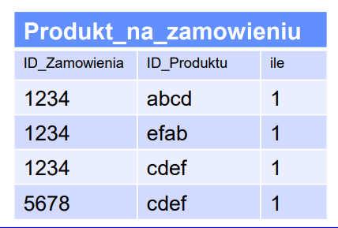
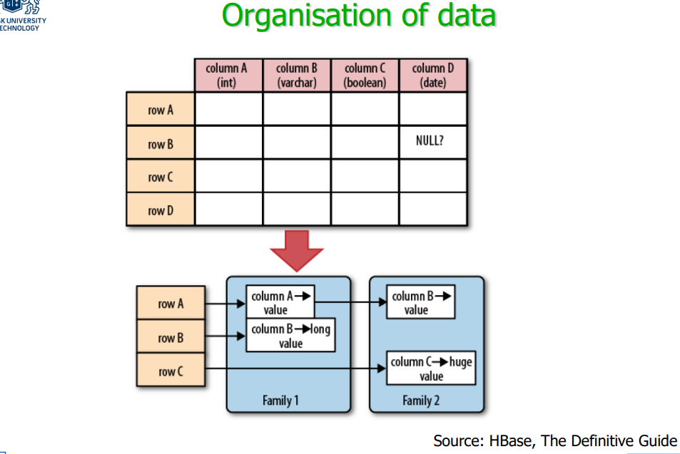
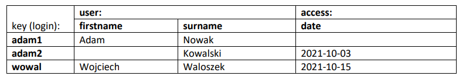

# Hadooop_HBase

## Basic concept

### HBase

* HBase is a base that was built from the very beginning as  intended for **parallel storage and processing**, 
* As such, it is designed with a huge emphasis on scalability, at  the cost of limited functionality 

* HBase 是从一开始就为并行存储和处理而构建的基础，
* 因此，它的设计非常强调可扩展性，但代价是功能有限

### HBase and HDFS
* HBase 可以看作是 Hadoop 和 HDFS 在数据存储领域提供的扩展， 
* HBase 通过以下方式丰富了文件支持： 
  - 查找具有特定键值的记录， 
  - 查找键值范围内的一组记录 , 
  - 更新记录的能力, 
  - 添加记录的能力, 
  - 删除记录的选项

### constraints
* HBase is unable to handle:
    * integrity rules,
    * transactions,
    * SQL,
    * joins
* Instead HBase offers:
    * atomic update of one record

### why HBase
* RDBMS 生命周期（大型互联网服务）： – 我们开始！
- 我们有一个定义明确的数据库模式，服务器就绪！
- 我们的人气越来越高，阅读量太大了！
- 让我们添加一个缓存！ 有用！ 但是……不是每个人都能看到当前数据了。
- 我们的人气越来越高！！ 写的太多了...
- 我们正在购买更好的服务器。 我们一半的收入被吃光了……

* RDBMS 生命周期继续：
  - 用户请求新功能：新表…… 
  - 连接太多！ 我们通过去规范化来减少它们的数量。
  - 一切都变慢了......
  - 不再存储函数和触发器 :( 
  - 一些查询仍然太慢......
  - 我们实现了一些查询而不是执行它们 
  - 读取仍然有效，但写入速度越来越慢 
  - 我们删除了除主键之外的所有索引

### Features
• In the CAP characteristic, CP type base, strongly coherent,
• Distributed, vertically and horizontally scalable, 
• Supports CRUD,
• Written in Java, open-source,
• Available through the Java API,
• Integrated with Map-Reduce processing framework,
• Provides network interfaces including REST,
• Flexible base structure supporting column organization

• CAP特性，CP类型基，强一致性， 
• 分布式，纵向和横向可扩展， 
• 支持CRUD， 
• Java编写，开源， 
• 可通过Java API获取， 
• 与Map-Reduce处理框架集成，  
• 提供包括 REST 在内的网络接口， 
• 支持列组织的灵活基础结构

### Column-oriented database
• Column-oriented databases have specific way of soring  data: data are stored column-by-column.
• Traditional storing method is row-by-row, like:               
    `Produkt_na_zamowieniu ((1234, abcd, 1), (1234, efab, 1),  (1234, cdef, 1), (5678, cdef, 1))`
• In column-oriented databases data are stored column-by-column: 
`((1234, 1234, 1234, 5678), (abcd, efab, cdef,  cdef), (1, 1, 1, 1))`



#### why column-oriented database
• 稍微简化一下，我们可以说在关系数据库中有两种访问数据的方法： 
    – 通过索引（Index Access）， 
    – 通过扫描（Table Scan）。
• 大多数分析查询必须通过扫描执行，

##### column = speed
• 面向行的数据库必须读取表的全部内容（由于从磁盘读取数据的方式“跳过”记录片段是不可行的） 
• 面向列的数据库将只读取所需的列

* 通常列数比我们的示例大得多（表 Produkt_na_zamowieniu 很可能还包含价格、总价值、备注等），这大大提高了收益

##### column = better compression
列基具有更大的数据压缩潜力，因为通常值经常重复（例如（1234, 1234, ..., 5678））对于大数据，磁盘传输成为瓶颈，压缩可以实现更大的加速

#### OLAP-only?
Selectivity of the query = average% of records returned from the table

• 根据已发表的研究，只有当查询的选择性 <= 10% 时，通过索引访问才有意义 \
• 然而，在解释这些结果时，我们需要考虑如何 使用索引

### Data model
• The data are stored in tables, 
• The tables contain rows, 
• Rows are made up of a key and (ordinary) columns, 
• The columns are grouped into column families 
• Each value is placed on a certain row, in a certain column (cell) and has a certain time stamp, which is also a version marker

### organization of data


• The data are stored in the way that allows for sparse filling of the matrix or rows and columns,
• Within one column family on can easily adds columns without adverse performance effects,
• Column families, in contrast, should stay constant during the system lifetime

• 数据以允许稀疏填充矩阵或行和列的方式存储， 
• 在一个列族中可以轻松添加列而不会对性能产生不利影响， 
• 相反，列族应在系统生命周期内保持不变

Keys and cell values are simply treated as sequences of bytes
Keys are sorted lexicographically, i.e. 1, 10, 2, 20, 3…

#### HBase vs RDBMS（data organization)
• Similarities:
– Data are organised into rows and columns,
– Rows have their keys,
• Differences:
– Columns are organised into column families,
– Columns can be added during „ordinary” work with table,
– The data is assigned time stamps, which allows for storing earlier versions

#### organization in time
• 每个单元格都有自己的时间戳，也表明记录的版本， 
• 当我们在不指定时间条件的情况下请求记录时，我们收到最新版本， 
• 我们可以在数据库中存储一定数量的版本，  
• 我们还可以设置删除内容的时间限制，进一步考虑，为简单起见，我们通常会假设我们保留每条记录的一个版本

### Data
*  Data in HBase are therefore members of the following structure:
    ```
    SortedMap<
        RowKey, List<
            SortedMap<
                Column, List<
                    Value, Timestamp
                >
            >
        >
    >
    ```
* Keys and cell values are simply treated as sequences of bytes
* Keys are sorted lexicographically, i.e. 1, 10, 2, 20, 3…

### Two basic forms of accessing HBase
• There are two basic forms of accessing data in HBase: Get and Scan,
• Get( key_value ) returns the value of the record for the given key value,
• Scan( key_value ) returns something like a cursor which traverses data in the direction of increasing key values. The initial position of the cursor is the record with the give key value, if such a record exists, or the record with the „next” closest value of the key otherwise 翻译： Scan(key_value) 返回类似于游标的东西，它以增加键值的方向遍历数据。 光标的初始位置是具有给定键值的记录，如果存在这样的记录，否则是具有“下一个”最接近键值的记录


## Operations

启动命令：`hbase shell`



```bash
create
list
put
get
scan
alter
disable 'table'
drop 'table'
```

```bash
create 'users', 'user', 'access'
put 'users', 'adam1', 'user:firstname', 'Adam'
put 'users', 'adam1', 'user:surname', 'Nowak'
put 'users', 'adam2', 'user:surname', 'Kowalski'
put 'users', 'adam2', 'access:date', '2021-10-03'
put 'users', 'wowal', 'user:firstname', 'Wojciech'
put 'users', 'wowal', 'user:surname', 'Waloszek'
put 'users', 'wowal', 'access:date', '2021-10-15'
```

1. Add a new record with the key adam10. Examine the contents of the table with scan 'users'. What is the position of the new record in the list? Why? (?)
```bash
put 'users', 'adam10', 'user:firstname', 'me'
```
result:
```bash
hbase(main):019:0> scan 'users'
ROW                      COLUMN+CELL                                                          
 adam1                   column=user:firstname, timestamp=1673422268489, value=Adam           
 adam1                   column=user:surname, timestamp=1673422268508, value=Nowak            
 adam10                  column=user:firstname, timestamp=1673422595513, value=me             
 adam2                   column=access:date, timestamp=1673422268550, value=2021-10-03        
 adam2                   column=user:surname, timestamp=1673422268525, value=Kowalski         
 wowal                   column=access:date, timestamp=1673422269987, value=2021-10-15        
 wowal                   column=user:firstname, timestamp=1673422268570, value=Wojciech       
 wowal                   column=user:surname, timestamp=1673422268592, value=Waloszek         
4 row(s)
Took 0.0188 seconds
```
explanation:
adam10 is between adam1 and adam2, because it is lexicographical order.

2. Enter the new value 2022-01-08 to the cell access:date for the record with the key wowal. Show the contents of the table with `scan 'users'` and the record with `get 'users', 'wowal'`. What is the result? (?)
```bash
put 'users', 'wowal', 'access:date', '2022-01-08'
```

results:
```bash
hbase(main):003:0> scan 'users'
ROW                      COLUMN+CELL                                                          
 adam1                   column=user:firstname, timestamp=1673422268489, value=Adam           
 adam1                   column=user:surname, timestamp=1673422268508, value=Nowak            
 adam10                  column=user:firstname, timestamp=1673422595513, value=me             
 adam2                   column=access:date, timestamp=1673422268550, value=2021-10-03        
 adam2                   column=user:surname, timestamp=1673422268525, value=Kowalski         
 wowal                   column=access:date, timestamp=1673442971684, value=2022-01-08        
 wowal                   column=user:firstname, timestamp=1673422268570, value=Wojciech       
 wowal                   column=user:surname, timestamp=1673422268592, value=Waloszek         
4 row(s)
Took 0.0131 seconds 

##################

hbase(main):001:0> get 'users', 'wowal'
COLUMN                   CELL                                                                 
 access:date             timestamp=1673442971684, value=2022-01-08                            
 user:firstname          timestamp=1673422268570, value=Wojciech                              
 user:surname            timestamp=1673422268592, value=Waloszek                              
1 row(s)
Took 0.3811 seconds
```

explanation:
It update previous record.

3. Show the three last versions of the record using: 
`get 'users', 'wowal', { COLUMN => 'access:date', VERSIONS => 3 }`
What is the result? (?)

The result only show the last version. Because temporarily we haven't set this column support three versions.

4. Alter the schema of ‘users’ table with the command:
`alter 'users', { NAME => 'access', VERSIONS => 3 }`
Insert two new values (subsequent days) into the cell access:date for the record with the key wowal. 
Execute the scan command. What happened? Display the 3 last versions of the record with the key `wowal`. Insert another value to the cell `access:date` for the record with the key `wowal`. Try to display 
its 4 last versions. What happened? (?)
```bash
hbase(main):012:0> get 'users', 'wowal', { COLUMN => 'access:date', VERSIONS => 3}
COLUMN                   CELL                                                                 
 access:date             timestamp=1673444505420, value=2022-01-10                            
 access:date             timestamp=1673444501389, value=2022-01-09                            
 access:date             timestamp=1673443976003, value=2022-01-08                            
1 row(s)
Took 0.0131 seconds

####

hbase(main):014:0> get 'users', 'wowal', { COLUMN => 'access:date', VERSIONS => 4}
COLUMN                   CELL                                                                 
 access:date             timestamp=1673444570111, value=2022-01-11                            
 access:date             timestamp=1673444505420, value=2022-01-10                            
 access:date             timestamp=1673444501389, value=2022-01-09                            
1 row(s)
Took 0.0124 seconds

####
hbase(main):015:0> alter 'users', { NAME => 'access', VERSIONS => 4 }
Updating all regions with the new schema...
1/1 regions updated.
Done.
Took 2.5126 seconds                                                                           
hbase(main):016:0> get 'users', 'wowal', { COLUMN => 'access:date', VERSIONS => 4}
COLUMN                   CELL                                                                 
 access:date             timestamp=1673444570111, value=2022-01-11                            
 access:date             timestamp=1673444505420, value=2022-01-10                            
 access:date             timestamp=1673444501389, value=2022-01-09                            
 access:date             timestamp=1673443976003, value=2022-01-08                            
1 row(s)
Took 0.0133 seconds
```

If we directly `get` by `VERSION => 3` or `4 `, it only displays last three version.

If we `alter` to change it support 4 last version, even though we didn't insert a new value, it will display the last 4 version.
