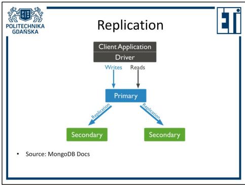
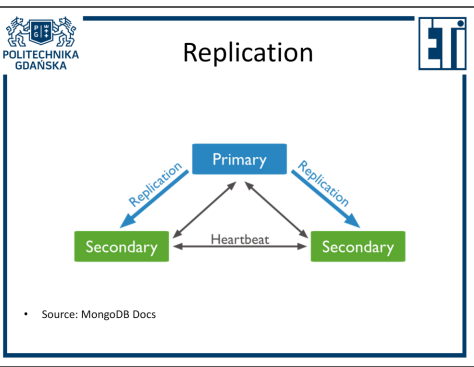
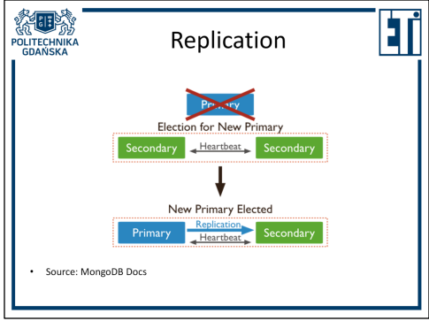
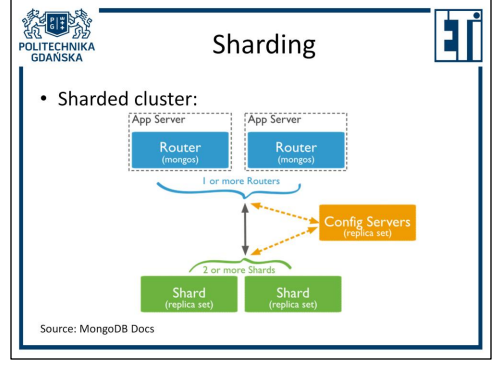
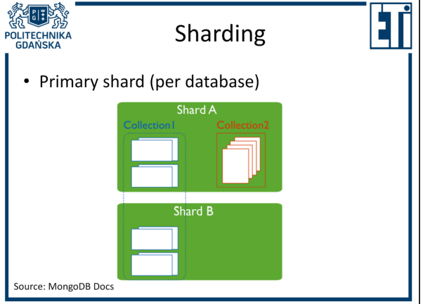
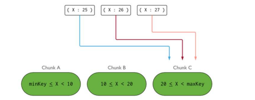
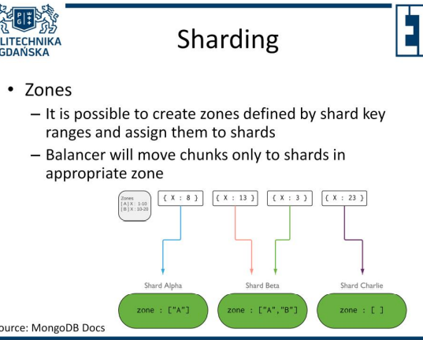
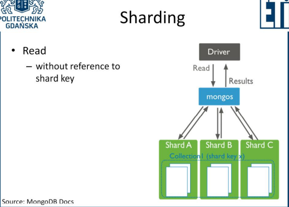
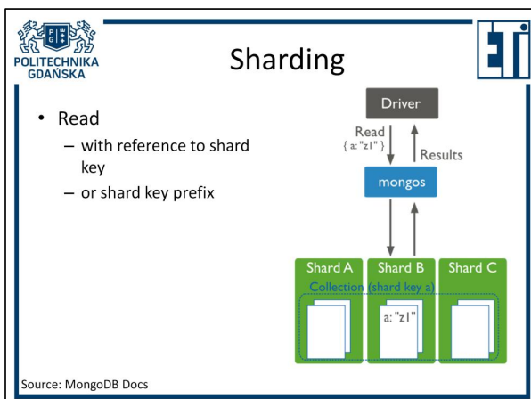

# DocumentDatabase

1. [Document store](#document-store)
2. [常见文档数据库](#常见文档数据库)
3. [MongoDB](#mongodb)
   1. [MongoDB features](#mongodb-features)
   2. [Tools](#tools)
   3. [JSON](#json)
      1. [JSON format](#json-format)
   4. [BSON format](#bson-format)
   5. [Representing related document](#representing-related-document)
      1. [Embedding](#embedding)
      2. [Referencing](#referencing)
4. [Distribution in document databases](#distribution-in-document-databases)
   1. [replication](#replication)
      1. [read performance?](#read-performance)
      2. [心跳验证可用性](#心跳验证可用性)
         1. [主节点选举](#主节点选举)
            1. [Delayed nodes](#delayed-nodes)
      3. [Read concern \& Tags](#read-concern--tags)
      4. [Write concern \& Tags](#write-concern--tags)
   2. [Sharding](#sharding)
      1. [primary shard (per database)](#primary-shard-per-database)
      2. [shard key](#shard-key)
      3. [after shard key configuration for a collection](#after-shard-key-configuration-for-a-collection)
      4. [choosing a shard key:](#choosing-a-shard-key)
         1. [two sharding strategies](#two-sharding-strategies)
      5. [Zones](#zones)
      6. [Read](#read)
   3. [Mongo Operations](#mongo-operations)

## Document store
* semi-structured data
  * XML
  * JSON
  * YAML
  * HTML
* No data schema enforced
  * Each document different
* No relations between data
* No transactions
* Similar documents grouped in collections
  * Capped collections 固定大小的集合(**见下**)
* Data format readable by the database
  * updates of parts of documents possible
  * searching by contents of documents possible （数据库能解释文档内容）
  * retrieving portion of document possible
* Unstandardised CRUD operations
  * creation
  * retrieval
  * updates
  * deletion
* 尽管for XML Stores有很多标准化query（接上点）
  * XQuery (XML Query)
  * XQuery Update
  * XQuery Full Text
  * EXPath Extensions
  * EXQuery Extensions
  * XSLT
  * XForms
  * XProc

文档被分组为**集合**（关系表的等价物）。 从数据库机制的角度来看，**任何不同的文档都可以添加到一个集合中，尽管这会阻碍对以这种方式收集的数据进行有效的查询写入**。 因此，“逻辑上”将不同集合之间的不同文档类型分开符合用户的利益，尽管不需要所有文档都具有完全相同的结构。 在某些数据库中，还可以选择创建**Capped collections上限集合**（元素数量有限的集合）。

## 常见文档数据库
* ArangoDB
* BaseX
* Couchbase Server
* CouchDB
* Cosmos DB
* Dynamo DB
* MarkLogic
* MongoDB
* OrientDB
* RavenDB
* SimpleDB

其中 MongoDB 最常见，这些类都是基于它的

## MongoDB
* Document database
* Uses **BSON** format
* **MongoDB Query language**
* Community and Enterprise Editions
* MongoDB Atlas
* Version 1.0 released on February 2009

The mongo database is available in community (free), enterprise (with support) and atlas editions. Atlas is a cloud-based data storage service based on the mongo database.

mongo 数据库有社区（免费）、企业（有支持）和 atlas 版本。 **Atlas**是基于mongo数据库的**云端数据存储服务**

### MongoDB features
1. Aggregation
   1. Aggregation pipeline
   2. Map-Reduce
2. Indexes
3. Change Streams
4. Schema validation
   1. Json Schema
   2. Query Expression
5. Replication
6. Sharding
7. Security
   1. Authentication
   2. Authorisation
   3. Encryption
8. transactions
9. Suite(套件) of tools

解释：
1. aggregation (one of two mechanisms to choose from), i.e. obtaining information on the basis of a set of documents (e.g. average / total field value for all documents from a collection)
    聚合（可供选择的两种机制之一），即基于一组文档获取信息（例如，集合中所有文档的平均/总字段值）
2. change streams (the database informs you on an ongoing basis about changes in  "observed" data) 
   变化流（数据库持续通知您“观察到”数据的变化）
4. schema validation (optional), validation can be performed based on **JSON** schema or native query language (MongoDB Query language)
   schema验证（可选），验证可以基于JSON schema或原生查询语言（MongoDB Query language）
5. 复制（数据复制——在多台服务器上存储相同的数据）
6. sharding (division of data into subsets stored on different servers; can be combined  with replication, then each of the subsets is stored on more than one server)
   分片（将数据分成存储在不同服务器上的子集；可以与复制相结合，然后每个子集存储在多个服务器上）

### Tools
1. Atlas Kubernetes Operator
2. Charts
3. Database Tools
4. Connector for BI
5. Compass
6. Kafka Connector
7. Shell

这是部分工具，对我们来说最重要的是允许我们与数据库 (shell) 通信的文本工具。

MongoDB charts

### JSON
* JavaScript Object Notation
* Lightweight data interchange format
* Based On JavaScript
* Language independent

JSON 语言在 W3C 编写的 RFC 7159 中定义。 该名称来自“JavaScript Object Notation（符号）”一词，该语言本身是一种用于数据交换的轻量级格式。 尽管该语言基于 JavaScript，但它独立于编程语言。

#### JSON format
* Object - `{name/value pairs}`
* Name/value pairs - `"name":value`
* Value - object, array/string, string, number, boolean(true/false), empty(null)
* Array - `[(value)*]`

### BSON format
* **Bianry JSON**
* Binary-encoded JSON-like documents
* Additional value types
  * ObjectID: 12bytes id
    * ({_id: ObjectId("5099803df3f4948bd2f98391")})
  * Date: unix encoded 64-bit value
    * ({birth: new Date('Jun 23, 1912')},
    * {timestamp: new Date()})

The BSON format is derived from the JSON format. The name is derived from **"Binary  encoded JSON"** and describes the essence of the format well. The BSON format is **an optimization of the JSON format** for efficient storage / search.
For the database user, the differences between the formats are small and come down to **two new data types (ObjectID and date)** and **no need to use quotation marks in field names when these names are single-word**.

对于数据库用户来说，格式之间的差异很小，归结为**两种新的数据类型（ObjectID 和日期）**，当这些名称是**单个单词时，不需要在字段名称中使用引号**。

### Representing related document
1. Embedding
   1. storing related documents together
2. Referencing
   1. storing a combination of unique fields from one document in another 将一个文档中的唯一字段组合存储在另一个文档中
3. Data structure and access characteristic dependant 数据结构和访问特性依赖

The Mongo database does not support dependencies between documents, which  means it will not check consistency between related documents (there is no  equivalent for a foreign key constraint). This does not mean, however, that these  relationships cannot be expressed.
Mongo 数据库不支持文档之间的依赖关系，这意味着它不会检查相关文档之间的一致性（没有外键约束的等效项）。 然而，这并不意味着这些关系无法表达。

Two approaches are possible here:
1. nesting(Embedding) (due to the fact that the value of a field in a JSON document may be another  document, the related element can be added as a field of the document with which it  is related to) | 嵌套（由于JSON文档中某个字段的值可能是另一个文档，所以可以将相关元素添加为与其相关的文档的字段
2. referencing (you can also store a combination of fields in one of the related  documents that will allow you to uniquely identify (and search for) the second one). | 引用（您还可以将字段组合存储在一个相关文档中，这样您就可以唯一标识（和搜索）第二个文档）。

The choice of strategy will depend not only on the data structure or the nature of the  dependency expressed, but also on the typical method of accessing related data. | 策略的选择不仅取决于数据结构或所表达的依赖关系的性质，还取决于访问相关数据的典型方法。 

#### Embedding
* For "contains" relationships
* For one-to-many relationships
* Single CRUD operation for the whole document set
  * Faster reads?
* Data duplication
* Data manipulation anomalies(异常)
* Privileged top document
* Maximum document size: 16MB

优点：
a single read/write operation allows both related documents to be retrieved/modified, which has the  potential to speed up the read operation if typically both documents are retrieved  together.
**单个读/写操作允许检索/修改两个相关文档，如果通常同时检索两个文档，这有可能加快读取操作。**

Additionally, manipulating (writing queries) on the containing document is easier than on the nested element.
此外，对包含文档的操作（编写查询）比对嵌套元素的操作更容易。

缺点：
The disadvantage of this approach is the need to **duplicate** the same data in the case  of a **many-to-many** relationships (the same document must be nested in many related documents), which **increases memory consumption**, and may also cause **data manipulation anomalies** (in the case when a nested document is being modified and it is contained in many parent documents, it is possible to **skip some copies of the document during the update operation**).
这种方式的缺点是在**多对多**关系的情况下需要复制相同的数据（同一个文档必须嵌套在很多相关的文档中），增加了内存消耗，也可能导致**数据操作异常**（在修改嵌套文档并且它包含在许多父文档中的情况下，可以在更新操作期间**跳过文档的某些副本**）。

In addition, the maximum document size in MongoDB (16 MB) may limit the  applicability of the method。
此外，MongoDB 中的最大文档大小 (16 MB) 可能会限制该方法的适用性

#### Referencing
* For many-to-many relationships
* For more complicated data structures
* Uni- or bi- directional 单或双向操作
* Separate CRUD operations for each document in a set
  * Faster updates?
* Limit on reference array size?
  * Reference documents possible
* No support for foreign keys

参考文献是多对多相关文档的自然候选者，当**两种以上的文档相互关联**时。 引用（标识相关文档的值）可以只放在**一个文档**中，也可以放在**两个文档**中。

If you use a reference, CRUD operations on each of the related documents will have to be performed separately. As a result, the operation of **updating only one of the related documents may be faster** due to the smaller size of the modified document.
For references, the **maximum document size is also a potential limitation** (especially  when referencing multiple documents), but it is **less severe than for nesting**. It is also  possible to use separate documents to **indicate relationships** between documents  (like relationship tables in relational databases).
如果您使用引用，则必须分别对每个相关文档执行 CRUD 操作。 结果，由于修改后的文档的尺寸较小，仅更新其中一个相关文档的操作可能会更快。
对于引用，最大文档大小也是一个潜在的限制（尤其是在引用多个文档时），但它没有嵌套那么严重。 也可以使用单独的文档来指示文档之间的关系（如关系数据库中的关系表）。

The Mongo database does not support foreign keys, so it may happen that the inserted values ​that point to another document will not actually point to anything, or that the document will be deleted despite the existence of a reference to it. When using references, it is the user's responsibility to maintain referential consistency.
Mongo 数据库不支持外键，因此可能会发生指向另一个文档的插入值实际上不会指向任何内容，或者尽管存在对它的引用，但该文档将被删除。 使用引用时，用户有责任保持引用的一致性。

## Distribution in document databases
Different solutions were used for relational databases depending on the problems:
* Read / Write Performance - A more efficient server.
* Failure Tolerance - Backup.
* Data availability - more reliable server.
* Capacity - larger drives.

In NoSQL databases, the basic solution to most of the problems is to add **more servers**.

### replication
* Many servers store the same data
* Advantages:
  * resilience to Failure
  * data availability
  * read performance?

在多台服务器上存储相同的数据意味着如果其中一台发生故障，数据库不必停止，数据几乎可以连续使用。
**有可能**通过在不同的服务器之间spread它们来**提高读取的效率**。 然而，这种方法有一些**禁忌症**，稍后讨论

In a replica set there are multiple Mongo servers (mongod) that store the same data.
One of them (primary) handles all write operations, which the server then **asynchronously replicates** to the secondary replicas. The replica set may contain an  arbiter. An arbiter is a server that does not store data, but votes for the primary  server.
在副本集中有多个 Mongo 服务器（mongod）**存储相同的数据**。
其中之一（主要）处理所有写操作，然后服务器将其**异步复制**到次要副本。 **副本集可能包含一个仲裁者**。 仲裁器是**不存储数据**但**用于主服务器投票（见下【选举】）**的**服务器**。

**偶数个节点才需要仲裁器**

#### read performance?
* reading from primary by default
* other read preference mode can be set:
  * primary
  * primaryPreferred
  * secondary
  * secondaryPreferred
  * nearest
* Contraindications
  * secondary write the same amount of data as primary
  * replication is asynchonic
  * distribution of reads decreases performance after failure
  * migration delay with sharding
  * mirrored reads used for cache 'pre-warming'

To refer to secondary nodes, set the following in the client: 
`db.getMongo().setReadPref("secondaryPreferred", [{"dc":"1"}])` or separately for each read operation (`db.collection.find().readPref("secondaryPreferred")`) (options  "primaryPreferred" and "secondary" will also enable reading from secondary) 

The **read preference** values ​mean:
* Primary - read from primary only
* primaryPreferred - read from primary, if available
* Secondary - read from secondary only
* secondaryPreferred - read from secondary, if available
* Nearest - reading from the replica with the **lowest latency**

通过使用来自**secondary nods**的读取，您可以提高性能，但要考虑以下因素:
* Secondary nodes do the same number of writes as a primary - with a small number of  reads, reading from a secondary node will not be faster 
* Replication is asynchronous - data on secondary may be out of date 
* Read scattering decreases performance during failures - a reduced number of servers is  serving the same number of reads 
* Migration delays when sharding - due to delays in applying data migrations on secondary  replicas, it may happen that the same data is read 2 times or certain data is omitted

• 辅助节点与主节点执行相同数量的写入 - 但读取次数较少，从辅助节点读取不会更快 
• 复制是异步的 - 辅助节点上的数据可能已过时 
• Read scattering（分散）会降低故障期间的性能 - 减少数量的服务器提供相同数量的读取 
• 分片时的迁移延迟 - 由于在辅助副本上应用数据迁移的延迟，可能会发生相同数据被读取 2 次或某些数据被省略的情况

#### 心跳验证可用性

Servers in a replica set control the database status through messages called  **heartbeat**. Heartbeat is sent every 2 seconds, **if there is no response from any of the  servers for 10 seconds, this server is treated as unavailable.**
副本集中的服务器通过称为心跳的消息控制数据库状态。 **心跳每 2 秒发送一次，如果 10 秒内没有任何服务器响应，则该服务器被视为不可用。**

##### 主节点选举

如果检测到主节点不可用，则选择一个新节点（从可以成为主节点的副本中（稍后详细介绍））

* priority
  * floating point number in 0-1000 range
  * the higher the value the greater the chance to become primary (1 by default)
  * **nodes with poriority 0 cannot become primary; cannot call for all election**
* if an eligible (有资格的) secondary receives no communication from primary it calls for an election
* if primary cannot communicate with majority of secondaries it steps down (下台) (network partitioning)
* other election conditions

自动选择主节点，具有最高优先级的节点成为主节点（最终）。

在以下情况下宣布选举： 
1. 将新节点添加到副本集， 
2. 副本集初始化， 
3. 使用 `rs.stepDown()` 或 `rs.reconfig()` 等方法执行管理活动， 
4. 在固定时间段内（默认为 10 秒）从辅助节点丢失与主节点的连接，
5. 或者如果副本集中有一个节点的优先级高于当前主节点。
6. 如果主节点无法与大多数辅助节点通信，它会下台（下台）（网络分区）
7. 如果符合条件的次级没有收到来自初级的通信，则它要求进行选举

* 副本集最多可以容纳50个节点，但是只有7个可以投票
  * 投票节点数量应该是奇数 
  * 如果节点不够多，可以添加arbiter（一个不存储数据但投票的节点 
  * 部分节点可能配置为不投票（需要优先级为0）
* 一些节点可以配置为隐藏 (hidden)（需要0的优先级）
* 一些节点可以配置为延迟 (delay)（需要0的优先级）

###### Delayed nodes
1. Delayed replica set nodes:
  延迟节点包含copy of the replica set data。 但是，延迟节点数据集反映了集合的早期（延迟）状态。 例如，如果当前时间是 09:52，一个节点延迟一个小时，则该节点上的数据将不会反映任何比 08:52 更新的操作

  Since delayed nodes are **a rolling backup** (滚动备份) (a working **'historical' snapshot** of a dataset),  they can help you fix all sorts of human errors. For example, a delayed node may allow data recovery after unsuccessful application updates or from operator errors,  including deleted databases and/or collections.例如，延迟节点可能允许在应用程序更新失败或操作员错误（包括删除的数据库和/或集合）之后恢复数据。

2. Delayed nodes:
   * Must have priority 0.
   * They should be configured as hidden.
   * Should be configured as non-voting: Delayed nodes may vote in elections if  members[n].votes is set to 1. This will also have the effect that data write  acknowledgments from the delayed node will be taken into account for an write  concern „majority”, and such confirmations will be sent with a delay equal to the  node delay.
   * 优先级必须为 0。
   * 它们应该配置为**隐藏**。
   * 应配置为**非投票**：如果 `members[n].votes` 设置为 1，则延迟节点可能会在选举中投票。这也会产生延迟节点的数据写入确认将被考虑用于写入问题的效果 “多数”，并且此类确认将以等于节点延迟的延迟发送。

#### Read concern & Tags
* local
* majority
* available, linearization, snapshot
* Tags
  * Tags can be assigned to replica nodes
  * a set of tags given for a read **defines which node should be asked for data** (**not compatible with primary Read Preference Mode**)

* majority - 返回保存到**副本集中大多数节点的最新数**据（**不会回滚**） 
* local - 返回**本地节点的最新数据**，即使它还没有写入到大多数副本（并且**可能 因此被回滚**）
* available - 与本地相同，但在**分片时速度更快**，并且可以返回**孤立文档** (孤立文档 - 在分片集群中，孤立文档是指由于异常关闭导致迁移失败或迁移清理不完整而导致分片上的那些文档也存在于其他分片上的块中。)
*  linearizable - 查询返回反映所有**成功写入的，被大多数节点确认的，在读取操作开始之前已完成的**数据。 在返回结果之前，查询可以等待**并发写入**以传播到大多数副本集节点

snapshot - Available only in **transactions**:
* 如果事务**不是因果一致**会话的一部分，当提交具有**关注"majority"的write**的事务的时，**可以保证事务读取的数据属于副本集中大多数节点提交的数据快照**。
* 如果事务**是因果一致**会话的一部分，当提交具有**关注“majority”**的write的事务的时，**可以保证事务读取的数据属于副本集中大多数节点提交的数据快照 which 快照确保与事务开始前的操作的因果一致性**。

#### Write concern & Tags
* number (default of 1 in same situation)
* majority (usually default since Mongo 5.0)
* tags:
  * tags can be assigned to replica nodes
  * a set of tags given for a write **defines which node should receive the write**
* j option
* wtimeout

Write concern dictates how many nodes must confirm execution of the requested data  modification operation before mongo informs the client about the successful completion of  the operation.
Write concern 指示在 mongo 通知客户端操作成功完成之前，有多少节点必须确认执行请求的数据修改操作。

* number - 在确认"majority"成功之前在给定数量的节点上写入的数据  - 需要确认写入操作已在**大多数投票数据节点**上成功执行（即 `members[n].votes` 大于 0 的主要和次要节点）  .

  在 Mongo 5.0 之前，默认的写入关注点是 w:1。 从 MongoDB 5.0 开始，默认写关 注 `w:majority`。 使用仲裁者时，默认值可以更改为 w:1：所需多数计算为 `1(仲 裁者) + 投票节点的一半`向下舍入和非仲裁者比较。
  如果可以持有数据的投票节点数不大于这个数，则默认的write concern设置为w:1

  For example, with the following numbers of nodes:

  non-arbiters | arbiters | voting nodes | req.majority | default Write   Concern
  ---------|----------|---------|-|- 
  2 |1 |3 |2 |{w: 1}
  4 |1 |5 |3 |{w: "majority"}

  悟：所以导致了在节点多的时候被设置为majority，少的时候有仲裁者可以变为1。

* j Option - true：数据存储在磁盘操作日志（on-disk journal），false：数据存储在内存中
* wtimeout - 限制等待响应（以毫秒为单位）。如果 Mongo 无法在这段时间过去之前确认写入操作是否成功，则会报告失败。但是，**向客户端返回失败信息并不会停止写入数据的尝试**，数据最终可能会写入副本集的所有节点。

### Sharding
* Automatic division of data between different servers
* Advantages
  * read performance
  * write performance
  * storage space
  * data availability?

由于分片将数据拆分为由不同服务器存储的块，因此它允许您在这些服务器之间分散读取和写入操作。
添加新服务器的能力还意味着可以轻松添加新驱动器(drivers)，让您轻松解决容量问题。
由于数据分散在多个分片中，如果其中一个分片发生故障，**只会丢失对它存储的那部分数据的访问。**

分片集群由以下组件组成： 
• Shard分片：每个分片包含数据的一个子集。 每个分片都设置为副本集(replica set)。
• mongos：mongos 充当查询路由器(query router)和客户端应用程序与分片集群(sharded cluster)之间的中介(intermediary)。 从 Mongo 4.4 开始，mongos 支持“**对冲读取(hedged reads)**”，可用于**提高响应速度**（**从副本replica读取数据时，查询被发送到两个副本并返回更快的响应**） 
• 配置服务器：一个副本集，用于**存储元数据和集群配置。**

#### primary shard (per database)

分片集群中的每个数据库都有其主分片，其上存储非分片集合。

#### shard key
* Distribution of data between shards based on a shar key
  * single document field
  * a collection of document fields (in a specified order)
* Shard key defined on collection level
* Limtations:
  * 可以强制使compound keys 复合键unique
  * create unique indexes on fields not in the key is not possible 在不在键中的字段上创建唯一索引是不可能的
  * up to v4.2 shard key fields could not be updated
  * starting in mongo4.4, you can refine a collection's shard key by adding a suffix field or firlds to the existing key
  * srating in mongo5.0 collections can be resharded (by changing the shard key)

Mongo 中的分片基于在集合级别指定的分片键将文档分散到不同的分片上。
对集合进行分片有一些限制： 
• 强制文档字段的唯一值仅适用于以分片键开头的复合键。 无法在其他字段上设置唯一索引 
• 在 4.2 版本之前，无法更新分片键字段的值。
• 从 4.4 版开始，可以使用其他字段扩展分片键（在末尾添加） 
• 从 5.0 版开始，可以在称为重新分片的过程中更改分片键 
• 在 4.4 版之前，必须设置所有分片键字段 到一个值。 从 4.4 版开始不再需要它——在没有设置字段的情况下，文档被视为（为了将文档分发到分片或路由查询的目的），就好像该字段被设置为 null 一样。

#### after shard key configuration for a collection
- data in the collection is divided into chunks with a specified maximum size (64MB by default)
- each chunk has a specified key range it holds
- balancer spreads the chunk uniformly between clusters shards
- chunks that exceed maximum size are split
- information about key ranges and chunk locations is stored in a **configuaration server**

为了在分片上分布数据，数据被分成在服务器之间迁移的块。 每个块都有一个特定范围的键，**它包含范围内的较低值始终包含在内，而较高值则不包含在内。相当于[min,max)** 默认最大块大小为 64MB，超过该大小的块将被拆分。 Mongo 数据库中有一个平衡器，其目的是在分片之间传输块，使块在各个分片之间均匀分布。
有关每个块的密钥位置和范围的信息存储在配置服务器上。
**应该注意的是，要对现有集合进行分片，该集合不应大于最大块大小（例如 64MB）**

#### choosing a shard key:
* large shard key cardinality 基数
* low shard key frequence
* non-monotonically changeing shard keys 非单调变化的分片键

选择分片键时，请记住以下几点： 
• 键值数量少时，数据可拆分成的块数有限，这会降低分布收益。
• 如果许多文档具有相同的键（或键的子集），则情况变得类似于具有少量值的键。 rare-key 数据会很好地分布，但是 frequent-key 数据会被分成几个不能拆分的块。
• 如果根据键序列对数据执行某些操作（搜索、插入），则当前处理的块成为瓶颈-例如 如果键在插入新文档时自动递增

##### two sharding strategies
1. Hashed Sharding
   * Data distribution based on the hashed shard key values
   * solves the problem of monotonicity
   * range queries are not grouped
  散列分片是一种方法，其中散列函数的值是根据键的值计算的，并且仅根据该值将文档分配给块。
  这会导致处理具有相似键值的文档的分散，但会阻止对具有给定键值范围的文档的查询被定向到选定的分片子集。
2. Ranged sharding
   1. Data distribution based on the key value
   2. monotonicity and frequency a problem
   3. range queries can be grouped
  第二种方法是直接根据关键字段的值将文档分配给块。 在这种情况下，具有相似键的文档的处理将集中在单个分片上，但范围查询可以分组。
  分组范围读取允许您将对选定范围的分片键值的查询定向到仅包含该范围的那些分片，从而提高性能（其他分片不需要搜索它们的基础）。

#### Zones

- it is possible to create zones defined by shard key ranges and assign them to shards
- balancer will move chunks only to shards in the appropriate zone

可以为分片分配多个标签，每个标签具有特定范围的有效键值。
添加文档时，将其键与标签中包含的范围进行比较，然后转到标有正确范围的分片之一。 如果分片键未被任何标签覆盖，则文档可以放置在任何分片上（一个没有分配标签或一个分配有标签）。

#### Read
1. without reference to shard key
   
   A read request that does not query a shard key is forwarded by the router to all  shards. The router combines the received responses and returns them to the client.
2. with reference to shard key or shard key prefix
   
   With a shard key given, the router selects an appropriate shard based on the  configuration, sends a query to it, and the received response is forwarded to the  client.
  Possible intermediate version: 
  Shard key {a: 1, b: 1, c: 1} 
  {a: 1} {a: 1, b: 1} queries can go to 1 or several (i.e. not all) shards - depends on the distribution of data

### Mongo Operations
[Mongo_Operations](appendix/Mongo_Operations.md)
