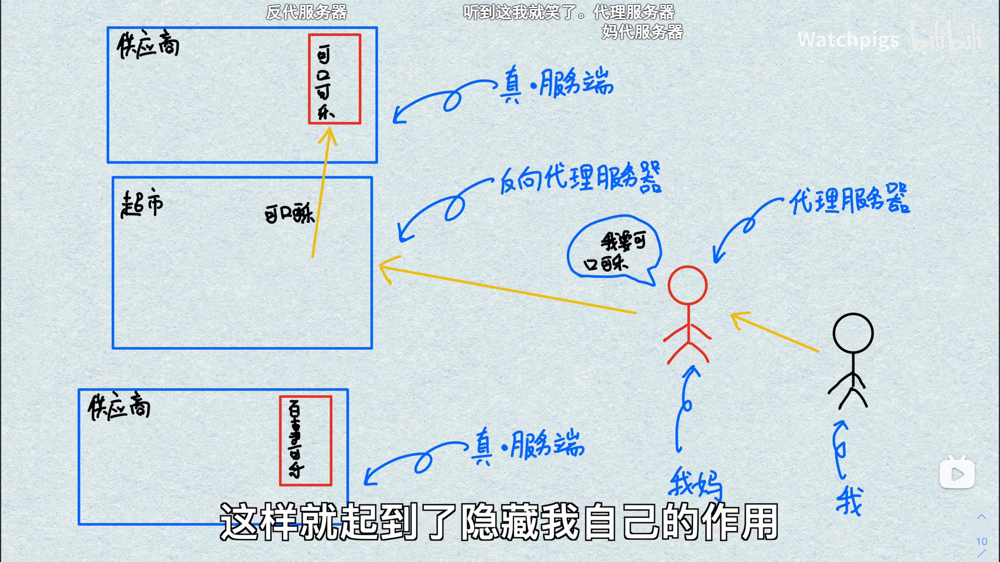
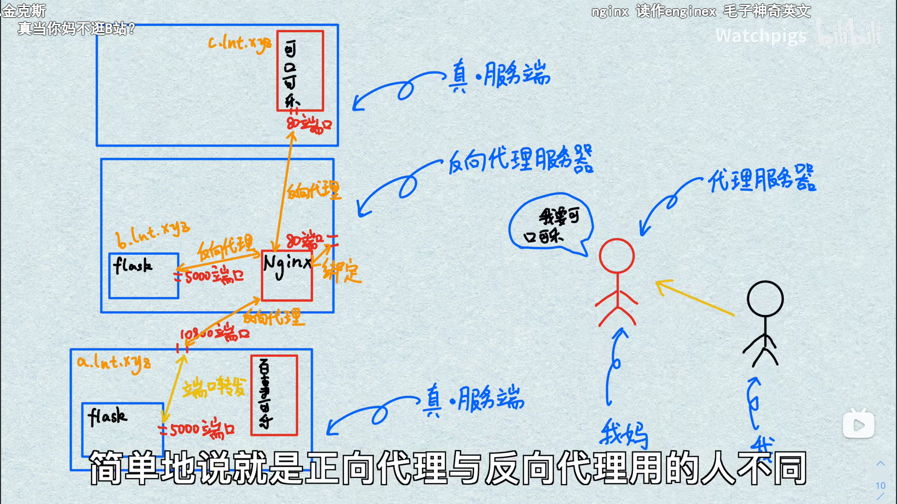

# 代理_Proxy和反向代理_ReverseProxy

## 目的
隐藏真实ip地址和用80端口提供多个服务

## proxy 和 reverse proxy
1. proxt通常客户端使用,reverse proxy 通常服务端使用
2. 应用：
   1. 代理：
      1. 网络加速：游戏加速器，加速打开网页，隐藏ip
      2. 过滤内容：去广告
   2. 反向代理应用：
      1. 负载均衡
      2. 隐藏服务端

## 端口映射 端口转发
[端口映射 端口转发](端口映射_端口转发.md)

## docker
[创建反向代理](../../../Docker/创建反向代理.md)