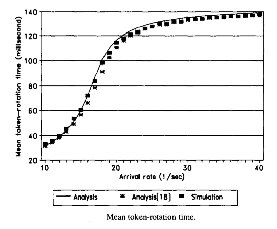
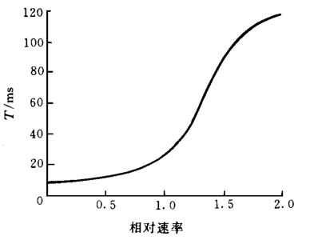
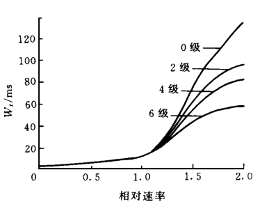

# IEEE802._4_5

## General Description
### Comparison
|     | IEEE 802.4                                                     | IEEE 802.5                                                                                                                    |
| --- | -------------------------------------------------------------- | ----------------------------------------------------------------------------------------------------------------------------- |
| 1   | The topology used is a bus or tree topology.                   | The topology used is a ring topology.                                                                                         |
| 2   | Size of the frame format in IEEE 802.4 standard is 8202 bytes. | Frame format in IEEE 802.5 standard is of the variable size.                                                                  |
| 3   | Size of the data field is 0 to 8182 bytes.                     | No limit is on the size of the data field.                                                                                    |
| 4   | It can handle short minimum frames.                            | It supports both short and large frames.                                                                                      |
| 5   | Protocol is extremely complex.                                 | Protocol is moderately complex.                                                                                               |
| 6   | It is applicable to Real time traffic.                         | It can be applied for Real time applications and interactive applications because there is no limitation on the size of data. |

### Token Ring and Token Bus
In the bus LAN of the **CSMA/CD (IEEE 802.3) protocol**, each node occupies the right to access the media through competition. After a conflict occurs, the retransmission must be delayed. The time from when a node prepares to send data to when it successfully sends data cannot be determined. It is not suitable for Transmission of real-time data that requires high latency. Its advantages are simple structure, convenient network maintenance, easy addition and deletion of nodes, and high network efficiency under light load (small number of nodes). 
**Token Ring** will not conflict, it is a deterministic medium access control method, and the delay time of each node sending data can be determined. **When the load is light, the efficiency is low due to the time to wait for the token; and when the load is heavy, it is fair to each node and the efficiency is high**. 
**Token bus** is similar to the token ring, it is suitable for heavy load network, determining the delay time of data transmission, and it is suitable for real-time data transmission, etc., but the network management **(protocol) is more complicated**.

在CSMA/CD协议的总线局域网中，每个节点通过竞争占有媒体的访问权。发生冲突后，必须延迟重传。无法确定节点从准备发送数据到成功发送数据的时间。它不适合传输需要高延迟的实时数据。其优点是结构简单，网络维护方便，节点增删容易，轻负载（节点数少）下网络效率高。 Token Ring不会冲突，是一种确定性的介质访问控制方式，可以确定每个节点发送数据的延迟时间。负载较轻时，由于等待token时间长，效率低；负载大时，对每个节点公平，效率高。
令牌总线类似于令牌环，适用于重负载网络，数据传输的延迟时间确定，适用于实时数据传输等，但网络管理比较复杂。

## IEEE 802.4 Efficiency analysis

### General
[Performance analysis of the IEEE 802.4 token-passing system with finite buffers and asymmetric loads](https://www.sciencedirect.com/science/article/pii/S0140366498001200)
In *Performance analysis of the IEEE 802.4 token-passing system with finite buffers and asymmetric loads (1999)*, a performance analysis of the IEEE 802.4 token-passing system with finite buffers, a single access class and asymmetric loads is presented under the realistic assumption that frames can arrive at any arbitrary instant. 

In the picture showed the mean token-rotation time of the model in this paper. (line of "Analysis 18" in the figure is the result of the reference article of this paper.) We can find under these assumption, the performance will increase rapidly before 20/sec and gradully flatten after that. The highest time is 140 millionseconds. 

But this article didn't consider the priority mechanism of the IEEE 802.4 token-passing system. However, the priority mechanism needs to be included in the analysis model of the IEEE 802.4 token-passing system to obtain more realistic performance evaluations.

### Consider the priority mechanism
[IEEE  802.4  令牌总线网实时应用性能分析算法](https://www.doc88.com/p-2394901303386.html)

The abscissa is the relative velocity where 1.0 is base velocity. 

In the figure, T is time of token rotation. It shows the same tend as previous article. 

$W_t$ is waiting time. At low load, due to the short rotate time of the token, each priority packet can obtain sufficient service time, so the results for different priority packets are basically the same. But at high load, packets with higher priority will be served first, while packets with lower priority will wait longer.

