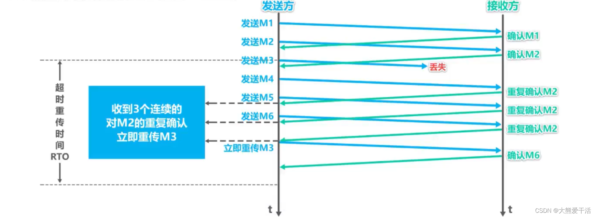

# TCP和TCPIP

1. [区别](#区别)
2. [TCP](#tcp)
   1. [结构](#结构)
      1. [流量控制和拥塞控制区别](#流量控制和拥塞控制区别)
      2. [流量控制详情](#流量控制详情)
         1. [滑动窗口](#滑动窗口)
            1. [零窗口](#零窗口)
      3. [拥塞控制详情](#拥塞控制详情)
         1. [快恢复](#快恢复)
         2. [快重传](#快重传)
         3. [慢启动](#慢启动)
         4. [拥塞响应](#拥塞响应)
         5. [拥塞避免](#拥塞避免)
         6. [拥塞检测](#拥塞检测)

## 区别
TCP（Transmission Control Protocol）和TCP/IP（Transmission Control Protocol/Internet Protocol）并不是完全相同的东西，但它们是密切相关的。

TCP是一种传输层协议，用于在网络上可靠地传输数据。它负责将数据分割成数据包，并确保这些数据包按照正确的顺序和速率传输到接收方，同时还具有拥塞控制等功能。

TCP/IP是一组网络协议，包括传输层协议TCP、网络层协议IP以及一些其他的协议。它是因特网通信的基础，被广泛应用于互联网和企业内部网络等。

TCP协议是TCP/IP协议族中的一部分，它与IP协议一起构成了TCP/IP协议栈中的传输层和网络层。TCP负责传输数据，并且在应用层和网络层之间提供了可靠的传输服务，而IP协议则负责将数据包传输到目标主机的网络层。

## TCP

### 结构
1. TCP头部
   1. TCP头部是TCP协议中传输数据所必须的信息，它包含了源端口号、目的端口号、序列号、确认号、数据偏移量、窗口大小等字段。通过这些信息，TCP协议可以进行数据的可靠传输，保证数据包的顺序、完整性和正确性。
2. 拥塞控制
   1. 拥塞控制是TCP协议中的一个重要机制，用于避免网络拥塞并保证网络的稳定性。拥塞控制主要有慢启动、拥塞避免、拥塞检测和拥塞响应等方面，通过这些机制，TCP协议可以在网络出现拥塞时及时进行调整，避免数据的丢失和延迟。
3. 流量控制
   1. 流量控制是TCP协议中的另一个重要机制，用于控制发送方的数据发送速率，保证网络的可靠性和效率。流量控制主要通过TCP窗口大小的动态调整来实现，当接收方处理能力较弱时，可以通过减小窗口大小来降低发送方的数据发送速率。即`滑动窗口`
4. 数据可靠性
   1. 数据可靠性是TCP协议的另一个重要机制，它通过TCP头部中的序列号和确认号来保证数据的可靠性。TCP协议发送数据时，每个数据包都会被赋予一个唯一的序列号，接收方收到数据后会发送一个确认号给发送方，确认已经收到这个序列号之前的所有数据。如果发送方没有收到接收方的确认，则会进行重传，保证数据的可靠性。
5. 分段机制
   1. 拥塞控制和流量控制都是为了减少重传，这个是降低重传已经发生时的影响。
   2. [MSS和MTU](MSS和MTU.md)
   3. 乱序重排
      1. 数据头里有seq，这样在接收缓冲区就可以按照seq排序

#### 流量控制和拥塞控制区别
流量控制针对自身情况，拥塞控制针对整个网络情况。

#### 流量控制详情

##### 滑动窗口
有发送窗口和接收窗口，发送窗口是发送方的缓冲区大小，接收窗口是接收方的缓冲区大小，发送窗口和接收窗口的大小是由TCP协议自动调整的，不需要应用程序来设置。

###### 零窗口
“零窗口”是 TCP 协议中的一个问题，也称为“窗口关闭”（Window Closing）或“零窗口通知”（Zero Window Notification），是指在 TCP 连接中，接收方告诉发送方自己的接收窗口为零，因此发送方暂时无法向接收方传输数据。

#### 拥塞控制详情
##### 快恢复
快恢复（Fast Recovery）是TCP拥塞控制算法的一种，用于在TCP连接出现丢包时快速恢复数据传输速率，以提高数据传输的效率。

如果发送方收到了3个重复确认(详见快重传)，就执行快恢复算法

将慢开始门限sstresh和拥塞窗口cwnd都设置为当前拥塞窗口的一半，然后执行拥塞避免算法。

##### 快重传

快重传（Fast Retransmit）是 TCP 协议中的一种拥塞控制机制，用于避免由于数据包丢失而造成的不必要的重传延迟。

当发送方发送一个数据包时，会等待接收方的确认（ACK）消息，如果接收方收到了数据包但没有及时发送确认消息，或者确认消息在传输过程中丢失了，发送方就会认为数据包已经丢失，然后立即重传该数据包。但是，这样做可能会导致不必要的重传延迟，因为有可能只是接收方的确认消息丢失了而并非数据包丢失。

为了避免不必要的重传延迟，TCP 引入了快重传机制。当发送方收到连续的三个相同的 ACK 消息时，它就会立即重传丢失的数据包，而不必等到重传超时时间（RTO）到期。这是因为连续的三个相同的 ACK 消息意味着接收方已经接收到了该数据包并正在等待下一个数据包，因此发送方可以通过立即重传该数据包来避免不必要的重传延迟。

需要注意的是，快重传机制只适用于可靠传输的 TCP 连接。在 TCP 连接中，快重传机制通常与快恢复（Fast Recovery）机制一起使用，以更好地控制网络拥塞并提高传输效率。

##### 慢启动
慢启动（Slow Start）是TCP拥塞控制算法的一种，用于在TCP连接建立时逐步增加发送数据量，以避免网络拥塞和丢包。

当TCP连接建立时，发送方并不知道网络的带宽和拥塞程度。因此，TCP通过慢启动算法来逐渐增加发送方的数据传输速率，以便在网络出现拥塞之前适应当前的网络环境。

在慢启动阶段，TCP发送方将初始的拥塞窗口设置为一个较小的值，然后每次接收到一个确认应答（ACK）时，将拥塞窗口大小加倍。这个过程将一直持续到达到一个预设的拥塞窗口阈值，之后就进入拥塞避免阶段。

通过慢启动算法，TCP发送方可以逐渐提高数据传输速率，并且在网络出现拥塞时可以快速降低传输速率以避免网络拥塞和数据包丢失。慢启动算法在TCP拥塞控制中扮演着重要的角色，它使得TCP协议能够在不同的网络环境中实现高效、稳定的数据传输。

##### 拥塞响应
拥塞响应（Congestion Response）：当TCP发送方检测到网络出现拥塞时，它将通过减少拥塞窗口的大小来降低发送速率，从而避免网络拥塞和丢包。

##### 拥塞避免
拥塞避免（Congestion Avoidance）：当TCP发送方进入拥塞避免阶段时，它将通过逐渐增加拥塞窗口的大小来适应当前的网络环境，以避免网络拥塞。

##### 拥塞检测
拥塞检测（Congestion Detection）：TCP发送方通过监控网络的延迟和丢包情况来检测网络是否出现拥塞，从而适时调整发送速率。