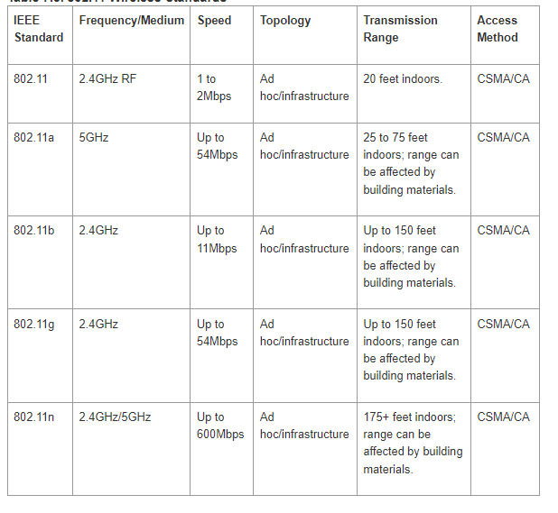

# Wifi

1. What does the **ad-hoc** mode of wireless networks enable?
	1. The ad-hoc mode of wireless networks enables devices to communicate with each other directly **without the need for a centralized access point or infrastructure**. In ad-hoc mode, devices such as laptops, smartphones, or other wireless-enabled devices can form a network **on the fly**, allowing them to share data, files, or other resources with one another.
	2. key word: **without the need for a centralized access point or infrastructure**, **on the fly**, **Peer-to-peer communication**, **Decentralized network architecture**, **Spontaneous network formation**, **Dynamic topology**, **Limited range**, **Less security**
2. What does the **infrastructure** mode of wireless networks enable?
	1. The infrastructure mode of wireless networks enables devices to connect to a **centralized access point or router**, which serves as a central hub for communication and provides network connectivity. In infrastructure mode, devices rely on the access point to facilitate their communication with other devices and to access resources such as the internet or shared network resources.
	2. key word: **centralized access point or router**, **Extended network coverage**, **Enhanced security**, **Support for additional network services**
3. What does the **bridge** mode of wireless networks enable?
	1. The bridge mode of wireless networks enables the connection of **two separate network segments or LANs** (Local Area Networks) into a **single logical network**. It allows devices connected to different wireless access points or routers to communicate with each other **as if** they were on the same network.
	2. key word: **two separate network segments or LANs**, **as if single logical netword**, **Transparent communication**, **Flexibility and scalability**
4. What is SSID?
	**Service Set Identifier**, 服务设备标识符，它是用于识别无线网络的唯一标识符。 当您扫描设备上的可用无线网络时，SSID 是出现在可用网络列表中的名称。 When you want to connect to a specific wireless network, you select the network by its SSID.
5. Which frame begins the process of joining to a wireless network?
	1. `Association Request` frame: The Association Request frame contains information such as the **device's capabilities**, **supported data rates**, and the **desired SSID (Service Set Identifier)** of the network it wants to join.
	2. 如果请求被接受，接入点或无线路由器会以“关联响应”帧进行响应，通知设备它已成功与网络关联。 关联响应帧包含附加信息，例如分配的 IP 地址、安全参数和其他网络配置详细信息。关联请求和关联响应帧是管理无线网络的 IEEE 802.11 标准的一部分。 这些帧对于在设备和无线网络之间建立初始连接和关联至关重要。
	3. Frame **"Association Request"** belongs to the frame type of **Management frames** in the **IEEE 802.11 wireless networking standard**.
	4. “Association Request”帧属于IEEE 802.11无线网络标准中管理帧的帧类型。
6. Frame `<name of a 802.11 frame>` belongs to a frame type of...
	属于 IEEE 802.11 的帧类型，它是无线局域网 (WLAN) 的标准.The 802.11 standard defines various frame types to support different functionalities within a WLAN, including **management** frames, **control** frames, and **data** frames. 
7. What is scanning in infrastructure mode?
	- Scanning in infrastructure mode refers to the process by which **a wireless device searches for and detects available wireless networks in its vicinity**. In infrastructure mode, scanning is performed by devices such as laptops, smartphones, or other wireless-enabled devices to discover **nearby access points (APs) or routers** that are broadcasting their SSIDs (Service Set Identifiers).
	- 基础结构模式下的扫描是指无线设备搜索和检测其附近可用无线网络的过程。 在基础架构模式下，扫描由笔记本电脑、智能手机或其他无线设备等设备执行，以发现附近的接入点 (AP) 或广播其 SSID（服务集标识符）的路由器。
8. In 802.11g standard, what is the transmission speed for the 2.4GHz band?
	- 54Mbps（megabits per second）
	- 
9.  In 802.11b standard, what is the transmission speed for the 2.4GHz band?
    11Mbps（megabits per second）
10. In 802.11b/g (Europe) standard, how many channels are defined in the 4.4GHz band?
    13，只有2.4GHz，没有4.4GHz，其中也只有1、6、11是不重叠的、可用的。
11. Which mode of operations is specific for wireless interfaces? 
    Monitor mode, or RFMON (Radio Frequency MONitor) mode, ad-hoc mode, infrastructure mode