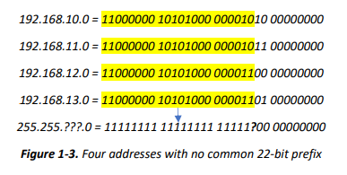

# ip杠mask写法并非万能

并非所有地址和网络掩码的组合都可以使用此表示法正确编写。 上图 显示了四个地址不能由一个地址/掩码条目表示。 之所以会这样，是因为地址尽管具有连续性，但没有相同的 22 位前缀。 因此，不可能指定覆盖所有这些地址的 22 位掩码。 如果您想通过提供 192.168.10.0/22 来记下这些地址，则只包含四个给定地址中的两个，其他两个将被忽略。

应该使用两个单独的规范来代替这样的记录：**192.168.10.0/23 和 192.168.12.0/23**，这意味着路由表中有两个单独的条目。 192.168.10.0/22 是否指定任何有效地址空间？ 是也不是。 如果您对该地址使用掩码，结果发现地址空间与地址 192.168.8.0/22 相同。 这种类型的记录是主地址重要吗？ 是的！ 即使是有经验的管理员也会错误地认为这样描述的地址空间是从 192.168.10.0 到 192.168.13.255，虽然计算机会根据 192.168.1 0.0/22 从 192.168.8.0 到 192.168.11.255 指定地址空间。 当然，这是两个完全不同的地址空间。 这种误写会导致重复的地址分配、路由问题和其他神秘错误。

附录：8 = 0b1000

如果您想避免这种情况并使记录明确无误，则用给定掩码掩码的基地址不能在主机号部分中有任何 1 位。 这个限制非常重要，以至于编写良好网络程序的每个人都会强制进行这样的写入，并在不遵守此规则的情况下通知地址错误。 一般规则如下：对于具有相同前缀的多个 N 个基地址，N 必须是 2 的幂的基数，并且包含网络号的最后一个八位字节（其中没有位指定主机号）必须 能被N整除。