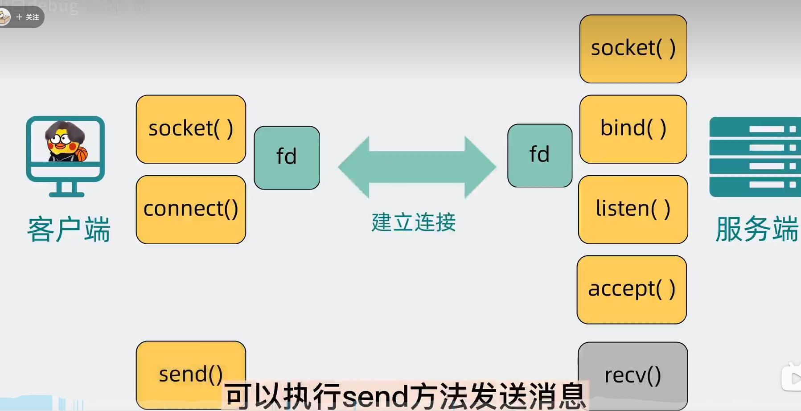
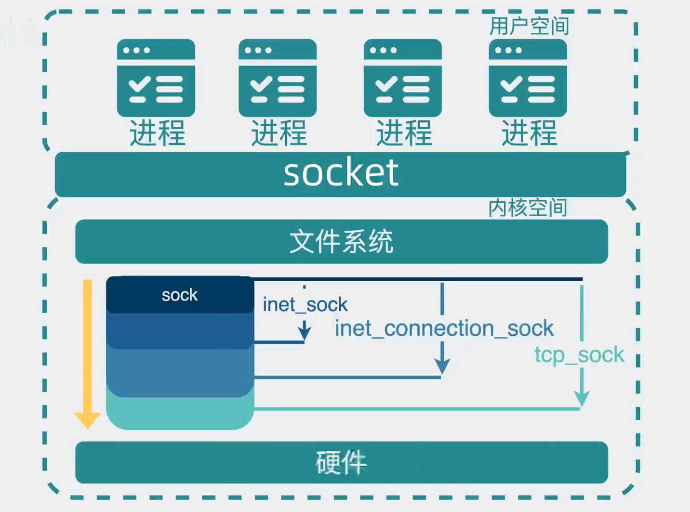
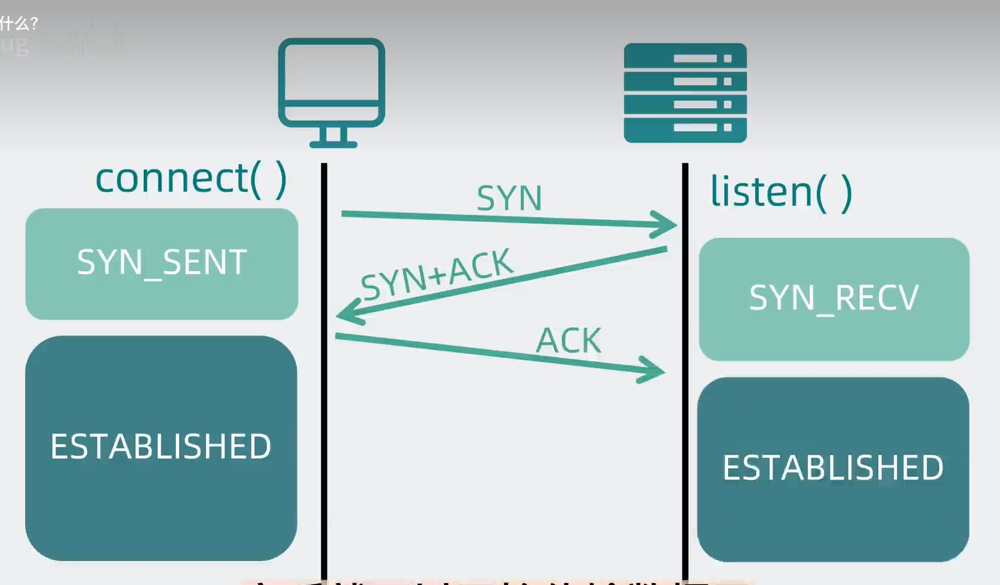
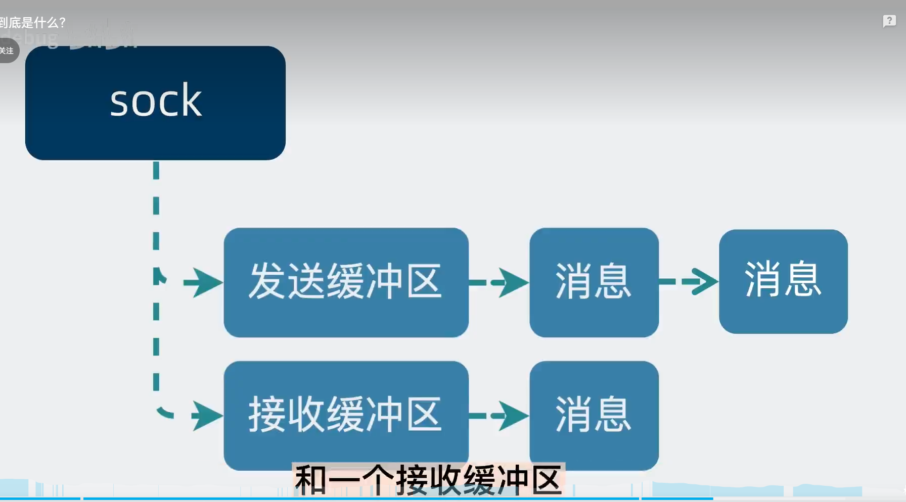
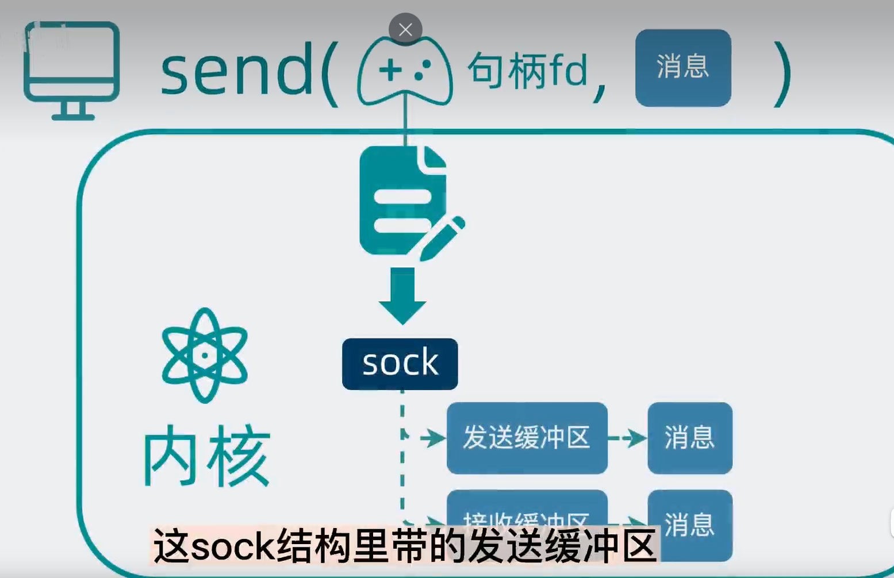
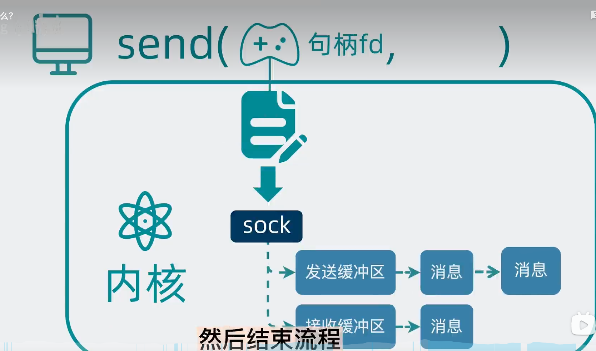
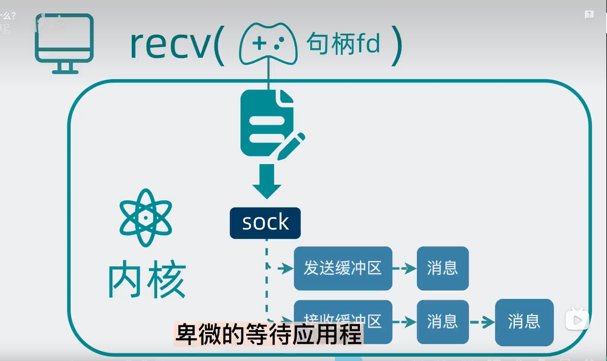
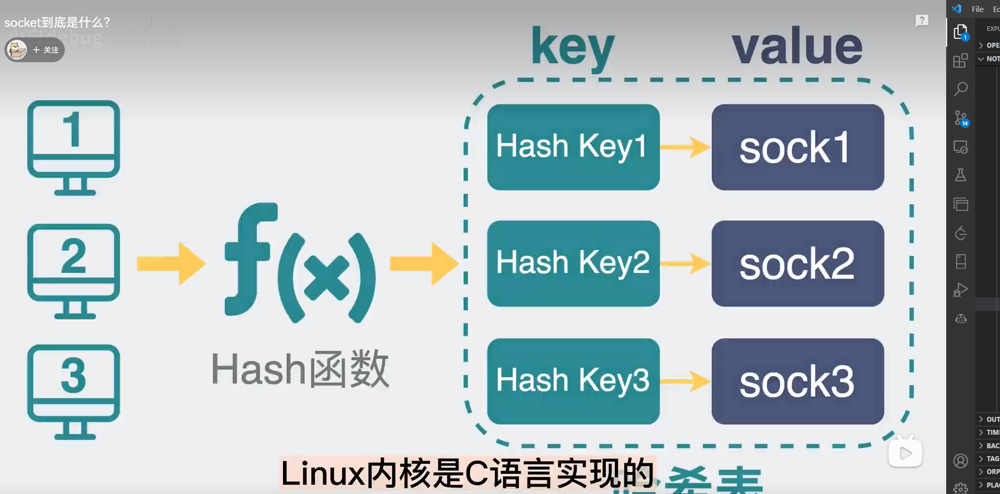
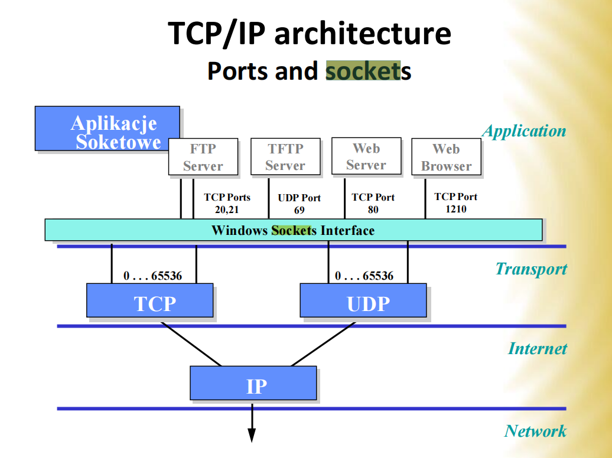

# socket

## 连接
[socket到底是什么？](https://www.bilibili.com/video/BV12A411X7gY/)

## 基础

以图上TCP的为例，socket就是套接字，理解为一种接口。上面就是TCP版本的sock结构体的函数，这些函数就是比如`linux内核`的API（Windows就是`Winsock API`）。

### 结构体
所以sock就是基类，而后不同的通信协议复用这个基础结构生成自己的socket结构体。

1. `sock`: 通用的套接字（socket）结构体，包含了所有类型的套接字共有的属性和方法。
   1. `inet_sock`: 是sock的子类，表示IPv4套接字的结构体，它在sock的基础上增加了一些IPv4相关的属性和方法，比如IP,port,[TTL](TTL.md)。
      1. `inet_connection_sock`: 是inet_sock的子类，表示IPv4连接套接字的结构体，它在inet_sock的基础上增加了TCP面向连接的连接管理相关的属性和方法。比如：[accept队列](accept%E9%98%9F%E5%88%97.md)，[MMS(数据包分片大小)](MSS和MTU.md)，握手失败重试次数等。注意它其实只为TCP准备，其他面向连接的比如`SCTP`，`RDP`有自己的结构体。
         1. `tcp_sock`: 是inet_connection_sock的子类，表示TCP套接字的结构体，它在inet_connection_sock的基础上增加了TCP协议相关的属性和方法。比如滑动窗口，拥塞控制算法等。
      2. `udp_sock`: 是inet_sock的子类，表示UDP套接字的结构体，它在inet_sock的基础上增加了UDP协议相关的属性和方法。
   2. 还有一些不需要经过网络的套接字，比如unix domain socket，用于unix多进程间通信，结构体是`sockaddr_un`

### 架构理论
为什么称它为API呢？如下图：

它本质是外包给linux内核，然后可以通过驱动硬件i.e.网卡，文件系统保存socket结构的文件(在windows其实也差不多，别忘了winapi创建共享内存的api其实叫[CreateFileMapping](../../%E8%AE%A1%E7%AE%97%E6%9C%BA%E5%8E%9F%E7%90%86%E5%92%8C%E6%93%8D%E4%BD%9C%E7%B3%BB%E7%BB%9F/%E8%BF%9B%E7%A8%8B%E9%97%B4%E9%80%9A%E4%BF%A1%E6%96%B9%E5%BC%8F.md))，最后发送数据包。

## socket包含
1. 描述符（Descriptor）：在操作系统中，每个打开的文件和设备都有一个唯一的描述符，socket也不例外。在网络编程中，我们使用socket描述符来表示一个网络套接字。
2. 网络地址（Address）：包括IP地址和端口号，用于唯一标识一个网络端点。
3. 通信协议（Protocol）：包括TCP、UDP等，用于确定网络通信的方式和规则。
4. 通信模式（Communication mode）：包括面向连接的通信和无连接的通信。

## 怎样实现网络传输功能

以TCP为例(一下不要正经当作api，只是用来理解)
1. 建立连接
   1. connect(fd, IP:port) 
   2. fd就是File Descriptor文件描述符，也可以叫句柄，通过它找到socket对应文件，通过对应信息找到内核的对应的sock结构。描述符（Descriptor）和文件描述符（File Descriptor，简称FD）通常是等价的概念。在操作系统中，每个打开的文件和设备都有一个唯一的描述符，通常用一个非负整数来表示。这个描述符在后续的操作中用于标识这个文件或设备，包括读取、写入、关闭等操作。
   3. 然后sock结构发起三次握手，建立连接
      1. 
2. 传输数据
   1. 
   2. 发送缓冲区（消息链表）
   3. 接收缓冲区（消息链表）
   4. 一样通过fd找到文件，然后找到对应的sock结构，然后通过sock结构找到对应的缓冲区，然后将数据放入缓冲区链表里
      1. `send(fd, msg)`
      2. 注意下图`消息`位置变化
      3. 
      4. 
   5. 接收也类似
      1. `recv(fd, msg)`
      2. 放到缓冲区等程序读取
      3. 

## 如何分辨那么多消息来自哪个客户端
四元组：`IP:port:IP:port`，也就是`源IP:源端口:目的IP:目的端口`，这样就可以唯一标识一个socket了。

然后Hash四元组生成key，将socket存入hash表中，这样就可以通过key找到对应的socket了。

## 教材-不好的解释

socket 
* 手机号码因为每个人都有套接字
* 物流公司因为：
  * TCP：得确认你在了再给你货
  * UDP：不管你在不在家，我给你送到了

The Internet socket is:
IP address, port number, port type.

>IP address `192.254.60.10`, port number `23`, `TCP` socket type >>> `192.254.60.10: 23 TCP`