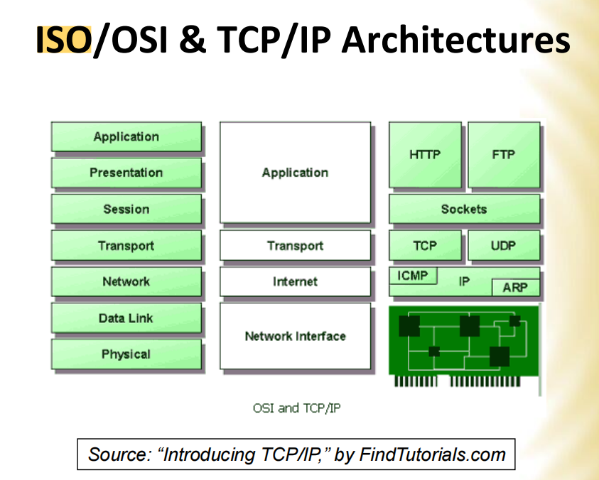
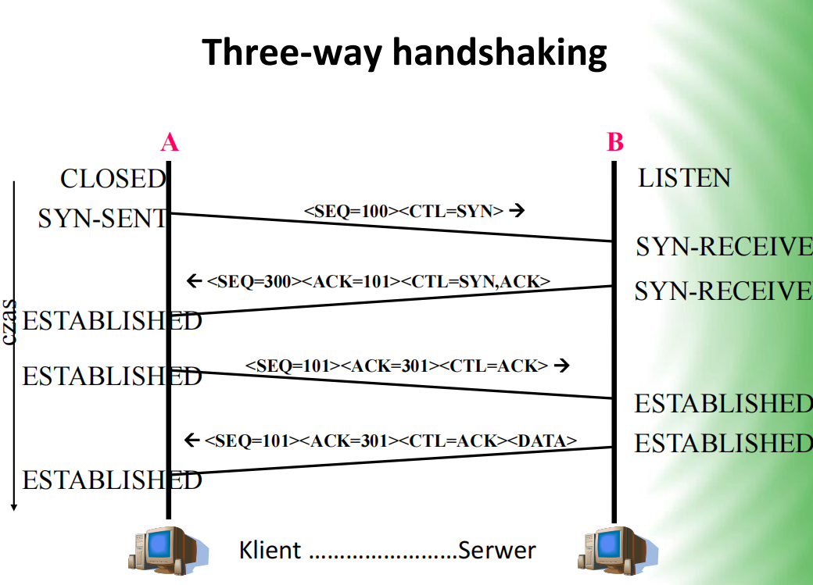

# 系统学习_计算机网络

## 复习
### Classification and general characteristics of computer networks
1. CN development goals and services provided;
   1. Aims of networking
      1. Proper load sharing between different computers;
      2. Ensuring the effective use of hardware (e.g. printers, plotters, high-speed computers) and software resources (e.g. common databases) located in different parts of the network;
      3. Financial savings in the operation of the station;
      4. Provision of a wide and distributed communication media over the network;
      5. Providing higher reliability of services by providing alternative information sources, computing capabilities and connection routes.
   2. Network services
      1. File transfer and e-mail handling;
      2. Remote program updates and remote calculations 
        (specialized programs, on-line calculations, division of tasks, etc.)
      3. Remote access to various databases 
        (news websites, financial services, information library, automatic newspapers, etc.)
      4. Multimedia services
         1. Teleconferencing and videoconferencing - related to two-way and real-time symmetric exchange of information
         2. Speech, still and moving images
         3. Choice of TV programs or videos on demand (Video/TV on Demand)
2. Classification of computer networks;
   1. Due to the territorial scope and the owner- network manager:
      1. WANs (Wide Area Networks) (manager >> 1)
      2. MANs (Metropolitan Area Networks) (manager > 1)
      3. LANs (Local Area Networks) (manager = 1)
   2. Due to the network structure (way of the network control):
      1. a network with a hierarchical structure
      2. a network with a distributed structure
   3. Due to affiliation:
      1. Scientific / educational networks (non-commercial)
      2. Commercial networks
      3. Civil networks
      4. Military networks
      5. Public networks
      6. Dedicated networks
   4. Other divisions are e.g. due to the offered speed (e.g. fast and very fast networks), topologies (mentioned before), or a kind of switching (commutation) technique (way of assembling communication links and whole paths).

### Connection-oriented AND Connectionless (transfer mode)
1. Connection-oriented transfer mode:
   The connection is first set up, then data (packets) are sent along a communication path (estabilished in a physical or logical way) – modeled on the telephony solutions.
2. Connectionless transfer mode:
   Mechanism of forwarding data, based on the snail mail solutions - packets are sent through the network "individually" (datagram-based) without setting up a connection ealier.
3. Broadcast vs point-to-point (multicast - anycast)

### ISO-OSI, TCP/IP

### TCP 和 UDP
#### TCP
Transmission Control Protocol

* Connections 类似于打电话，两者要建立连接
* Reliability 仍然是打电话，我说的话你都听到了，你都收到了。
* Flow control
* Multiplexing

##### 三次握手

* The three-way handshaking procedure is used to establish a TCP connection 
* The initiating host sends a packet containing the TCP segment with the SYN flag (tag/marker) set in the tags field 
* The host receiving the connection, if it wants to service it, sends back a packet with SYN and ACK flags set 
* Then the starting host sent the first batch (file/segment) of data with the ACK flag set. 
* If the receiving host is unwilling or unable to complete the connection, it responds with a packet with the RST flag set
* The connection ends by sending the FIN flag

### UDP
User Datagram Protocol
YES:
* Connectionless.类似于发邮箱，不管你在不在，我都可以给你发邮件。
* Unreliability.仍然是发邮件，我发送给你，你看不看是你的事情。
NO:
* Caching (buffering)
* Segmentation
* Flow control

### TCP 和 UDP
| Parameter/Functionality        | TCP | UDP |
| ------------------------------ | --- | --- |
| Transmission integrity control | YES | NO  |
| Large information overhead     | YES | NO  |
| Need to establish a connection | YES | NO  |
| Fast transmission              | No  | YES |
| Flow control                   | YES | NO  |
| Process identification         | YES | YES |

## 参考文献
[01A - CN  Teleinformatics Systems 2022](01A%20-%20CN%20%20Teleinformatics%20Systems%202022.pdf)
[02A - CN  CN Architectures 2022](02A%20-%20CN%20%20CN%20Architectures%202022.pdf)
[03A - CN  LAN Characteristics 2022](03A%20-%20CN%20%20LAN%20Characteristics%202022.pdf)
[04A - CN Classic LANs IEEE 802.3-5 2022](04A%20-%20CN%20Classic%20LANs%20IEEE%20802.3-5%202022.pdf)
[05A - Evolution of the  Ethernet standard](05A%20-%20Evolution%20of%20the%20%20Ethernet%20standard.pdf)
[06B - Computer Networks-Network Interconnection](06B%20-%20Computer%20Networks-Network%20Interconnection.pdf)
[07B - Computer Networks-VLANs](07B%20-%20Computer%20Networks-VLANs.pdf)
[08C - Computer Networks - WiFi](08C%20-%20Computer%20Networks%20-%20WiFi.pdf)
[09A - CN WANs -  Introduction and concepts of routing  (IGP) for IP nets 2022](09A%20-%20CN%20WANs%20-%20%20Introduction%20and%20concepts%20of%20routing%20%20(IGP)%20for%20IP%20nets%202022.pdf)
[10C-12C - Computer Networks-IPv4-IPv6](10C-12C%20-%20Computer%20Networks-IPv4-IPv6.pdf)
[13A - CN TCP  UDP protocols. Flow and congestion control v 2023](13A%20-%20CN%20TCP%20%20UDP%20protocols.%20Flow%20and%20congestion%20control%20v%202023.pdf)
[14C - Computer Networks-Network security](14C%20-%20Computer%20Networks-Network%20security.pdf)
[15C - Computer Networks-Services and applications](15C%20-%20Computer%20Networks-Services%20and%20applications.pdf)

ABC means 3 professors