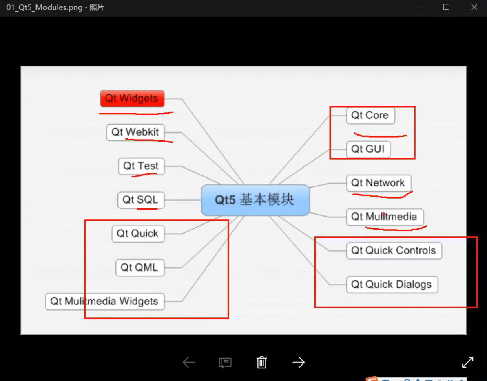

# 基础结构

1. [QMainwindo QWidget QDialog](QMainwindo_QWidget_QDialog.md)

2. main 函数：
* QApplication 就是Qt每个应用程序有且仅有一个的应用程序对象。
* QApplication::exec() 程序的生命循环、消息循环
* Widget头文件
  * Q_OBJECT  // 宏，引入qt信号和槽的一个宏
  * HelloWidegt(QWidget *parent = 0) // parent 窗口指针，父窗口对象的指针，如果parent为0或者NULL，表示当前为顶层窗口，顶层窗口就是在任务栏可以找到的窗口

3. CMakeList.txt跟`.pro`文件一样就是用来引入qt模块的方便build。
   1. 
   2. .pro文件是qmake

4. Qt大部分类都继承自QObject，它是一个顶层类（表示值的不是，其他像窗口相关的都是它）