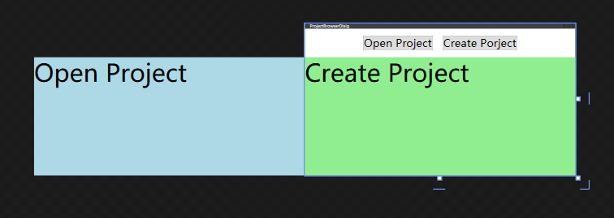

# xaml布局


```xml
    <Grid>
        <Grid.RowDefinitions>
            <RowDefinition Height="auto" />
            <RowDefinition />
        </Grid.RowDefinitions>
        <StackPanel Orientation="Horizontal" HorizontalAlignment="Center" Margin="20">
            <ToggleButton Content="Open Project" x:Name="openProjectButton" FontSize="32"/>
            <ToggleButton Content="Create Porject" x:Name="newProjectButton" FontSize="32" Margin="30,0,0,0"/>
        </StackPanel>
        <StackPanel Orientation="Horizontal" Grid.Row="1" Margin="-800, 0, 0, 0" >
            <Border Width="800" Background="LightBlue">
                <TextBlock FontSize="72" Text="Open Project"/>
            </Border>
            <Border Width="800" Background="LightGreen">
                <TextBlock FontSize="72" Text="Create Project"/>
            </Border>
        </StackPanel>
    </Grid>
```



