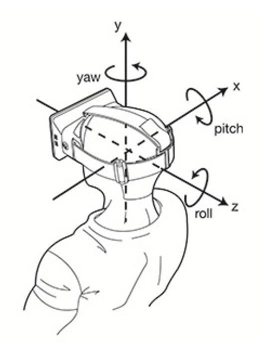
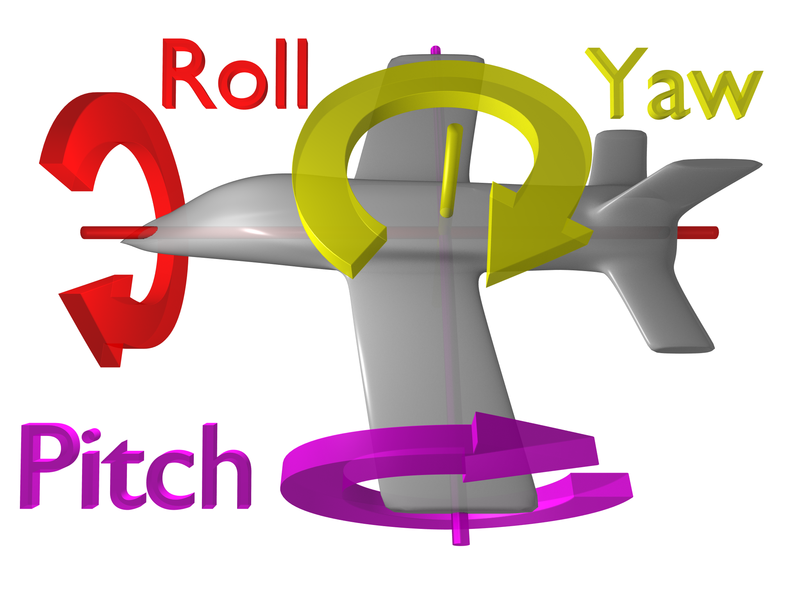

# 第02章03绑定运动输入

## 添加输入
```cpp
void ASCharacter::SetupPlayerInputComponent(UInputComponent* PlayerInputComponent)
{
    Super::SetupPlayerInputComponent(PlayerInputComponent);

    PlayerInputComponent->BindAxis("MoveForward", this, &ASCharacter::MoveForward);

    PlayerInputComponent->BindAxis("Turn", this, &APawn::AddControllerYawInput);
}

void MoveForward(floar Value)
{
    AddMovementInput(GetActorForwardVector(), Value);
}
```

## BindAxis
比如用pad玩时候，可以将值从0到1或-1渐变

## Editor setting
Edit -> Project Settings -> Input -> Axis Mapping

* 添加 `MoveForward`, `W`(1.0)、`S`(-1.0)

* 添加 `Turn`, `MouseX`

## YawInput PitchInput roll
* Yaw 是 horizontal rotation
* Pitch 是 vertical rotation
* roll 是 顺逆时针


