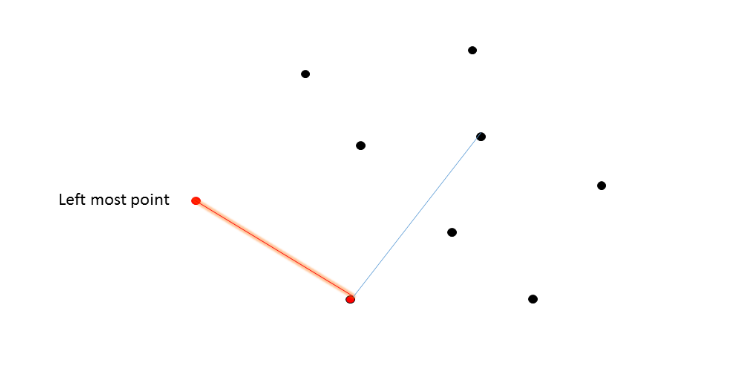
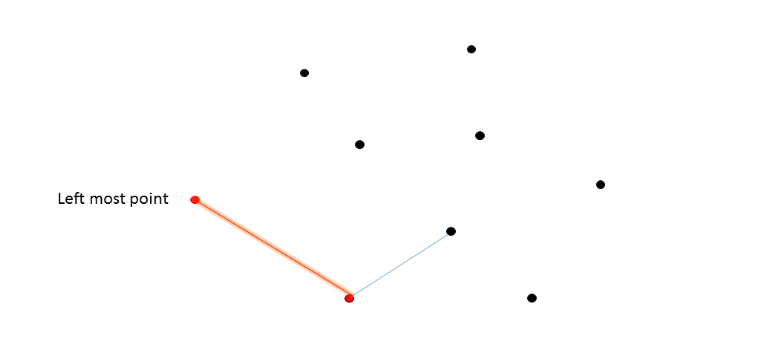
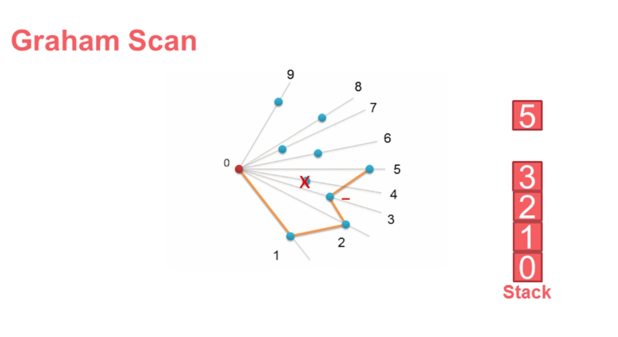
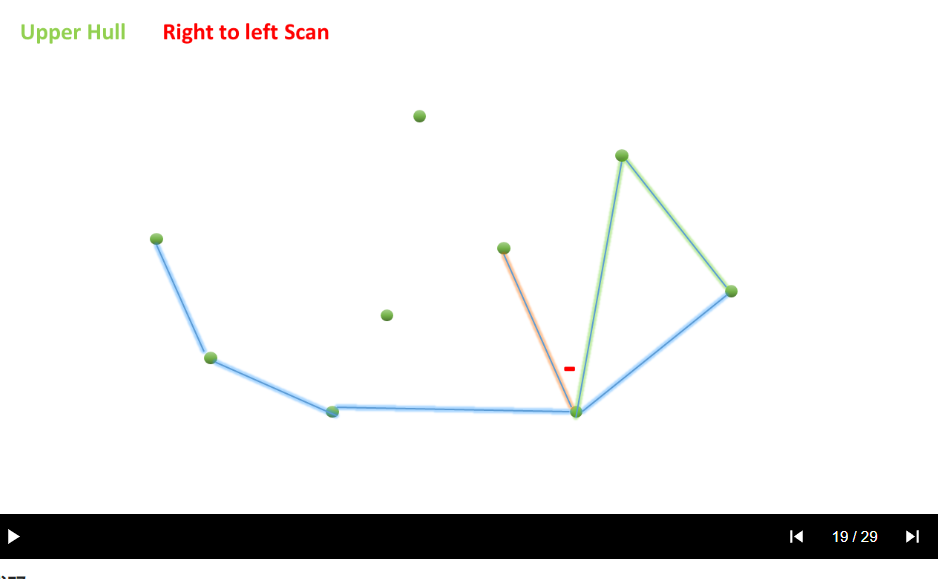

# 凸包算法_Jarvis算法_Graham算法_Andrew算法
[力扣](https://leetcode-cn.com/problems/erect-the-fence/solution/an-zhuang-zha-lan-by-leetcode-solution-75s3/)

## 图解
首行网页超链接有图片动态展示：
1. Javis:


2. Graham:
   
3. Andrew:
   

## 代码
1. Jarvis:
```cpp
class Solution {
public:
    int cross(vector<int> & p, vector<int> & q, vector<int> & r) {
        return (q[0] - p[0]) * (r[1] - q[1]) - (q[1] - p[1]) * (r[0] - q[0]);
    }

    vector<vector<int>> outerTrees(vector<vector<int>>& trees) {
        int n = trees.size();
        if (n < 4) {
            return trees;
        }
        int leftMost = 0;
        for (int i = 0; i < n; i++) {
            if (trees[i][0] < trees[leftMost][0]) {
                leftMost = i;
            }
        }

        vector<vector<int>> res;
        vector<bool> visit(n, false);
        int p = leftMost;
        do {
            int q = (p + 1) % n;
            for (int r = 0; r < n; r++) {
                /* 如果 r 在 pq 的右侧，则 q = r */ 
                if (cross(trees[p], trees[q], trees[r]) < 0) {
                    q = r;
                }
            }
            /* 是否存在点 i, 使得 p 、q 、i 在同一条直线上 */
            for (int i = 0; i < n; i++) {
                if (visit[i] || i == p || i == q) {
                    continue;
                }
                if (cross(trees[p], trees[q], trees[i]) == 0) {
                    res.emplace_back(trees[i]);
                    visit[i] = true;
                }
            }
            if  (!visit[q]) {
                res.emplace_back(trees[q]);
                visit[q] = true;
            }
            p = q;
        } while (p != leftMost);
        return res;
    }
};

作者：LeetCode-Solution
链接：https://leetcode-cn.com/problems/erect-the-fence/solution/an-zhuang-zha-lan-by-leetcode-solution-75s3/
来源：力扣（LeetCode）
著作权归作者所有。商业转载请联系作者获得授权，非商业转载请注明出处。
```
2. Graham:
```cpp
class Solution {
public:
    int cross(const vector<int> & p, const vector<int> & q, const vector<int> & r) {
        return (q[0] - p[0]) * (r[1] - q[1]) - (q[1] - p[1]) * (r[0] - q[0]);
    }

    int distance(const vector<int> & p, const vector<int> & q) {
        return (p[0] - q[0]) * (p[0] - q[0]) + (p[1] - q[1]) * (p[1] - q[1]);
    }

    vector<vector<int>> outerTrees(vector<vector<int>> &trees) {
        int n = trees.size();
        if (n < 4) {
            return trees;
        }
        int bottom = 0;
        /* 找到 y 最小的点 bottom*/
        for (int i = 0; i < n; i++) {
            if (trees[i][1] < trees[bottom][1]) {
                bottom = i;
            }
        }
        swap(trees[bottom], trees[0]);
        /* 以 bottom 原点，按照极坐标的角度大小进行排序 */
        sort(trees.begin() + 1, trees.end(), [&](const vector<int> & a, const vector<int> & b) {
            int diff = cross(trees[0], a, b) - cross(trees[0], b, a);
            if (diff == 0) {
                return distance(trees[0], a) < distance(trees[0], b);
            } else {
                return diff > 0;
            }
        });
        /* 对于凸包最后且在同一条直线的元素按照距离从小到大进行排序 */
        int r = n - 1;
        while (r >= 0 && cross(trees[0], trees[n - 1], trees[r]) == 0) {
            r--;
        }
        for (int l = r + 1, h = n - 1; l < h; l++, h--) {
            swap(trees[l], trees[h]);
        }
        stack<int> st;
        st.emplace(0);
        st.emplace(1);
        for (int i = 2; i < n; i++) {
            int top = st.top();
            st.pop();
            /* 如果当前元素与栈顶的两个元素构成的向量顺时针旋转，则弹出栈顶元素 */
            while (!st.empty() && cross(trees[st.top()], trees[top], trees[i]) < 0) {
                top = st.top();
                st.pop();
            }
            st.emplace(top);
            st.emplace(i);
        }

        vector<vector<int>> res;
        while (!st.empty()) {
            res.emplace_back(trees[st.top()]);
            st.pop();
        }
        return res;
    }
};

作者：LeetCode-Solution
链接：https://leetcode-cn.com/problems/erect-the-fence/solution/an-zhuang-zha-lan-by-leetcode-solution-75s3/
来源：力扣（LeetCode）
著作权归作者所有。商业转载请联系作者获得授权，非商业转载请注明出处。
```
3. Andrew:
[587.安装围栏——leetcode](../../LeetCode/587.安装栅栏.cpp)
```cpp
class Solution {
public:
    int cross(const vector<int> & p, const vector<int> & q, const vector<int> & r) {
        return (q[0] - p[0]) * (r[1] - q[1]) - (q[1] - p[1]) * (r[0] - q[0]);
    }

    vector<vector<int>> outerTrees(vector<vector<int>>& trees) {
        int n = trees.size();
        if (n < 4) {
            return trees;
        }
        /* 按照 x 大小进行排序，如果 x 相同，则按照 y 的大小进行排序 */
        sort(trees.begin(), trees.end(), [](const vector<int> & a, const vector<int> & b) {
            if (a[0] == b[0]) {
                return a[1] < b[1];
            }
            return a[0] < b[0];
        });
        vector<int> hull;
        vector<bool> used(n, false);
        /* hull[0] 需要入栈两次，不进行标记 */
        hull.emplace_back(0);
        /* 求出凸包的下半部分 */
        for (int i = 1; i < n; i++) {
            while (hull.size() > 1 && cross(trees[hull[hull.size() - 2]], trees[hull.back()], trees[i]) < 0) {
                used[hull.back()] = false;
                hull.pop_back();
            }
            used[i] = true;
            hull.emplace_back(i);
        }
        int m = hull.size();
        /* 求出凸包的上半部分 */
        for (int i = n - 2; i >= 0; i--) {
            if (!used[i]) {
                while (hull.size() > m && cross(trees[hull[hull.size() - 2]], trees[hull.back()], trees[i]) < 0) {
                    used[hull.back()] = false;
                    hull.pop_back();
                }
                used[i] = true;
                hull.emplace_back(i);
            }
        }
        /* hull[0] 同时参与凸包的上半部分检测，因此需去掉重复的 hull[0] */
        hull.pop_back();
        vector<vector<int>> res;
        for(auto & v : hull) {
            res.emplace_back(trees[v]);
        }
        return res;
    }
};

作者：LeetCode-Solution
链接：https://leetcode-cn.com/problems/erect-the-fence/solution/an-zhuang-zha-lan-by-leetcode-solution-75s3/
来源：力扣（LeetCode）
著作权归作者所有。商业转载请联系作者获得授权，非商业转载请注明出处。
```