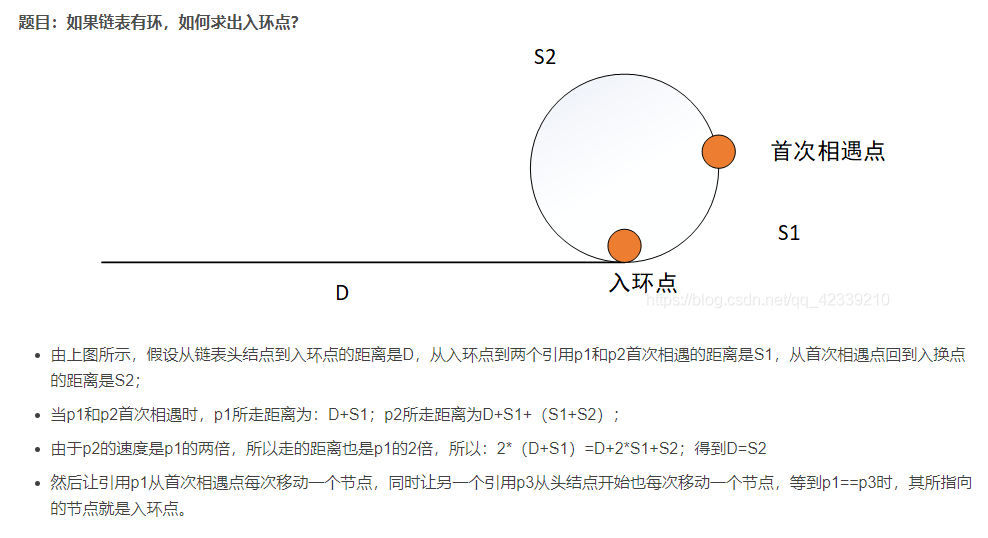

# 判断链表的环问题
[如何判断链表有环以及求出环的长度和入口点_大音希声_的博客-CSDN博客](https://blog.csdn.net/qq_42339210/article/details/107996090)

## 链表有环
一快一慢，同时出发，如果相遇，即有环。

## 链表环长度，
一个一倍速，一个二倍速，相遇后继续跑，再相遇就是快的多跑了一圈，即环长度。

## 链表环入口
首次相遇后，将一个移动到起始点，同时以一倍速移动，相遇时即入环点。

证明：

