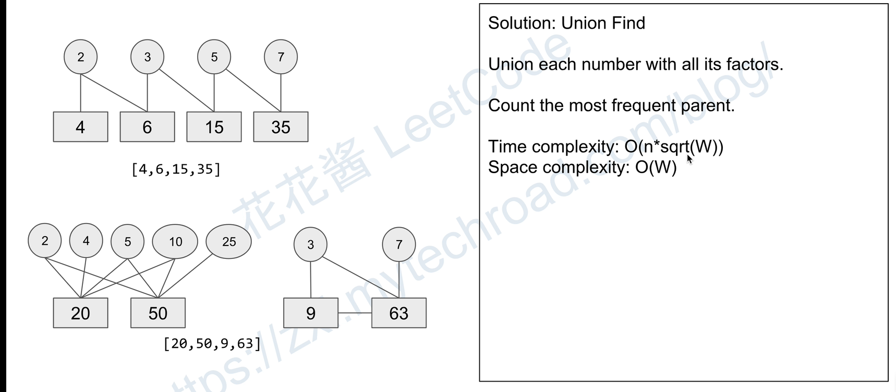

# 并查集

**每个索引所在位置存的是索引所在原数组的数字的父亲的索引**



这种并查集结构，不用只找每个数字的质数因子，它可以只要所有因子，然后层层被parent递进

[LeetCode 1697.检查边长度限制的路径是否存在](../../LeetCode/1697.检查边长度限制的路径是否存在.cpp)
```cpp
class Solution {
private:
    vector<int> dsu;
public:
    int find(int x){
        if(dsu[x] == x)
            return x;
        // 这样的用处是，使所有的子节点都赋值为同一个爹，尽量减少层数加速搜索
        return dsu[x] = find(dsu[x]);
    }

    void merge(int x, int y){
        x = find(x);
        y = find(y);
        dsu[y] = x;
    }

    vector<bool> distanceLimitedPathsExist(int n, vector<vector<int>>& edgeList, vector<vector<int>>& queries) {
        sort(edgeList.begin(), edgeList.end(), [](vector<int>& a, vector<int>& b) {return a[2] < b[2];});
        vector<int> index(queries.size());
        iota(index.begin(), index.end(), 0);
        sort(index.begin(), index.end(), [r = queries.data()](int& a, int& b) {return r[a][2] < r[b][2];});

        vector<bool>ans(queries.size());
        dsu = vector<int>(n);
        int id = 0;
        int m = edgeList.size();
        // 初始化为自己
        iota(dsu.begin(), dsu.end(), 0);
        for(auto& i : index)
        {
            while(id < m && edgeList[id][2] < queries[i][2])
            {
                merge(edgeList[id][0], edgeList[id][1]);
                id++;
            }
            ans[i] = find(queries[i][0]) == find(queries[i][1]);
        }
        return ans;
    }
};
```


[LeetCode_952.按公因数计算最大组件大小.cpp](../../LeetCode/952.按公因数计算最大组件大小.cpp)
```cpp
class UnionFind{
private:
    vector<int> parent; // 存放每个数字的parent（parent就是因子），长度不是原数字的长度，而是原数组最大值的长度
    vector<int> rank;   // 存放每个父亲节点的儿子数量，按儿子数量合并，存入多的（其实可以不要，直接每次让y存入x就行了,y是原数字，x是因子）, 但是速度会下降，因为根据经常连接的点可以找出谁更常用，会加速新数字找parent

public:
    UnionFind(int n)
    {
        parent = vector<int> (n);   
        rank = vector<int>(n);
        
        // 先将每个数的parent初始化为自己
        for(int i = 0; i < n; i++)
        {
            parent[i] = i;
        }
    }

    // 因为这是个链型结构，不是每个parent作为父节点就连上所有子节点的
    // 比如24父亲可能会是8，8的父亲是4，4的父亲如果就是4，那就停下，否则继续往前，最后应该会停在一个质数上
    int find(int x)
    {
        if(parent[x] != x)
        {
            parent[x] = find(parent[x]);
        }
        return parent[x];
    }

    void uni(int x, int y)
    {
        int rootx = find(x);
        int rooty = find(y);

        //下面其实可以不用，直接parent[rooty] = parent[rootx]就行了，y是origin，x是parent才行
        //但是速度会下降，因为根据经常连接的点可以找出谁更常用，会加速新数字找parent
        if(rootx != rooty)
        {
            if(rank[rootx] > rank[rooty])
                parent[rooty] = rootx;
            else if (rank[rootx] < rank[rooty])
                parent[rootx] = rooty;
            else
            {
                parent[rooty] = rootx;
                rank[rootx]++;
            }
        }
    }
};

```