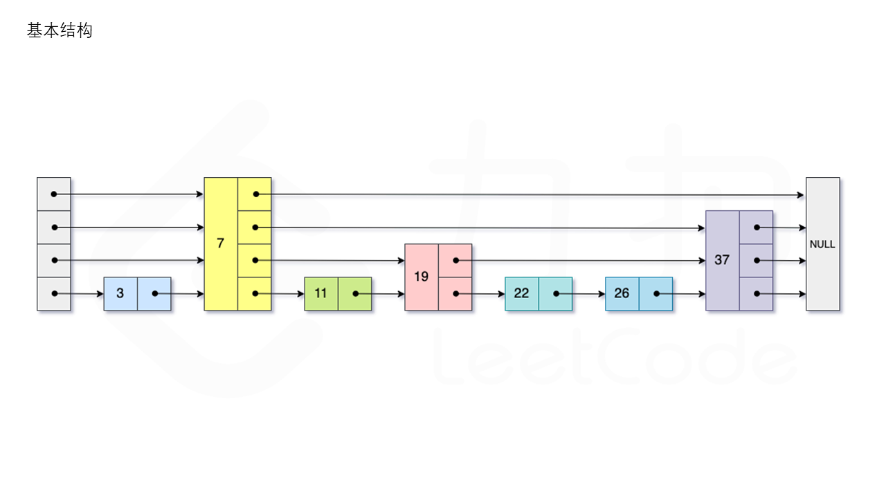

# 跳表



[力扣](https://leetcode.cn/problems/design-skiplist/solution/she-ji-tiao-biao-by-leetcode-solution-e8yh/)

跳表实际为一种多层的有序链表，跳表的每一层都为一个有序链表，且**满足每个位于第 i 层的节点有 p 的概率出现在第 i+1 层，其中 p 为常数**。

```cpp
#include <vector>
#include <random>//随机数
using namespace std;

constexpr int MAX_LEVEL = 32;
constexpr double P_FACTOR = 0.25; // 因为概率需要一样

struct SkiplistNode
{
    int val;
    vector<SkiplistNode*> forward;
    SkiplistNode(int _val, int _maxLevel = MAX_LEVEL) : val(_val), forward(_maxLevel, nullptr){}
};
class Skiplist {
private:
    SkiplistNode * head;
    int level;
    mt19937 gen{random_device{}()};
    uniform_real_distribution<double> dis;
public:
    Skiplist() : head(new SkiplistNode(-1)), level(0), dis(0, 1){
        
    }
    
    bool search(int target) {
        SkiplistNode *curr = this->head;
        for (int i = level - 1; i >= 0; i--) {
            /* 找到第 i 层小于且最接近 target 的元素*/
            while (curr->forward[i] && curr->forward[i]->val < target) {
                curr = curr->forward[i];
            }
        }
        curr = curr->forward[0];
        /* 检测当前元素的值是否等于 target */
        if (curr && curr->val == target) {
            return true;
        } 
        return false;
    }
    
    void add(int num) {
        vector<SkiplistNode *> update(MAX_LEVEL, head);
        SkiplistNode *curr = this->head;
        for (int i = level - 1; i >= 0; i--) {
            /* 找到第 i 层小于且最接近 num 的元素*/
            while (curr->forward[i] && curr->forward[i]->val < num) {
                curr = curr->forward[i];
            }
            update[i] = curr;
        }
        int lv = randomLevel();
        level = max(level, lv);
        SkiplistNode *newNode = new SkiplistNode(num, lv);
        for (int i = 0; i < lv; i++) {
            /* 对第 i 层的状态进行更新，将当前元素的 forward 指向新的节点 */
            newNode->forward[i] = update[i]->forward[i];
            update[i]->forward[i] = newNode;
        }
    }
    
    bool erase(int num) {
        vector<SkiplistNode *> update(MAX_LEVEL, nullptr);
        SkiplistNode *curr = this->head;
        for (int i = level - 1; i >= 0; i--) {
            /* 找到第 i 层小于且最接近 num 的元素*/
            while (curr->forward[i] && curr->forward[i]->val < num) {
                curr = curr->forward[i];
            }
            update[i] = curr;
        }
        curr = curr->forward[0];
        /* 如果值不存在则返回 false */
        if (!curr || curr->val != num) {
            return false;
        }
        for (int i = 0; i < level; i++) {
            if (update[i]->forward[i] != curr) {
                break;
            }
            /* 对第 i 层的状态进行更新，将 forward 指向被删除节点的下一跳 */
            update[i]->forward[i] = curr->forward[i];
        }
        delete curr;
        /* 更新当前的 level */
        while (level > 1 && head->forward[level - 1] == nullptr) {
            level--;
        }
        return true;
    }

    int randomLevel() {
        int lv = 1;
        /* 随机生成 lv */
        while (dis(gen) < P_FACTOR && lv < MAX_LEVEL) {
            lv++;
        }
        return lv;
    }
};

/**
 * Your Skiplist object will be instantiated and called as such:
 * Skiplist* obj = new Skiplist();
 * bool param_1 = obj->search(target);
 * obj->add(num);
 * bool param_3 = obj->erase(num);
 */
````