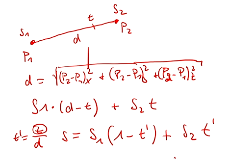
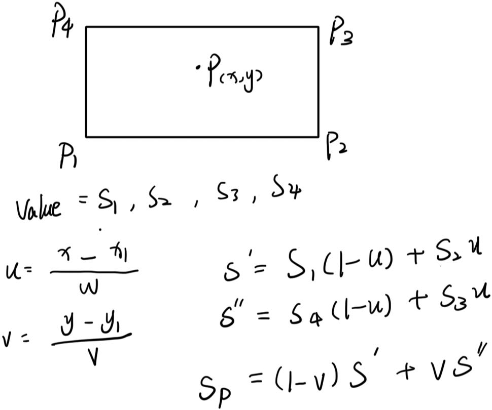
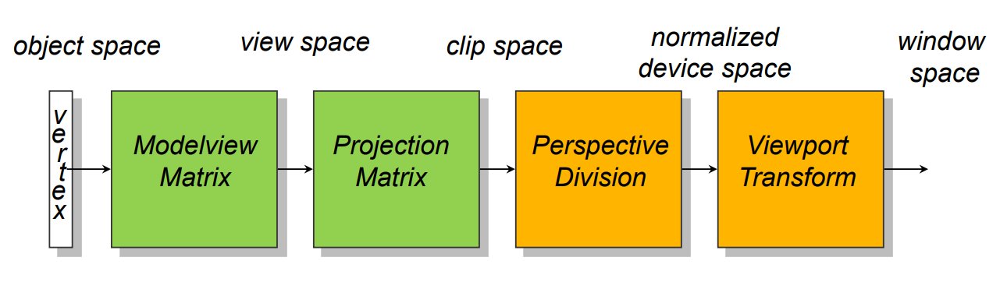
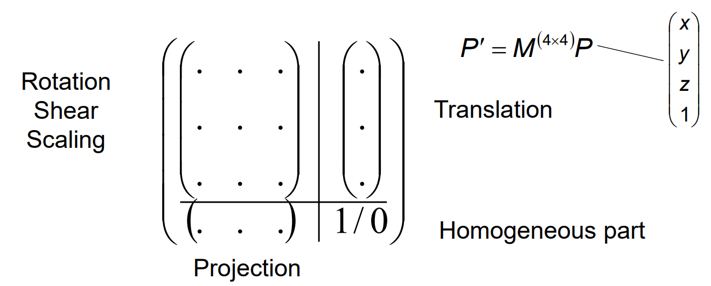
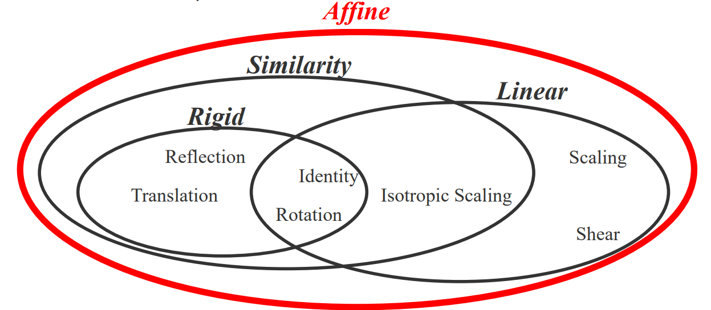
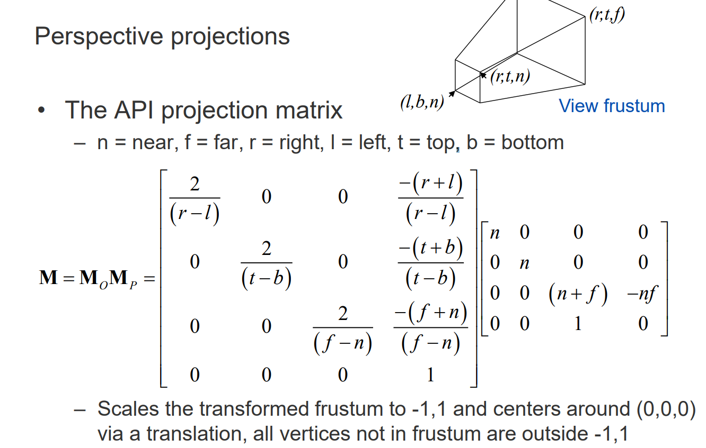
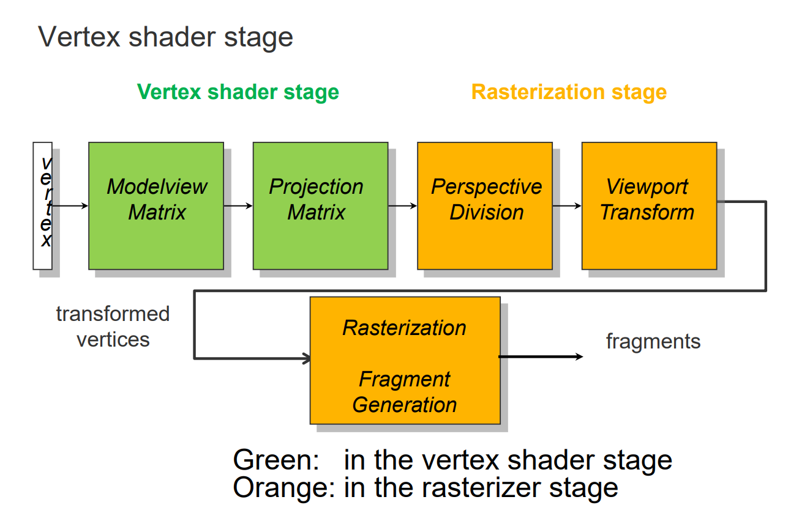
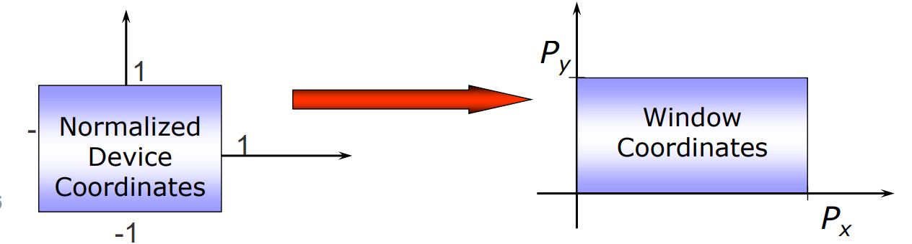
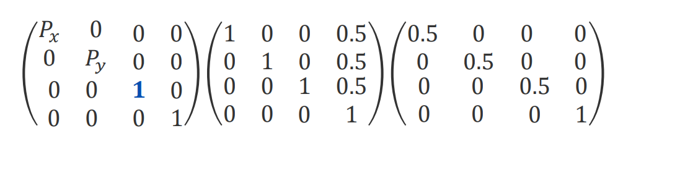

# 08 09 Geometry Processing I II

## 课前补充

1. [射线和线段或三角形的交点](../计算机图形学知识积累/射线和线段或三角形的交点.md)
2. [点是否在三角形内](../计算机图形学知识积累/点是否在三角形内或多边形内.md)
4. [找到光源到视角在平面上的反射点](../计算机图形学知识积累/找到光源到视角在平面上的反射点.md)
5. Interpolation in line
   1. 
   2. P1到中间一点距离d, 总长t
   3. $$t\prime = \frac{d}{t}$$
   4. $$S = S_1(1-t\prime) + S_2t\prime$$
6. Interpolation in rectangle
   1. 
   2. 也可以直接计算四个小块的面积比例

## Geometry Processing

工作在顶点上，在vertex shader stage中操作。

---

* Per-vertex attributes:
  * coordinate (x, y, z, 1)
  * color (r, g, b, α)
  * normal ($n_x, n_y, n_z$)
  * texture coordinates ($u, v$)
* +
* A set of transformation matrices, typically issued via the application program

---

* Per vertex operations:
  * Coordinate/normal transformation
  * Perspective projection of vertices
* Per triangle operations (optional in the geometry shader):
  * front/back face culling
    * 不展示法线远离视点的三角形。可以减少渲染多边形的数量。
  * Clipping
    * 裁剪, 去掉超出视锥体的部分
* 结果是projected triangle vertices (in homogeneous coordinates) with attributes
  * homogeneous coordinates: $(x, y, z, w)$，其实就是加一个维度，方便做各种变换。

## Transformations

* Model transform: 本地坐标系到世界坐标系的变换
* View transform: 世界坐标系到相机坐标系的变换
* Projection transform: 相机坐标系到裁剪坐标系的变换 - 透视投影，比如近打远小 （调整相机的lens）
* Viewport transform: 裁剪坐标系到屏幕坐标系的变换，photograph

Transformation pipeline:

* 绿色 - vertex shader stage
* 橘色 - rasterizer stage (见[07GraphicsAPIs](./07GraphicsAPIs.md), 是geometry shader stage的下一步)

### Translation

$$\begin{bmatrix} x\prime \\ y\prime \\ z\prime \\ 1 \end{bmatrix} = \begin{bmatrix} 1 & 0 & 0 & t_x \\ 0 & 1 & 0 & t_y \\ 0 & 0 & 1 & t_z \\ 0 & 0 & 0 & 1 \end{bmatrix} \begin{bmatrix} x \\ y \\ z \\ 1 \end{bmatrix}$$

齐次坐标的w
* 在坐标变换中会是1，因为点可以让变换矩阵的最后一列作用
* 在向量变换中会是0，因为向量不受平移影响，保证了向量的方向 （比如法线）

### Scaling

$$\begin{bmatrix} x\prime \\ y\prime \\ z\prime \\ 0/1 \end{bmatrix} = \begin{bmatrix} s_x & 0 & 0 & 0 \\ 0 & s_y & 0 & 0 \\ 0 & 0 & s_z & 0 \\ 0 & 0 & 0 & 1 \end{bmatrix} \begin{bmatrix} x \\ y \\ z \\ 0/1 \end{bmatrix}$$

### Rotation

1. around z-axis
   $$\begin{bmatrix} x\prime \\ y\prime \\ z\prime \\ 1 \end{bmatrix} = \begin{bmatrix} \cos(\theta) & -\sin(\theta) & 0 & 0 \\ \sin(\theta) & \cos(\theta) & 0 & 0 \\ 0 & 0 & 1 & 0 \\ 0 & 0 & 0 & 1 \end{bmatrix} \begin{bmatrix} x \\ y \\ z \\ 1 \end{bmatrix}$$
2. around x-axis
   $$\begin{bmatrix} x\prime \\ y\prime \\ z\prime \\ 1 \end{bmatrix} = \begin{bmatrix} 1 & 0 & 0 & 0 \\ 0 & \cos(\theta) & -\sin(\theta) & 0 \\ 0 & \sin(\theta) & \cos(\theta) & 0 \\ 0 & 0 & 0 & 1 \end{bmatrix} \begin{bmatrix} x \\ y \\ z \\ 1 \end{bmatrix}$$
3. around y-axis
   $$\begin{bmatrix} x\prime \\ y\prime \\ z\prime \\ 1 \end{bmatrix} = \begin{bmatrix} \cos(\theta) & 0 & \sin(\theta) & 0 \\ 0 & 1 & 0 & 0 \\ -\sin(\theta) & 0 & \cos(\theta) & 0 \\ 0 & 0 & 0 & 1 \end{bmatrix} \begin{bmatrix} x \\ y \\ z \\ 1 \end{bmatrix}$$

### 分类

* Rigid body transformations: 保持距离和角度不变，又叫做Euclidean transformations
* Similarity transformations: 保持角度不变
* Linear transformations:
  * L(x + y) = L(x) + L(y)
  * L(ax) = aL(x)
  * L(0) = 0
* Affine transformations: 保持平行线不变

翻译: Isotropic Scaling 是 各向同性缩放

### Combination

先A再B，即$B \times A \times v$

inverse就是$A^{-1} \times A \times v = v$

### 补充
[仿射变换-旋转_平移_缩放_剪切_投影_反射_变换矩阵](../计算机图形学知识积累/仿射变换-旋转_平移_缩放_剪切_投影_反射_变换矩阵.md)

## ModelView Matrix

* M = View * Model, 作用后会得到物体的坐标在相机(view/camera)坐标系中的位置
* 法线矩阵是(View × Model)矩阵的逆矩阵的转置矩阵。

### View Matrix 计算

* 已知相机位置C,看向D, 上方向U
* 移动到原点
  * $$T = \begin{bmatrix} 1 & 0 & 0 & -C_x \\ 0 & 1 & 0 & -C_y \\ 0 & 0 & 1 & -C_z \\ 0 & 0 & 0 & 1 \end{bmatrix}$$
  * 令$M_{trans}=T$
* 计算三个正交向量作为基向量
  * R = D × U
  * U = R × D (再次计算一次U，是因为有时候因为D和U可能不正交)
* 调整方向
  * 因为`[R,U,D]`将基向量`[e1,e2,e3]`作用到`[R,U,D]`上，所以需要逆
  * $M_{view} = [R,U,D]^{-1}M_{trans}$

## Projective Matrix 透视矩阵

另一种适用于特定的图形API或者硬件需求的：

[构建投影矩阵](../计算机图形学知识积累/仿射变换-旋转_平移_缩放_剪切_投影_反射_变换矩阵.md)

## 流程梳理

* Vertex shader stage的结果：
  * perspective projection后的齐次顶点坐标
  * （modelview transformed）法线
  * 额外的属性（颜色，纹理坐标等）
* The transformed, attributed vertex stream is passed to the rasterizer stage
  * 光栅化使用**除以w**和maps NDC to 像素坐标
    * NDC (Normalized Device Coordinates) 规一化设备坐标，范围是[-1, 1]
  * 对于每个三角形，光栅器决定哪些像素被这个三角形覆盖 - 对于每个这样的像素，a fragment is generated
  * 每个顶点的属性被插值到这个fragment上。
  * 补充fragment概念在[图元片元光栅化概念](../计算机图形学知识积累/图元片元光栅化.md)一文里。

1. modelview之后在view coords
2. projection之后在clip coords
3. 然后才是perspective divide，得到NDC
4. 最后viewport transform，得到屏幕坐标

NDC的作用和viewport transformation:
1. 范围在[-1, 1]
2. 假设点屏幕即视口宽高是`[1024,512]`，NDC=`[0.2,0.2]`
3. 那么屏幕坐标:
   1. 先将NDC转换到[0,1]，即`[0.2,0.2]` -> `(0.2 + 1)/2 = 0.6`
   2. 再乘以屏幕宽高，即`[0.6,0.6]` -> `(0.6*1024,0.6*512) = (614.4,307.2)` = `x=614,y=307`
   3. 实际情况有时候可能略有偏差，比如`x=613,y=306`
4. 如果屏幕坐标可能是y轴向下的，那么可能计算时，纵坐标不是 `(y+1)/2`，而是`(1-y)/2`
5. 深度也一样，但是深度perspective后在`[-1,1]`，再经过viewport transformation后在[0,1]，但是之后就不用再变了，不需要变大。

下面是viewport transformation的矩阵，其实很好理解，就是单纯的先缩放一半，再平移0.5。

