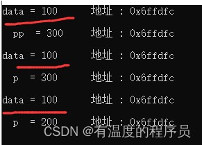

# const_cast

const_cast是一个基于C语言编程开发的运算方法，其主要作用是：修改类型的const或volatile属性。

```cpp
#include <iostream>
using namespace std;
 
int main () {
	const int data = 100;
    int *pp = (int *)&data;
    *pp = 300;
    cout << "data = " << data << "\t地址 : " << &data << endl << endl ;
	cout << "  pp  = " << *pp << "\t地址 : " << pp << endl << endl ;
	int *p = const_cast<int*>( &data ) ;
	cout << "data = " << data << "\t地址 : " << &data << endl << endl ;
	cout << "  p  = " << *p << "\t地址 : " << p << endl << endl ;
	*p = 200 ;
 
	cout << "data = " << data << "\t地址 : " << &data << endl << endl ;
	cout << "  p  = " << *p << "\t地址 : " << p << endl << endl ;
 
	return 0 ;
}
```



data 的地址是 0x6ffdfc, p 指向的地址也是 0x6ffdfc, 但是修改 p 之后, 同一个地址上的内容却不相同。

可能是 const 的问题？ const 的机制，就是在编译期间，用一个常量代替了 data。这种方式叫做**常量折叠**。

常量折叠与编译器的工作原理有关，是编译器的一种编译优化。在编译器进行语法分析的时候，将常量表达式计算求值，并用求得的值来替换表达式，放入常量表。所以在上面的例子中，编译器在优化的过程中，会把碰到的data（为const常量）全部以内容100替换掉，跟宏的替换有点类似。