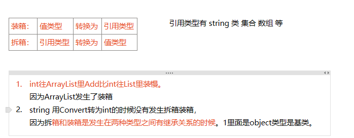

# 拆箱装箱

ArrayList存的是object对象，可以装任何类型，但涉及装箱拆箱，效率低，类型转换可能报错

List只能存一种类型，不涉及装箱拆箱，效率高

装箱：值类型->引用类型
拆箱：引用类型->值类型

剩下的唯一问题就是要知道装箱和拆箱在什么时候发生。拆箱一般很明细的，因为要在代码中明确地显示一个强制类型转换。装箱则可能在没有意识的时候发生。如上面代码的第二行。但是，为了一个类型的值调用ToString,Equals或GetHashCode方法时，如果该类型没有覆盖这些方法，也会发生装箱。（同时，当你调用类型变量值的**GetType()方法时，也会伴随着装箱**的过程。如果处理为装箱形式的变量，你应该已经知道了具体类型，因此使用typeof替代即可。）别外，**将值作为接口表达式使用时——把它赋值给一个接口类型的变量，或者把它作为接口类型的参数来传递——也会发生装箱。例如，Icomparable x = 5；语句会对5进行装箱。**