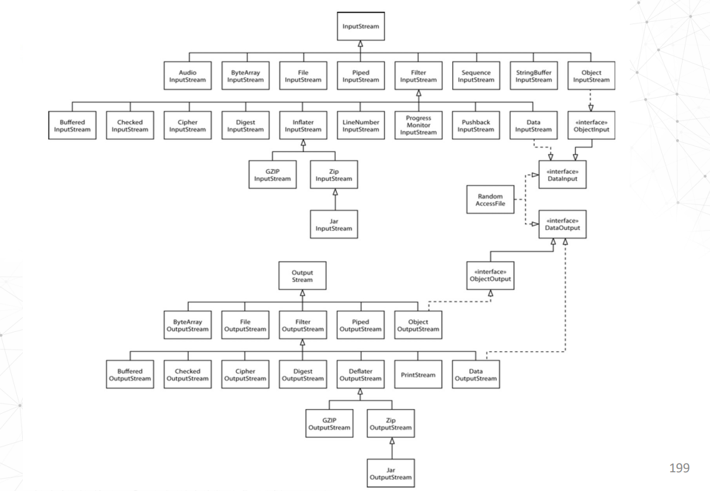

# I/O Streams

## 介绍

和[Stream](Stream.md)没有关系。Stream类是`java.util.stream`包下的，而InputStream和OutputStream是`java.io`包下的。

### InputStream

InputStream是一个抽象类，定义了所有输入流的基本功能。它是所有输入流的父类。

### OutputStream

OutputStream是一个抽象类，定义了所有输出流的基本功能。它是所有输出流的父类。

### 分类
1. ByteStreams
   1. InputStream (e.g. FileInputStream, ByteArrayInputStream, AudioInputStream)
   2. OutputStream (e.g. FileOutputStream, ByteArrayOutputStream, AudioOutputStream)
2. CharacterStreams
   1. Reader (e.g. FileReader, InputStreamReader)
   2. Writer
   3. Note: 
      1. They use the Unicode character set.
      2. Auto character translation between the local character set and Unicode.

### 类视图


## close

invoke `close()` method after finalizing the operation with handler.

## Buffering

* Improve the comunication performance through I/O streams.
  * Reduction of the references to file/socket
* Byte Streams:
  * BufferedInputStream
  * BufferedOutputStream
* Character Stream:
  * BufferedReader
  * BufferedWriter
* Decorators: decorator是一种设计模式，它允许我们通过将对象包装在另一个对象中来扩展对象的功能。
  * `BufferedInputStream` and `BufferedOutputStream` are decorators of `InputStream` and `OutputStream` respectively.
  * `BufferedReader` and `BufferedWriter` are decorators of `Reader` and `Writer` respectively.
* `Flush` method forces the buffer contents to be written.

[Buffering](Buffering.md)

## Object和Byte使用案例
[udp](udp.md)中有一个案例，使用了ObjectInputStream和ObjectOutputStream。

```java
ObjectOutputStream out = new ObjectOutputStream(new FileOutputStream("data.obj"));

Footballer footballer = new Footballer("Ronaldo", 7);
Manager manager = new Manager("Zidane", 5);
out.writeObject(footballer);
out.writeObject(manager);

ObjectInputStream in = new ObjectInputStream(new FileInputStream("data.obj"));
Footballer footballer = (Footballer) in.readObject();
Manager manager = (Manager) in.readObject();
```

当然他们都需要实现[Serializable](Serializable.md)接口。