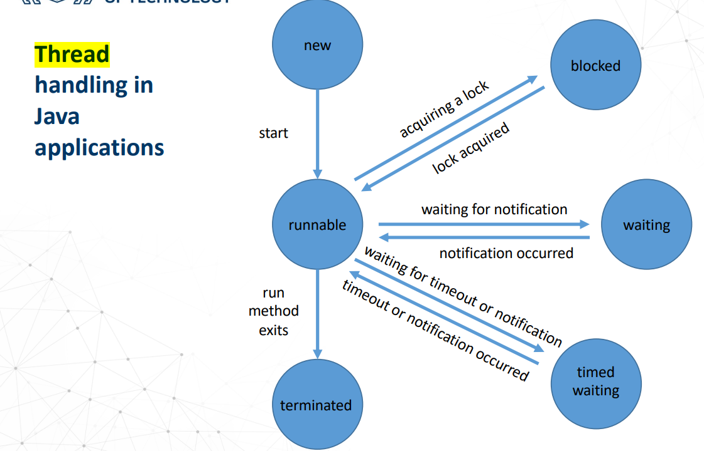

# Thread_Runable

## Thread
simplest but not cleanest way to create a thread

```java
public class HelloThread extends Thread {
	public void run() {
		System.out.println("Hello from a thread!");
	}
	public static void main(String args[]) {
		(new HelloThread()).start();
	}
}
```

## Runnable
```java
class MyRunnable implements Runnable
{
	public void run()
	{
		//. . .
	}
}
Runnable r = new MyRunnable();
Thread t = new Thread(r);
t.start();
```

## lifecycle
1. `thread.join();`
2. `thread.isAlive()`
3. `thread.interrupt();`
4. `Thread.interrupted();` 测试是否中断

### interrupt
`Thread.interrupted()` 作用是测试当前线程是否已经中断，当前线程是指运行this.interrupted()方法的线程，而不管是哪个对象的线程。因此，Thread.interrupted()等效于this.isInterrupted(true)。

```java
while (Thread.interrupted ()) {
	try {
		//...
	} catch (InterruptedException e) {
	//TODO: handle exception
		break;
	}
}
```

## 六个状态
