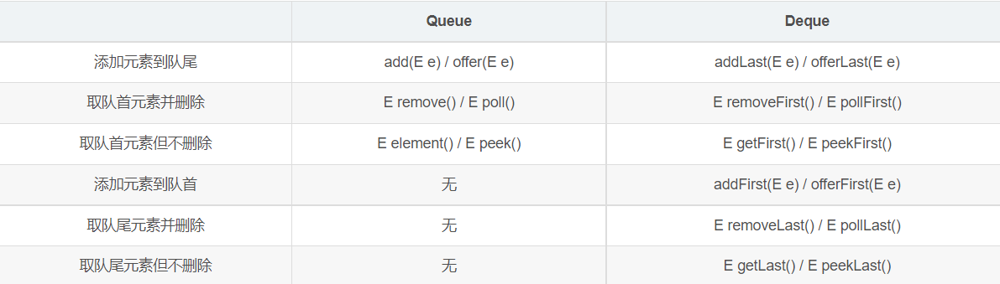

# deque 和 quque

## 区别
Deque是双端队列，可以从队头队尾入队出队。 
Queue是单向队列 只能从对尾入队，队头出队。(FIFO)


插入删除两种操作方法的区别：
1. add和offer区别
一些队列会有大小限制，当队列满时，调用 add() 方法就会抛出一个 unchecked 异常，而调用 offer() 方法会返回 false。因此就可以在程序中进行有效的判断。
2. remove和poll的区别
remove() 和 poll() 方法都是从队列中删除第一个元素。如果队列元素为空，调用remove() 的行为与 Collection 接口的版本相似会抛出异常，但是新的 poll() 方法在用空集合调用时只是返回 null。因此新的方法更适合容易出现异常条件的情况。
3. element和peek的区别
element() 和 peek() 用于在队列的头部查询元素。与 remove() 方法类似，在队列为空时， element() 抛出一个异常，而 peek() 返回 null。

**所以添加元素推荐offer() 删除元素推荐poll() 查看队首元素推荐peek()**

## queue
```Java
Queue<String> queue = new LinkedList<String>();
```