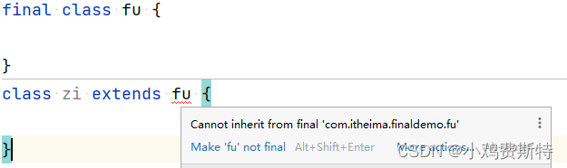
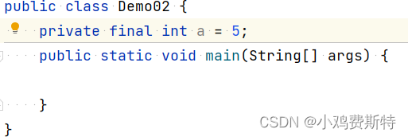
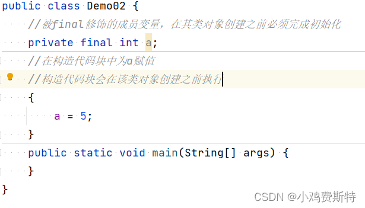
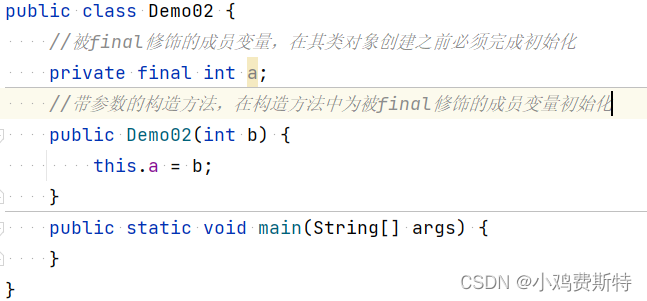

# final

1. [final修饰类](#final修饰类)
2. [final修饰变量（成员变量和局部变量）](#final修饰变量成员变量和局部变量)
3. [final修饰成员方法](#final修饰成员方法)

在java中，final关键字有三个用法，修饰类，修饰变量，以及修饰成员方法。

## final修饰类

当final关键字修饰一个类，则该类会成为最终类，即该类不能被继承（俗称“断子绝孙类”），但是该类可以有父类。

```Java
	//类名为Fu的类被final关键字修饰，代表其不能被继承
	final class Fu {
	    
	} 
	//现在类名为Zi的类想继承Fu这个类，编译器会报错
	class Zi extends Fu {
	    
	}
```



## final修饰变量（成员变量和局部变量）

变量分为成员变量和局部变量，他们被final修饰时有不同的注意事项。

1. final修饰成员变量：该成员变量必须在其所在类对象创建之前被初始化（且只能被初始化一次）。 初始化方法：
   1. 第一种，给其直接初始化（赋值）
   
   2. 第二种，在构造代码块中将其初始化（赋值）
   
   3. 第三种，在成员变量所在类的构造方法中将其初始化（赋值）
   

2. final修饰局部变量：该变量必须在使用之前赋值，且只能被赋值一次

**注意**：当final修饰引用数据类型（类、接口、数组）的变量，则引用变量所指向的对象（即该变量所存放的地址值）不能更改，但是该对象的内容（即地址值上存储的内容）可以更改！！

## final修饰成员方法

当final关键字修饰了成员方法，则意味着这个方法不能被重写，但是可以被继承（注意，这里final修饰的是方法而不是类）。