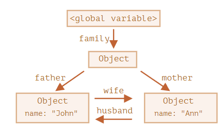
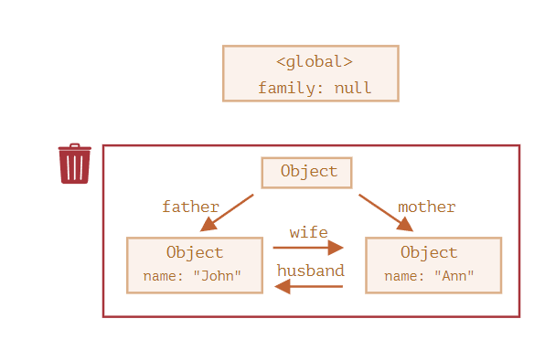

# 0403垃圾回收

## 可达性（Reachability）
1. 固有的可达值的基本集合，这些值明显**不能被释放**在内存中。
   * 当前执行的函数，它的局部变量和参数
   * 当前嵌套调用链上的其他函数，它们的局部变量和参数。
   * 全局变量
   * （还有一些内容的）
  这些值被成为根（root）
2. 如果一个值可以通过引用链从根访问任何其他值，则认为该值是可达的。

## 一个简单的例子
```javascript
// user 具有对这个对象的引用
let user = {
  name: "John"
};

user = null;
```

现在 John 变成不可达的了。因为没有引用了，就不能访问到它了。垃圾回收器会认为它是垃圾数据并进行回收，然后释放内存。

## 复杂
```javascript
function marry(man, woman) {
  woman.husband = man;
  man.wife = woman;

  return {
    father: man,
    mother: woman
  }
}

let family = marry({
  name: "John"
}, {
  name: "Ann"
});

delete family.father;
delete family.mother.husband;
```



成功删除，说明对外引用(husband->wife)不重要，只有传入引用才可以使对象可达。

## 孤岛
```javascript
family = null;
```


## 内部算法
垃圾回收的基本算法被称为 “mark-and-sweep”。

定期执行以下“垃圾回收”步骤：

1. 垃圾收集器找到所有的根，并“标记”（记住）它们。
2. 然后它遍历并“标记”来自它们的所有引用。
3. 然后它遍历标记的对象并标记 它们的 引用。所有被遍历到的对象都会被记住，以免将来再次遍历到同一个对象。
4. ……如此操作，直到所有可达的（从根部）引用都被访问到。
5. 没有被标记的对象都会被删除。

一些优化建议：

1. 分代收集（Generational collection）—— 对象被分成两组：“新的”和“旧的”。在典型的代码中，许多对象的生命周期都很短：它们出现、完成它们的工作并很快死去，因此在这种情况下跟踪新对象并将其从内存中清除是有意义的。那些长期存活的对象会变得“老旧”，并且被检查的频次也会降低。
2. 增量收集（Incremental collection）—— 如果有许多对象，并且我们试图一次遍历并标记整个对象集，则可能需要一些时间，并在执行过程中带来明显的延迟。因此，引擎将现有的整个对象集拆分为多个部分，然后将这些部分逐一清除。这样就会有很多小型的垃圾收集，而不是一个大型的。这需要它们之间有额外的标记来追踪变化，但是这样会带来许多微小的延迟而不是一个大的延迟。
3. 闲时收集（Idle-time collection）—— 垃圾收集器只会在 CPU 空闲时尝试运行，以减少可能对代码执行的影响。