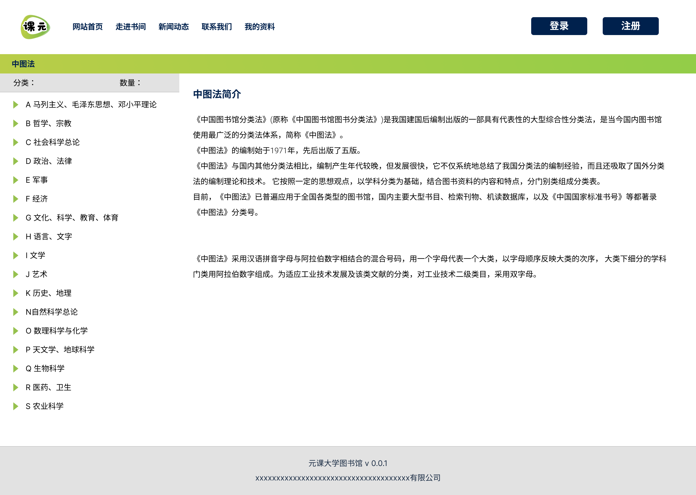

# 商单5-全栈-在线图书馆课元Library

## 介绍

1. 存在 管理员 + 组织管理员 + 读者
2. session管理
3. springboot + mysql + solr
4. 其中solr是搜索引擎来对图书进行检索
5. 前端（PC + 移动） + 后台 + 后端
6. 将美国图书分类映射到中图分类法
7. 阅读和下载数量限制
8. 在线阅读pdf + epub

## 难点
1. solr
2. 组织多级管理，鉴权，前端镜像
3. 映射时候使用了python机器学习进行相似度匹配，并生成json
4. 在线阅读 pdf + epub，从前端解决了

### 有趣的东西
将封面的2d图片通过css变为3d的图书。[]

## 设计师初稿

